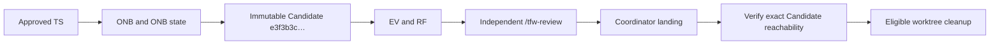

# RF — TFW_20260902-111644_CRATM / Phase A: Isolation and attribution for concurrent work

> **Date**: 2026-09-05
> **Author**: Codex (Executor)
> **Status**: 🟢 RF — Complete
> **Parent HL**: [HL-TFW_20260902-111644_CRATM](../HL-TFW_20260902-111644_CRATM.md)
> **TS**: [TS Phase A](TS__phase-a__isolation_and_attribution.md)

---

## 1. What Was Done

Phase A now has one canonical protocol for mutation worktrees, exact-path staging, and cross-session landing. Executor and Reviewer workflows enforce the rule at their commit/verification checkpoints, and the four approved tracked copies match their canonical workflows byte for byte. The implementation adds no executable mechanism, transport policy, identity behavior, manifest change, test, or later-phase content.

### Actual Value-Bearing Accounting

| Fact | Actual result |
|---|---|
| TS approval ref | `29a5c8a98af52493d142c9872ca97a22a5db4eda` |
| Baseline / Candidate | `11888e547b0b37dc09469aee8fe2fd897d797906` / `e3f3b3c149f0ef03157f65890d89438d11b8fe6e` (first tested Executor implementation commit) |
| VALUE membership | `M .tfw/conventions.md` — canonical worktree/staging/landing/failure rules; `M .tfw/workflows/handoff.md` — Executor commit/Candidate enforcement; `M .tfw/workflows/review.md` — independent Reviewer verification; `M .agent/workflows/tfw-handoff.md`, `M .agent/workflows/tfw-review.md`, `M .claude/commands/tfw-handoff.md`, `M .claude/commands/tfw-review.md` — accepted tracked workflow copies. All seven are `VALUE` under the approved TS. |
| Arithmetic | `97` additions + `17` deletions = `114` touched text LOC; `7` logical files; binary/non-text N/A |
| Membership deviations | None. Candidate commit contains exactly the seven literal VALUE paths and no ASSURANCE path. |
| Trigger disposition | **Keep one phase**: 7<50 files and 114<5,000 LOC; splitting canon from its role consumers/copies would ship inconsistent behavior. |
| Authority and timing | Owner-approved immutable denominator `7/160` at `29a5c8a…`, 2026-09-05T15:17:56+05:00. Actual membership equals 7 and actual LOC is below 160; both are below escalation ceilings 14/320, no planned zero grew, HC-1 did not move, and no widening ruling was required. Candidate was fixed at 2026-09-05T15:49:34+05:00 before EV/RF/final state. The denominator remains 7/160. |
| Reproduction | The approved commands are unchanged: `git diff --name-status --find-renames=50% -z 11888e547b0b37dc09469aee8fe2fd897d797906 e3f3b3c149f0ef03157f65890d89438d11b8fe6e -- $valuePaths` and the identical `--numstat` form with the literal seven-path array. Raw numstat: `7/1, 6/0, 7/1, 6/0, 58/14, 7/1, 6/0` in Git output order. |

This reports the approved contract; it does not create a selector, move Candidate, ratchet the denominator, or supply late authority.

### New Files

| File | Description |
|---|---|
| `ONB__phase-a__isolation_and_attribution.md` | Complete Executor onboarding, questions, risks, inconsistencies, and all 49 HL §7.2 citation checks |
| `journal/20260905-153146__handoff__b880.md` | Task-local handoff event for accepted ONB |
| `journal/20260905-155507__transition__ed73.md` | Task-local transition from ONB to RF after Candidate and evidence |
| `evidence/EV__phase-a__isolation_and_attribution.md` | Per-AC evidence, accounting replay, hashes, word counts, tests, fixture, and landing deferral |
| `RF__phase-a__isolation_and_attribution.md` | This cumulative result record |

### Modified Files

| File | Changes |
|---|---|
| `.tfw/conventions.md` | Added the six-part worktree protocol, exact-path staging rule, cross-session landing rule with TD-178, and three measured anti-patterns; compacted generic §14 wording without semantic loss to preserve D75 attention ceilings |
| `.tfw/workflows/handoff.md` | Added the minimal Executor-side exact-path commit edge and Candidate reachability/cleanup edge |
| `.tfw/workflows/review.md` | Added the minimal independent staging, path-set, attribution, reachability, and cleanup verification edge |
| `.agent/workflows/tfw-handoff.md` | Byte-identical tracked copy of canonical Handoff |
| `.agent/workflows/tfw-review.md` | Byte-identical tracked copy of canonical Review |
| `.claude/commands/tfw-handoff.md` | Byte-identical tracked copy of canonical Handoff |
| `.claude/commands/tfw-review.md` | Byte-identical tracked copy of canonical Review |
| `status.md` | Phase lifecycle advanced from `TS_DRAFT` to `ONB`, then to `RF` with task-local journal events |

### Round 2 — landing-evidence return

The accepted rung-1 return changed TRACE only. Append-only ONB records the ruled bound; phase state re-entered ONB; EV row E3b-R2 independently verifies the qualifying post-review landing; this RF records the current evidence verdict. Candidate `e3f3b3c149f0ef03157f65890d89438d11b8fe6e`, all seven VALUE files, 7/160 immutable denominator, 7-file/114-LOC actual accounting, observations, and prior test results are unchanged.

## 2. Key Decisions

1. The approved literal seven-path selector controls implementation and accounting. The stale manifest's plural `.agents/` target was reported but neither repaired nor expanded into scope.
2. `conventions.md` owns the complete rule body. Handoff and Review state only the action-specific facts that selective loading must expose at the commit and verification checkpoints.
3. Every real commit used complete status inspection, exact full paths, cached-name inspection, and `git commit --only`; the temporary sibling-staging fixture demonstrated why.
4. The first full suite exposed D75 attention regressions, so only changed §14 wording plus old generic §14 rows were compacted without semantic loss, and the Handoff edge was shortened. No RCFR/VBSA semantics or test ceilings were changed.
5. The actual cross-session landing is not claimed. It remains explicitly DEFERRED until independent REVIEW, after which the Phase Coordinator must land this exact Candidate, verify reachability, and only then consider cleanup.

### Round 2 decision

The first-round statement above remains the historical reason for REVISE. The qualifying landing is now `bb9c86f90208d9d58c62fe695e6d97d238ca28d7`, created after REVIEW and its ruling; it satisfies the closed return bound. Pre-review attempt `87c26bbcea64f3e2dcf4b6ebd094b4dc0da769ff` remains rejected evidence, preserved outside final ancestry rather than rewritten or deleted.

## 3. Acceptance Criteria

- [x] AC-1 — one portable Git worktree protocol answers all six lifecycle questions and states that isolation is neither lock nor merge strategy.
- [x] AC-2 — broad staging is named and forbidden; full paths, status, cached set, dirty-work preservation, and foreign-hunk STOP are enforced on both role surfaces.
- [x] AC-3 — dedicated producer-attributed landing, TD-178, path-history recovery, and exact Candidate retention are specified and verified; the actual post-REVIEW landing observation is honestly DEFERRED to the Coordinator.
- [x] AC-4 — selective-read ordering is preserved; canonical workflow bodies are not duplicated; all four approved copies have exact blob/SHA-256 parity.
- [x] AC-5 — Candidate is limited to seven Markdown VALUE paths, introduces no prohibited surface or provider product name, and records exact word-count necessity.
- [x] AC-6 — immutable approval/Baseline/Candidate facts and the literal NUL-safe accounting replay reproduce 7 files, 97 additions, 17 deletions, and 114 touched LOC.

### Round 2 acceptance update

- [x] AC-3 landing evidence — E3b-R2 verifies the post-review landing commit, producer task/phase, acting role, relevant path history, exact Candidate reachability, reviewed lineage, failed-attempt exclusion, and preserved cleanup precondition. No other AC result changed.

## 4. Verification

- Lint (`git diff --check 11888e547b0b37dc09469aee8fe2fd897d797906 e3f3b3c149f0ef03157f65890d89438d11b8fe6e -- $valuePaths`, using the TS's literal array): passed, exit 0.
- Structural check (`python .tfw/scripts/gen_index.py --check project`): passed — `project is consistent with the release it declares`.
- Extra non-gating corpus check (`python .tfw/scripts/gen_index.py --check tasks`): one pre-existing RDP journal summary is 123 code points against the 120 ceiling; its blob is identical in Baseline and Candidate and is recorded in §6, not modified.
- Targeted D75 regression tests: 2 passed in 25.16 s after the attention correction.
- Tests (`python -m pytest docs/scripts`): 306 passed in 246.07 s.
- Adapter parity: Handoff triplet blob `9f24b5c5a34d2c35be5629d0ec1c9be6337ff4ac`, SHA-256 `28D909D38F414EF0BCAD2E3D397D3F50F34412CB1DA2F751F7BAA9ECE5308A72`; Review triplet blob `e84d551c14248265c18e4d555f0268b73c8d6afb`, SHA-256 `24477A935BF9041AC9070A4E2751B8752F238D2904FAEF3B415EB7239975CE00`.
- Exact word counts (`\S+`): conventions 9,791→10,179; Handoff 2,013→2,088; Review 2,102→2,187.
- Staged-sibling fixture: committed only `selected.md`; `sibling.md` remained staged; derived fixture removed.

### Round 2 landing verification

- Landing metadata: `bb9c86f90208d9d58c62fe695e6d97d238ca28d7`; parents `29a5c8a98af52493d142c9872ca97a22a5db4eda 091cf865e8c58bd15db87ada321c0bc995e6ae3e`; tree `7ed54c1dc57c443196bb6441feddffc0193ab0d0`; producer-shaped subject and five required trailers verified.
- Tree/lineage: landing tree equals ruled REVIEW tree; Candidate, Executor TRACE, first REVIEW, and ruling are ancestors; rejected pre-review attempt is not.
- Path history: first-parent history exposes the qualifying Phase A coordinator landing; full history exposes Candidate's Phase A Executor commit.
- Cleanup precondition: exact Candidate object resolves and the Executor worktree remains registered. No cleanup was performed.

## 5. Evidence

See [EV file](evidence/EV__phase-a__isolation_and_attribution.md) for evidence details.

Evidence verdict: 6/7 evidence rows VERIFIED, 1 DEFERRED, 0 BLOCKED, 0 N/A. All six AC implementations are verified; only the actual post-REVIEW coordinator landing observation is deferred.

### Round 2 evidence verdict

See EV `E3b-R2` for the resolving evidence. Current verdict: **7/7 VERIFIED, 0 DEFERRED, 0 BLOCKED, 0 N/A**. Historical E3b remains visible and is superseded, not rewritten. The actual post-review landing is now verified; Candidate and accounting remain unchanged.

## 6. Observations (out-of-scope, not modified)

| # | File | Line(s) | Type | Description |
|---|---|---|---|---|
| 1 | `.tfw/adapters/manifest.yaml` | 85 | naming | Manifest maps the Antigravity workflow target to plural `.agents/workflows/…`, while the approved TS and the repository's tracked copies use singular `.agent/workflows/…`. Phase A's literal selector forbids repairing or expanding this topology. |
| 2 | `workspace/2026/TFW_20260902-111644_CRATM/HL-TFW_20260902-111644_CRATM.md` | 684, 738, 740 | naming | Two NS2 citations carry stale ordinals: the quoted current clauses are principles 5 and 7, not 4 and 6. Links and semantic text still resolve; the frozen/master artifact is outside Executor scope. |
| 3 | `workspace/2026/TFW_20260902-112841_RDP/journal/20260902-181437__amendment_escalated__531a.md` | 9 | style | `--check tasks` reports its immutable summary at 123 code points against the 120 ceiling. The blob `d156e68b55c47818820e364e2816630cbb03cef8` is identical in Baseline and Candidate; Phase A may neither rewrite another task's event nor widen HC-1. |

## 7. Fact Candidates

No fact candidates.

> fact-candidates: processed 2026-09-05

## 8. Strategic Insights (Execution)

No strategic insights.

## 9. Diagrams

---

*RF — TFW_20260902-111644_CRATM / Phase A: Isolation and attribution for concurrent work | 2026-09-05*
