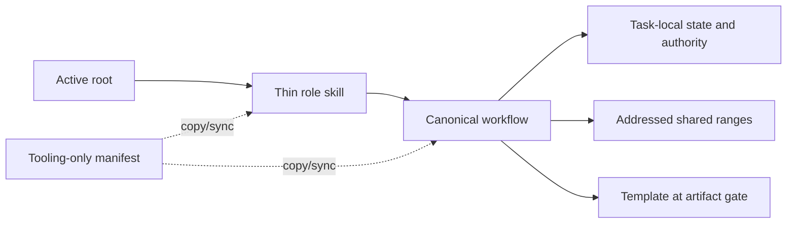

# RF — TFW_20260902-175227_RCFR / Phase B: Primary Role Paths

> **Date**: 2026-09-04
> **Author**: saubakirov (via Codex)
> **Status**: 🟢 RF — Complete
> **Parent HL**: [Phase B HL](HL__phase-b__primary_role_paths.md)
> **TS**: [TS Phase B](TS__phase-b__primary_role_paths.md)

---

## 1. What Was Done

### New Files
| File | Description |
|------|------------|
| `evidence/EV__phase-b__primary_role_paths.md` | Structured AC-1–AC-6 evidence and verdict. |
| `evidence/runtime-context-primary-roles.txt` | Raw five-variant baseline/candidate read graph and word audit. |
| `evidence/semantic-primary-roles.txt` | Source-derived semantic records and mutant test result. |
| `evidence/clean-receiver-primary-routes.txt` | Four-vendor clean-receiver, idempotence, repair, and preservation replay. |
| `evidence/verification-primary-roles.txt` | Targeted/full gates, project/task diagnostics, reduction, parity, and scope counters. |

### Modified Files
| File | Changes |
|------|---------|
| `.tfw/workflows/{plan.md,research/base.md,handoff.md,review.md}` | Made each primary workflow the sole owner of one ordered checkpoint Read Contract while retaining role-specific gates and hard stops. |
| `.tfw/adapters/codex/skills/tfw-{plan,research,handoff,review}/SKILL.md` | Reduced source skills to command, role-lock, canonical-workflow, template-gate, and final-routing obligations. |
| `.agents/skills/tfw-{plan,research,handoff,review}/SKILL.md` | Synchronized exact installed Codex skill copies. |
| `.claude/commands/tfw-{plan,research,handoff,review}.md` | Synchronized exact canonical workflow copies. |
| `.agent/workflows/tfw-{plan,research,handoff,review}.md` | Synchronized exact legacy Antigravity workflow copies. |
| `.tfw/adapters/manifest.yaml` | Identified the existing four primary routes versus unchanged secondary routes without changing schema or runtime authority. |
| `docs/scripts/test_runtime_context.py` | Added the immutable Phase B baseline, five role variants, scoped/dynamic/repeated read graph, source-derived semantic preservation, and high-risk mutants. |
| `docs/scripts/test_integration.py` | Added exact primary copy/role assertions and four-vendor clean install, idempotence, drift repair, unmarked-root, and persistent-router tests. |

## 2. Key Decisions

1. The selected canonical workflow owns read ordering; skills route into it and do not independently preload root or common libraries. This eliminates the largest duplicated fixed packet without creating a second authority.
2. Dynamic task artifacts and relevant P5–P7 sources remain explicit graph edges with `charged: false` on both baseline and candidate. This exposes mandatory dynamic reads without inventing a fixed payload.
3. The Reviewer keeps separate Verify PV and Judge Purpose reads. Their repeated source classification is deliberate and charged, preserving independent acceptance judgment rather than optimizing it away.
4. The existing adapter manifest remains tooling-only. No runtime manifest, field, configuration key, generated packet, template, or secondary workflow was added or changed.

## 3. Acceptance Criteria

- [x] AC-1 — reproduced all five immutable baselines exactly and reported every scoped, dynamic, repeated, purpose, and authority edge; omission/duplicate/preload mutants fail.
- [x] AC-2 — Coordinator and both Researcher modes preserve source-derived decisions, effects, citations, gates, and hard stops through minimal skills and checkpoint reads.
- [x] AC-3 — Executor initial/REVISE, onboarding, dependency, build, evidence, RF, state, and stop behavior remains source-backed; unsupported evidence/build mutants fail.
- [x] AC-4 — Reviewer verification, 42%/100% escalation, Purpose Check, citation bar, disposition, verdict routing, KNW route, independent rereads, and hard stop remain source-backed.
- [x] AC-5 — four primary workflows/skills are byte-equal to tracked copies; four clean receivers expose all 11 commands with exact primary roles; replay is idempotent and repairs drift safely.
- [x] AC-6 — every primary path clears 30%, combined reduction is 72.4%, semantic families match baseline, full gates pass, and no unauthorized path changed.

## 4. Verification

- Targeted runtime tests (`python -m pytest docs/scripts/test_runtime_context.py -q`): PASS — 86 passed.
- Targeted runtime/integration gate (`python -m pytest docs/scripts/test_runtime_context.py docs/scripts/test_integration.py -q`): PASS — 143 passed.
- Collection (`python -m pytest .tfw/scripts/ docs/scripts/ -q --collect-only`): PASS — 437 tests collected.
- Full tests (`python -m pytest .tfw/scripts/ docs/scripts/ -q`): PASS — 436 passed, 1 skipped.
- Project check (`python .tfw/scripts/gen_index.py --check project`): PASS — exit 0.
- Task diagnostic (`python .tfw/scripts/gen_index.py --check tasks`): expected nonzero — only the immutable RDP `123>120` event-summary exception; no new problem.
- Scope: PASS — 23/23 implementation/test files, 1,005/3,500 changed LOC, 0 new runtime files.

## 5. Evidence

See [EV file](evidence/EV__phase-b__primary_role_paths.md) for evidence details.

Evidence verdict: 6/6 VERIFIED, 0 DEFERRED, 0 BLOCKED, 0 N/A

## 6. Observations (out-of-scope, not modified)

| # | File | Line(s) | Type | Description |
|---|------|---------|------|-------------|
| 1 | `workspace/2026/TFW_20260902-112841_RDP/journal/20260902-181437__amendment_escalated__531a.md` | front matter `summary` | style | The committed immutable event summary remains 123 code points against the 120-code-point ceiling. The task diagnostic reports it as its only problem; Phase B was explicitly forbidden from repairing it. |

## 7. Fact Candidates

No fact candidates.

## 8. Strategic Insights (Execution)

No strategic insights.

## 9. Diagrams

---

*RF — TFW_20260902-175227_RCFR / Phase B: Primary Role Paths | 2026-09-04*
