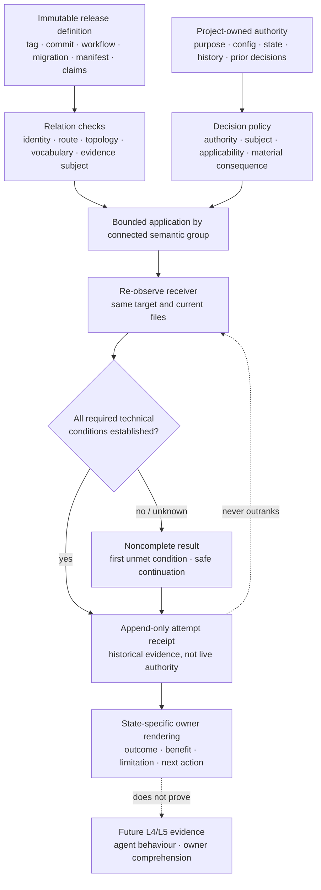

# RES — TFW_20260906-190312_CRUE: Evidence-led Release-to-Receiver Contract

> **Date**: 2026-09-06
> **Author**: saubakirov (research performed via Codex)
> **Status**: 🔬 RES — Iteration 1 complete
> **Parent HL**: [HL-TFW_20260906-190312_CRUE](../../HL-TFW_20260906-190312_CRUE.md)
> **Mode**: Pipeline · Deep

---

## Research Context

Iteration 1 tested H1–H3 against released TFW `v2.2.0` at commit `8e68ab37d300122ff110500ad58f354f76b6210f`, three advisory receiver reports, current framework sources and primary external references. The investigation separated release definition from receiver observation, classified reproduced defects separately from agent deviations, compared six complete update configurations across thirteen dimensions, and challenged them under interruption, repeat, partial application, ownership, adapter and communication scenarios. The result is an evidence-bounded design recommendation, not an implementation, a release verdict, a measured usability improvement or proof that a real owner understood an update.

## Briefing

The governing plan, H1–H3, scope boundaries and three guiding questions are in [1_briefing.md](1_briefing.md). Evidence mapping is in [2_gather.md](2_gather.md), the configuration space in [3_extract.md](3_extract.md), and pairwise/scenario attacks in [4_challenge.md](4_challenge.md).

## Decisions

| # | Decision | Rationale |
|---|---|---|
| D1 | Treat the Antigravity manifest/self-tree mismatch and three live uses of retired wording as the two independently reproduced `v2.2.0` delivery defects. | Both contradict the pinned tag's own topology or gate. The six-task repository test belongs to the intentionally separate maintainer repository subject; its external failure came from an optional wrong invocation and is not a third delivery defect without evidence that the required receiver route selects it. |
| D2 | Use observation + authority + subject + applicability + material consequence to distinguish facts, reusable choices and new owner decisions. | A stored value or byte equality can be both factual and inapplicable after semantics change. This policy reuses an applicable decision, asks one bounded project-language question when material meaning remains unresolved, and never asks the project owner to legalize a source defect. |
| D3 | Keep existing release carriers authoritative and add checked relations among version/ref, workflow, migration, manifest/tree, retired terms, preservation, verification subjects and owner-facing claims. | One owner per truth plus executable relation checks closes observed drift without a new mutable release registry. An immutable envelope remains logically viable only as a future fallback if the smaller design fails. |
| D4 | Re-observe the receiver on every invocation and treat completion conditions as check definitions with current evidence, never as trusted persisted state. | Equal version is compatible with interruption before verification, message or cleanup. Historical receipts guide recovery but do not outrank current files, config, authority or checks. |
| D5 | Use `.tfw/update_receipts/receipt_20260906_190312_2_2_0_8e68ab37_a1b2.md` as the consistent concrete example of the accepted prospective receipt form. | Version `2_2_0` matches source `8e68ab37`; no future release is assigned. `.tfw/update_receipts/` is project-owned append-only attempt history, outside task lifecycle and closed `status.md`/journal schemas. The Main Coordinator accepted this technical recommendation for TS elaboration at the Challenge checkpoint. |
| D6 | Write one immutable attempt receipt after current-state re-observation and cleanup resolution or disclosure, then render the owner response from it. | A crash before receipt creation is reconstructed from observation; a crash after receipt creation but before response emission permits safe re-rendering. The receipt proves neither channel delivery nor owner comprehension and never becomes current-state authority. |
| D7 | Stop the entire connected semantic group when a release relation, material merge or active adapter route is contradictory or unresolved. | Continuing with an independent-looking copy can expose a mixed vocabulary, route or ownership transition. A truly independent receiver failure retains its own verdict but prevents receiver completion; rollback is allowed only inside a predeclared safe boundary. |
| D8 | Preserve five evidence subjects: immutable payload, route/migration, receiver preservation, fresh-agent behavior and owner outcome. | A green project check cannot repair a source contradiction; a source check cannot prove receiver compatibility; a delivered message cannot prove comprehension. Every claim binds to the evidence layer that can establish it. |
| D9 | Use one outcome-first information contract with state-specific plain-language renderings and one technical receipt link. | Release benefits and run facts have different sources but can appear in one short message. Actual outcome comes first; applicable benefit, preservation/limitation and next action follow. Message presence is not comprehension evidence. |
| D10 | Restrict current Antigravity work to the already declared workflow command mode and its singular→plural project-root transition. | Current Google material distinguishes `.agents/workflows/` from `.agents/skills/`. TFW may detect legacy `.agent/workflows/`, preserve neighbours and stop on divergent duplicate commands; skill packaging, CLI/global paths and workflow→skill translation are a new provider mode and are not silently included. |
| D11 | Leave the exact legacy README project-purpose carrier and authority-routing mechanism for an explicit TS decision under fixed criteria. | Research proves the required outcome but not one universally correct destination. TS must select a project-owned carrier and the authority that permits relocation; current `.tfw/README.md` methodology must update, project purpose/meaning and history must survive, repeat must be deterministic, and the owner is asked only when existing authority does not settle materially different destinations. |
| D12 | For `source_blocked`, promise only that target payload/config/state/adapter changes were not applied; disclose diagnostic receipt/staging writes separately. | Receipt or staging creation is itself a technical receiver write. If diagnostic trace is permitted, keep it only in the declared project-owned/temporary area; if it is not permitted, preserve the report outside the receiver. Never say project data «was not overwritten» unless pre/post or write-set evidence establishes that preservation. |

## Open Questions

| # | Question | Status | Answer |
|---|---|---|---|
| Q1 | Which concrete project-owned carrier receives legacy text that was explicitly designated as project purpose, and which existing authority permits the relocation? | Open — TS design decision | Acceptable only if current TFW methodology installs in `.tfw/README.md`, designated project meaning/history and links survive, the transform is deterministic on repeat/recovery, and no values-adoption question is reintroduced. Existing unambiguous authority permits the transition; otherwise one bounded question names the project effect, recommended destination and consequence. |
| Q2 | Does a fresh Antigravity installation discover the plural workflow route and handle a singular legacy installation without duplicate commands or neighbour loss? | Open — L4 evidence | Tree/path consistency is logically specified; actual provider discovery and triggering require a declared fresh-agent scenario. Failure cannot be repaired by silently adding skill mode. |
| Q3 | Do recipients correctly identify outcome, one material effect and the next action from the state-specific rendering? | Open — L5 evidence | The information contract is logically complete. Comprehension requires live/task-based observation with sample, environment and mistakes recorded; no percentage or time saving is inferred from the three reports. |

## Hypotheses (from HL §10)

| # | Hypothesis | HL Status | RES Status | Evidence |
|---|---|---|---|---|
| H1 | A facts/established-choices/new-decisions distinction can remove routine repeat interviews without losing material owner decisions across representative receiver cases. | needs-research | 🟡 Logically supported; behaviour pending | Gather G4 found that three labels are insufficient; Extract P4 and Challenge C5 survived only with authority, subject, applicability and materiality checks. Counterexamples include changed budget semantics, designated README purpose, immutable archive policy, source defect and external effect. Fresh-agent false-question/hidden-decision evidence remains Open Thread 3 / L4 work. |
| H2 | A coherent release-to-receiver contract can keep migration and validation consistent without adding a new mutable registry. | needs-research | 🟢 Logically supported at design level | Challenge's guarded S1 survived all 78 dimension pairs: existing carriers remain authoritative; relation checks bind them; receiver conditions are recomputed; receipts are append-only history. C3 envelope remains fallback, while journaled state and pure version-last were rejected. Implementation and maintenance behaviour are unmeasured. |
| H3 | Evidence-backed release benefits and actual receiver outcome/continuation can form one clear final communication without either technical overload or hidden failures. | needs-research | 🟢 Logically supported at information-contract level | Extract M2–M4 and Challenge C1/C7 show one outcome-first contract can render success, source block, receiver block, interruption or refusal while separating release/run evidence. Delivery can be safely repeated; actual comprehension remains Q3. |

## HL Update Recommendations

> The originating proposer for R1–R5 is `research/iter1`. Owner statements remain attributed to the owner; the Coordinator's technical checkpoint decision remains attributed to the Main Coordinator. Comparison with independent `iter2` must preserve these origins rather than merge authorship.

### Refinements — free sections, coordinator applies

| # | § | What to update | Source |
|---|---|---|---|
| R1 | §2 · Current State | Record only two reproduced release defects; classify the six-task failure as an optional wrong-subject invocation under D69 unless the required receiver route is later proven wrong. Add the equal-version interruption ambiguity and the conflict between CHANGELOG-only briefing and actual receiver outcome/continuation. | Gather G2, G6–G8 and Coordinator correction commit `615ca27` |
| R2 | §7.2 · Knowledge Citations | Add the bounded uses of TUF for connected-set consistency/abort, RFC 9110 for idempotent-or-detectable replay, Kubernetes conditions for freshness, Git for limited ref atomicity, Amershi et al. for uncertainty/explanation heuristics, and current Google material for distinct workflow/skill paths. State the transfer limits beside each citation. | Gather G4–G6, Extract E1–E6, Challenge evidence boundary |
| R3 | §8 · Dependencies | Record the accepted technical dependency on a project-owned append-only `.tfw/update_receipts/` schema/read contract and preservation rules; record Q1 as a required TS decision with its carrier/authority/repeat criteria. Keep actual Antigravity discovery, fresh-agent recovery and owner-comprehension trials as separate evidence dependencies. | RES D5–D6, D10–D12; Challenge checkpoint decision |
| R4 | §9 · Risks | Add stale receipt/version markers being trusted as current state; partial continuation of a connected semantic group; diagnostic trace/staging being misstated as zero receiver writes; unverified preservation language; and silent Antigravity workflow→skill expansion. Mitigate with re-observation, connected-group stop, exact write disclosure, preservation evidence and explicit provider-mode bounds. | Challenge G8–G22 and C1–C6; RES D4, D7, D10, D12 |
| R5 | §10 · RESEARCH Case | Mark H1 logically supported with behavioural evidence pending; mark H2 and H3 logically supported at design/information-contract level; preserve H4 for independent iter2. Add S1, the rejected C1/C5/pure-C6 alternatives, C3 fallback, Q1–Q3 and the rule that analytical feasibility/cost is not a measured outcome. | Extract E7–E10; Challenge survivors/eliminations/C9; RES hypotheses and open questions |

### Amendment Proposals — frozen sections, resolved-ruler verdict required

No amendment proposals. S1, receipt history, connected-group stopping, evidence layers and message rendering refine how the already frozen outcome is met; they do not change §1 or the claims in §3–§7. The unresolved legacy README mechanism must be decided within those existing frozen ownership/outcome bounds, not treated as a new frozen commitment without evidence.

## Fact Candidates

No fact candidates. Human-sourced project direction relevant to this pass was already captured in the governing HL §3 and §11 before research; receiver-specific quotations remain evidence about those named receiver episodes, not facts about this project or a broad population.

## Strategic Insights (Research)

No new strategic insights. Owner-sourced purpose, ownership, positive-onboarding and independent-pass direction are already preserved with their original attribution in HL §11 S1–S8. Coordinator checkpoint decisions in this iteration are technical research routing, not new human-sourced domain knowledge.

## Findings Map

The map exposes the central separation: release definition and project authority meet only through checked relations and a bounded decision policy; a receipt records an attempt after observation but cannot become either source of truth. Both complete and noncomplete outcomes produce a truthful continuation, while behavioural success remains a later evidence layer.

## Iteration Status

- **Iteration:** 1 of 2 (min) / 5 (max)
- **Hypotheses tested:** H1 (logically supported; fresh-agent behaviour pending), H2 (logically supported at design level), H3 (logically supported at information-contract level)
- **Hypotheses deferred:** H4 — assigned to independent parallel `iter2`; its researcher must not read this pass before completing its own RES
- **Gaps discovered:** exact legacy README purpose carrier/authority route; actual Antigravity workflow discovery; interruption/repeat behaviour by a fresh agent; owner comprehension; measured maintenance/reading cost of relation checks and receipt schema
- **Superseded decisions:** Challenge C9.1 narrows Extract's R-B+B5/C6 candidate to guarded S1 and rejects pure C6; Challenge C9.7 supersedes Extract E5's single durable `OwnerBriefed` condition with technical convergence, message preparation/emission and future comprehension evidence; Gather correction `615ca27` supersedes the first checkpoint's six-task delivery-defect classification

### Open Threads (for Coordinator comparison and later TS/evidence)

These threads are not input to the still-independent `iter2`; the Coordinator holds them until both parallel RES artifacts exist.

| # | Thread | Why it matters | Suggested focus |
|---|---|---|---|
| 1 | Legacy README project-purpose carrier and authority route | A correct methodology update can still erase or silently reassign receiver purpose. | In TS choose the carrier and routing rule; test starter-identical, customized and explicitly designated cases, repeat and recovery. |
| 2 | Receipt schema and preservation | The accepted location avoids task/archive ambiguity but adds one project-owned artifact type. | Specify bounded fields, naming, append-only rule, reader selection, payload exclusion and source-blocked external-report fallback. |
| 3 | Fresh-agent update behaviour | Prompt logic may be coherent yet misread without maintainer correction. | Run declared clean, repeat, interruption, refusal, source-defect and receiver-failure scenarios; record questions, authority citations, actions and mistakes. |
| 4 | Antigravity current workflow path | Tree correctness does not prove actual provider discovery or absence of duplicate commands. | Test singular legacy → plural current workflow only, neighbours, both-root collision and second run; do not add skill mode. |
| 5 | Owner outcome | A delivered message may still hide state or fail to support continuation. | Observe whether a recipient identifies outcome, material effect and next action; report the sample and errors without universalizing. |

### Recommendation

- [ ] **SUFFICIENT** — proceed to `/tfw-plan` to classify these recommendations and write TS
- [x] **MORE NEEDED** — complete the already authorized independent `iter2` for H4, then use `/tfw-plan` to compare both passes while preserving proposer identity; no additional H1–H3 research is recommended before that comparison
- [ ] **BLOCKED** — not blocked

> The Main Coordinator decides whether the two-pass minimum is satisfied and whether later evidence belongs in TS. This researcher does not update HL, lifecycle or implementation.

## Conclusion

Iteration 1 found that the release/update problem is not solved by a longer checklist, a last-written version or a new central registry. The smallest configuration surviving all declared attacks keeps existing release carriers authoritative, checks their relations, re-observes the receiving project, stops connected semantic groups on contradiction, writes one project-owned append-only attempt receipt, and renders a short state-specific result from separate release and run evidence. It also narrows the owner gate to genuinely unresolved material meaning and keeps current Antigravity workflow compatibility separate from unapproved skill-mode expansion. The main limitation is empirical: no fresh-agent execution, provider discovery or owner-comprehension trial was performed, and no maintenance or interaction benefit was measured. The exact legacy README purpose carrier remains a named TS decision under explicit preservation and authority criteria rather than a mechanism research pretends to have settled.

---

*RES — TFW_20260906-190312_CRUE: Evidence-led Release-to-Receiver Contract | 2026-09-06*
