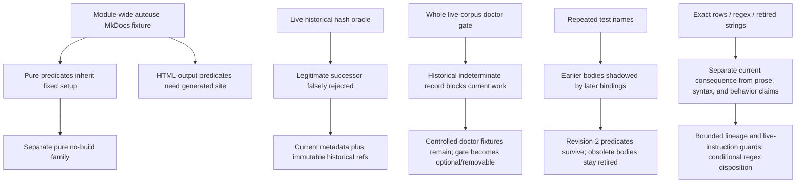

# RES — TFW_20260907-133942_PTTC: Proportionate Testing and Task Closure

> **Date**: 2026-09-08
> **Author**: robert
> **Status**: 🔬 RES — complete independent parallel source
> **Parent HL**: [HL-TFW_20260907-133942_PTTC](../../HL-TFW_20260907-133942_PTTC.md)
> **Mode**: Pipeline — focused

---

## Research Context

This independent iteration audited H4 within the repository test/audit surface: whether accidental fixture coupling and duplicated or historical predicates can be removed or consolidated into a simpler complete design without losing meaningful defect detection. It inspected bounded source files, the committed CRUE repair `a767b17072733dc856d4c73fa6a72277e1538ba5` (tree `06e466315a856ede01044b521d840647163014d4`), recorded traces, and official primary Python/pytest documentation. No pytest, MkDocs build, benchmark, selector probe, source edit, test edit, or closure experiment was run; no performance saving is claimed.

### Agent Team checkpoint and provenance

- **Selected LEAD layer:** principal `robert`; accountable owner `saubakirov`; owner-approved mandate A1 / HL §4.1; lifecycle `RES`; autonomous from `RES`; no implementation or publication authority.
- **Working-unit layer:** principal `robert`, role `Researcher`, actual unit `01a07f61-b613-7c10-b9f8-2b076af2a746`, parent Coordinator `01a07050-9d35-7080-a5f6-afd14334e68d`, host `local`; direct channel is native `send_message_to_thread` / `wait_threads` to root `01a07050-9d35-7080-a5f6-afd14334e68d`.
- **Dispatch lineage:** `06ad` → `1708` → `31d9` → `158a` → `b6a6` → `5894`; exact committed dispatch objects read at `71ed56cd5ff5eb5af917d6af7296f1ae5cbadc0f`, `cc427d666081ffb6d11c7836a94f6468adb7003a`, `ecb6a6156a274c579f4daeffd2fd495267ad95d7`, `7105affa68ce231d64b90334eb1dbabe0d98d763`, `2f23417661fb5609c263e2ae6f942927cbc53e01`, and `c99e314a90ec0a819f07c7fb00efaf149c2bddc2`. The later dispatch files were read by exact Git-object lookup while this producer tree held uncommitted stage files.
- **Origins:** mandate/scope dispatch originated from `{principal: robert, unit: 01a07050-9d35-7080-a5f6-afd14334e68d}`; this independent Briefing, Gather, Extract, Challenge and RES originated from `{principal: robert, unit: 01a07f61-b613-7c10-b9f8-2b076af2a746}`. Shared principal attribution does not merge units or grant amendment authority.

## Briefing

The full independent plan, scope boundary, guiding questions, and AT checkpoint are in [`1_briefing.md`](1_briefing.md). The audit deliberately formed initial conclusions without reading the main Researcher's findings and covered test-family necessity, protected consequences, harmful subtraction, KEEP cases, and simplest adequate dispositions.

## Decisions

| # | Decision | Rationale |
|---|----------|-----------|
| D1 | Keep a real build boundary for generated-HTML/link/rendering tests; move pure repository/Git/temp-tree predicates out of the module-wide autouse fixture. | `docs/scripts/test_integration.py:20-37` makes one module-scoped MkDocs build apply to all tests in that module. Output-facing tests need it; pure Phase D/E, knowledge, package and parity checks do not. Official pytest docs confirm scope-wide autouse behavior. |
| D2 | Separate current contracts from historical acceptance. | CRUE commit `a767b17072733dc856d4c73fa6a72277e1538ba5` accepts current release metadata and pins historical package bytes to immutable `8fd8e40b734e9c439bb84721ef8bee441b9fcdd7`, avoiding false rejection of a coherent successor. |
| D3 | Remove the global live-corpus doctor-clean release gate while keeping controlled doctor semantics and an explicitly optional diagnostic route. | Six controlled doctor tests preserve schema, read-only behavior, material/indeterminate exit semantics, collision handling, prose neutrality and bounded capability; whole-corpus cleanliness conflated historical health with current product acceptance. |
| D4 | Treat full D82/D83/D84 knowledge-row equality as a conditional REWORK candidate, not as the protected meaning itself. | Full-row equality can reject harmless explanation/citation changes. Keep bounded uniqueness, decision identity, task/phase lineage, required immutable references and known superseded/current distinctions; do not invent a universal semantic validator. |
| D5 | Do not revive all early same-name Phase D bodies. Preserve the later revision-2 predicates; investigate the compatibility wrapper separately. | Source comments identify the earlier baseline predicates as superseded by approval-epoch semantics, and later uniquely named predicates cover the revised protection. The exact 2159/2735 wrapper has no bounded in-repo consumer evidence, but external consumers remain unknown. |
| D6 | Keep retired-wording checks for normative and adapter surfaces; keep or narrowly rework the board-regex guard only if its residual architectural consequence remains distinct. | Separate live instruction surfaces can diverge. String/regex checks do not prove agent behavior, but they can protect against contradictory instructions or reintroduced retired architecture. Move pure guards out of the MkDocs fixture. |
| D7 | H4 is supported only within this bounded test/audit scope; it is not a result about closure design, total cost, or the combined PTTC system. | The audit found a simpler consequence-based test structure and no demonstrated need for a new selector/cache/control layer, but did not run measurements or inspect the main sequential research. |

## Open Questions

| # | Question | Status | Answer |
|---|----------|--------|--------|
| 1 | Which knowledge fields are explicitly immutable, and how should an owner-approved successor alter a retained decision without freezing explanatory prose? | Open | This audit identifies the minimum boundary (identity, task/phase, required immutable sources, superseded/current relation) but does not rule the final field grammar. |
| 2 | Does the board-regex guard have a residual consequence not covered by a simpler source-derived dependency check over all generator entrypoints? | Open | Bounded evidence shows adjacent checks are not identical; no probe was authorized, so KEEP/REWORK remains conditional. |
| 3 | Does any external CI or operator select the historical wrapper names? | Open | Repository-wide bounded search found only definitions/wrappers; that is not evidence about consumers outside this repository. |

## Hypotheses (from HL §10)

| # | Hypothesis | HL Status | RES Status | Evidence |
|---|-----------|-----------|------------|----------|
| H1 | A substantial avoidable part of the pure-check cost comes from implicit full-site setup and repeated processes; separating actual dependencies will materially improve it. | needs-research | Partially supported; magnitude unmeasured | Module-scoped autouse build is inherited by pure predicates; no timing probe was authorized. |
| H2 | Relevant-input and environment provenance permits useful evidence reuse while a bounded counterexample set still catches meaningful cross-surface defects. | needs-research | Supported structurally; effectiveness not rerun | CRUE separates current metadata from immutable historical bytes; controlled doctor/package mutants and `tmp_path` patterns preserve adverse cases without live-corpus gating. |
| H3 | A finite post-capture check and bounded administrative recovery can preserve all existing authority/knowledge safeguards without forcing fresh review and knowledge cycles on unchanged product claims. | needs-research | Deferred | Closure ownership and post-capture recovery were outside this independent test/audit scope. |
| H4 | Removing accidental coupling and consolidating duplicated verification/closure responsibilities can produce a simpler complete design than adding a new selection, caching or control layer, while preserving meaningful defect detection. | needs-research | Supported conditionally within test/audit scope | KEEP output and controlled semantics; MOVE pure checks; separate historical/current oracles; do not revive superseded predicates; retain concrete counterexample protections. Regex disposition and knowledge field grammar remain conditional. |

## HL Update Recommendations

> **The researcher classifies, never applies or rules.** These are recommendations for the Coordinator; no HL section was edited by this Researcher.

### Refinements — free sections, coordinator applies

| # | § | What to update | Source |
|---|---|----------------|--------|
| R1 | §2 | Record that the repository's module-scoped autouse MkDocs fixture couples pure repository/Git/temp-tree checks to a fixed per-module setup; distinguish this from HTML-output checks that genuinely require a build. Record that cost magnitude remains unmeasured. | `2_gather.md` G1; `docs/scripts/test_integration.py:20-37` |
| R2 | §9 | Add risks for full-row knowledge snapshots rejecting approved explanatory evolution and for same-name test definitions suppressing or confusing current predicates; mitigation is bounded semantic lineage and explicit unique names, not a universal validator or restoration of superseded checks. | `3_extract.md` E2/E4; `4_challenge.md` C1/C2 |
| R3 | §10 | Record the independent H4 result: consequence-based separation supports KEEP/MOVE/REWORK/REMOVE decisions in the test surface; exact-row, regex and external-selector questions remain conditional; closure and performance remain untested. | `4_challenge.md` C2-C4; Decisions D1-D7 |
| R4 | §7.2 | Add the official primary technical references used to establish fixture scope and Python name binding: [pytest fixture reference](https://docs.pytest.org/en/stable/reference/reference.html#pytest.fixture), [pytest autouse explanation](https://docs.pytest.org/en/stable/explanation/fixtures.html#autouse-fixtures-fixtures-you-don-t-have-to-request), and [Python function definitions](https://docs.python.org/3/reference/compound_stmts.html#function-definitions). | `2_gather.md` G1; `4_challenge.md` C1 |

### Amendment Proposals — frozen sections, resolved-ruler verdict required

**No amendment proposals.** The audit found refinements and implementation-boundary questions; it did not establish a necessary change to the frozen vision, target state, phases, DoD/DoF, role mandate, or principles. No proposal is filed in HL §12.

## Fact Candidates

**No new human-only Fact Candidates.** The observations in this RES were discoverable from repository files, committed diffs, task traces, and primary technical documentation. Owner and Coordinator directions remain in the governing HL/dispatch records rather than being promoted here as project knowledge.

## Strategic Insights (Research)

No strategic insights. The independent Researcher received operational scope and corrections, not new human-sourced domain knowledge that should be promoted beyond the governing HL.

## Findings Map

## Iteration Status

- **Iteration:** 1 of 2 (min) / 5 (max)
- **Hypotheses tested:** H1 (partially supported, unmeasured), H2 (structurally supported, not rerun), H3 (deferred), H4 (conditionally supported within test/audit scope)
- **Hypotheses deferred:** H3 — closure ownership, post-capture effects and administrative recovery were outside this independent audit; total-cost magnitude and agent behavior were not tested.
- **Gaps discovered:** exact knowledge-lineage field grammar; final board-regex disposition; external consumers of historical wrapper names; measured setup/body/process/review cost; main Researcher's causal and closure findings.
- **Superseded decisions:** early Phase D baseline-only predicates were superseded by approval-epoch predicates; the live Phase E historical hash oracle was superseded by current metadata plus immutable historical checks in CRUE `a767b17072733dc856d4c73fa6a72277e1538ba5`. Superseded bodies were not revived.

### Open Threads (for next iteration)

| # | Thread | Why it matters | Suggested focus |
|---|--------|---------------|-----------------|
| 1 | Define the smallest approved knowledge-lineage contract without freezing harmless prose or future additive decisions. | An overbroad row oracle rejects valid evolution; an under-specified check can lose authority/provenance. | Coordinator/Plan should name the protected fields and a bounded successor case before implementation. |
| 2 | Decide whether the board-regex guard remains distinct from source/output checks and whether the historical wrapper has an actual consumer. | These are the only remaining KEEP/REWORK/REMOVE choices with evidence-dependent outcomes. | Use bounded consumer/source analysis; do not run a broad benchmark or invent a universal selector registry. |
| 3 | Challenge this independent source against the main sequential research and a receiving project's own checks. | H4 here covers only test/audit structure, not closure or receiver behavior. | Main chain's separately authorized iteration 2; preserve this producer as an independent source. |

### Recommendation

- [ ] **SUFFICIENT** — proceed to `/tfw-plan` to classify these recommendations and write TS
- [x] **MORE NEEDED** — this independent parallel iteration is sufficient as an iter1 source, but PTTC overall still requires the separately governed sequential challenge iteration and Coordinator synthesis before `/tfw-plan`.
- [ ] **BLOCKED**

> Coordinator decides whether to continue or proceed. Researcher recommends but does **not** decide.

## Conclusion

The audit supports H4 in the bounded test/audit surface: keep build-backed HTML protection and meaningful controlled doctor, package, parity and stale-instruction checks; move pure predicates away from module-wide autouse setup; separate current metadata from immutable historical acceptance; and remove the whole-corpus doctor gate as a product oracle. It also shows why subtraction must stop short of blanket deletion: exact knowledge rows carry real lineage/provenance consequences even when their full prose is overlocked, retired-wording scans protect distinct reader-facing surfaces, and duplicate names must be evaluated against supersession before any restoration or removal. No current protection was proven lost solely through the superseded Phase D definitions, no performance saving was measured, and closure/H3 remain unresearched here. The result is an independent parallel iter1 source for the main chain, not a DONE verdict or authorization for implementation.

---

*RES — TFW_20260907-133942_PTTC: Proportionate Testing and Task Closure | 2026-09-08*
