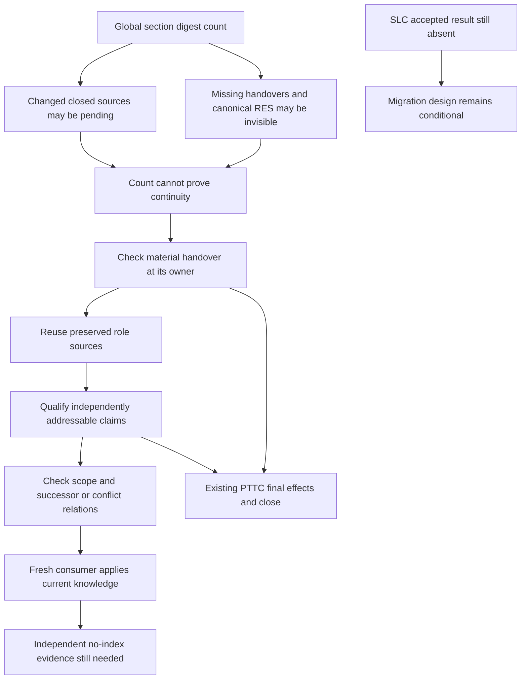

# RES — TFW_20260909-231654_TKL: Team Knowledge Lifecycle

> **Date**: 2026-09-13
> **Author**: robert, Researcher native task `01a0995f-6132-7c92-86d3-c5388827a8cd`, via codex
> **Status**: Research iteration 1 complete — return for Coordinator iteration decision
> **Parent HL**: [frozen TKL HL](../../HL-TFW_20260909-231654_TKL.md)
> **Mode**: Pipeline / focused
> **Inspected basis**: `3f4e59418c521dd22908662028351258288b89fb`

## Research Context

The global Knowledge Gate measures selected-section changes across discovered tasks; it does not establish that a task's participants preserved their material context or that later agents can use it. This focused iteration mapped the complete capture, qualification, retrieval, close and migration responsibilities and compared six ordinary-file configurations. **Recommend developing C3: existing role sources with minimal fallback checkpoints, independently qualified project records, a stable ordinary-file entry and the existing PTTC closer.** Keep repaired topic-based C1 as the lower-migration counterproposal. Architecture selection remains with the owner; retrieval behavior and SLC compatibility need further evidence before TS.

**Authority and exact return path.** Selected LEAD principal `robert`, accountable human owner `saubakirov`; protected mandate in HL §4.1 at re-freeze `251fbfdc1337a94099e0fbf1adfd534e9da46e6e`. This distinct Researcher is `01a0995f-6132-7c92-86d3-c5388827a8cd`, host `local`; direct parent/root Coordinator is `01a08161-79d3-7472-a01e-8cdc957ee951`; channel is native task messages. Autonomous from: `RES`, iteration 1 only. Governing status and ordered journal resolve the [dispatch](../../journal/20260913-110713__dispatch__e0b3.md), integrated by safe fast-forward before research. Dispatch origin: `{principal: robert, unit: 01a08161-79d3-7472-a01e-8cdc957ee951}`. These research recommendations originate from `{principal: robert, unit: 01a0995f-6132-7c92-86d3-c5388827a8cd}`; shared attribution grants this child no amendment or architecture-selection authority.

## Briefing

[Briefing and authority receipt](1_briefing.md) define H1–H4, the stage plan, scope and guiding questions. [Gather](2_gather.md) maps the actual system and primary sources; [Extract](3_extract.md) compares complete configurations and accounts for every current central-file/topic/state function; [Challenge](4_challenge.md) records consistency checks, scenario attacks, a real source-access walkthrough and bounded proposed next probes. All stage checkpoints were returned directly under the autonomous dispatch. The configured one-pass focused mode was used; the cross-cutting source mapping exceeded the soft file-read limit with its reason recorded in Gather.

## Decisions

These are research conclusions and recommendations, not implementation authority.

| # | Decision | Rationale |
|---|---|---|
| D1 | Replace the global planning count with material checks at selected handover, use and close | The current selector can include changed sealed/closed work and miss canonical `RES.md`; changed content is not contribution completeness. A gate toggle or selector patch alone is incomplete |
| D2 | Prefer C3 conditionally; keep refined C1 for comparison | C3 removes shared promotion/inventory writes while reusing existing capture. C1 preserves current topic access and can also remove counts/markers/digests. No measured cost advantage establishes a winner yet |
| D3 | Require every producing role's actual source return; distinguish captured, justified-none and unavailable material | The closer checks known contributors from task-local dispatch/handover evidence, without a new registry or a claim to see their private context |
| D4 | Separate preserved evidence from accepted current knowledge and governing authority | Each material contribution needs a completed disposition; technical/reference and human-sourced knowledge keep their distinct purposes. Uncertain retention is honest only when it fulfills the actual obligation; owed publication left pending still blocks PTTC close |
| D5 | Use stable publication identity and explicit later correction/conflict relations | Replay can reuse a known effect without source markers; conflicting successor records remain unresolved rather than choosing the latest timestamp. An integrated revision and relevant source lookup bound the claim |
| D6 | Preserve every information function before retiring a file or counter | Current map, decision rationale, important source links, legacy replacements, accepted topic meaning and PV access need explicit homes. Keeping a small stable KNOWLEDGE entry is compatible with removing its monolithic inventory role |
| D7 | Reuse actual PTTC close/recovery; await accepted SLC mechanics for final migration design | PTTC already separates independent review, actual final effects and current-carrier recovery. SLC is TS_DRAFT at this basis; a draft migration is not an accepted dependency |

The C3 lifecycle is complete in design: producer checkpoint → preserved task source → bounded existing-Coordinator qualification/disposition → independently addressable current record when warranted → ordinary-file retrieval and currentness check → application with citations → existing close verifies the handover and all required final effects. New project records preserve source versions, scope, uncertainty and qualifier authority. Material conflicts route to the existing authorized resolver. Record repair reuses accepted effects; source loss, changed output or uncertain authority cannot use that shortcut. Migration preserves old meaning/links and enables compatible readers before retiring live bookkeeping; no worker, new lifecycle or required runtime is added.

## Open Questions

| # | Question | Status | Answer |
|---|---|---|---|
| Q1 | Does C3's ordinary-file entry let an unprimed consumer find and apply the correct claim, including a stale-match trap? | Open; iteration 2 priority | Current D37/D86 navigation works in an informed Researcher walkthrough. It still uses KNOWLEDGE.md and cannot establish the proposed replacement's usability |
| Q2 | What minimum source and relation structure survives concurrent capture, contradictory promotion and interrupted replay at lower effort than C1? | Partially answered by design analysis | Reuse role artifacts, allocate stable publication identity, and inspect successor/duplicate/conflict relations. Exact granularity and comparative effort need bounded experiments |
| Q3 | What migration interface did SLC actually deliver? | Dependency unresolved | No RF/REVIEW exists in the inspected SLC tree. Consume its accepted Candidate, deviations and guide before final TKL design/shared implementation |

## Hypotheses (from HL §10)

| # | Hypothesis | HL Status | RES Status | Evidence |
|---|---|---|---|---|
| H1 | Producing-role handovers checked at the existing close can replace the global count without losing material knowledge | Needs research | **Conditionally supported; behavioral sufficiency unproved** | Gather G1–G3; Extract E1; Challenge scenarios. Existing close is real, but missing-context coverage is a proposed extension and cannot guarantee losslessness |
| H2 | Task-local sources and separate qualified project records remove shared inventory writes while supporting correction/concurrency | Needs research | **Conditionally supported in design** | Extract E2–E4 and Challenge consistency checks. Distinct writes preserve sources; semantic overlap and replay behavior remain to be exercised |
| H3 | Ordinary files give sufficient current knowledge at acceptable effort without central KNOWLEDGE authority | Needs research | **Open** | Challenge C2 gives a real, informed source walkthrough only. Fresh-consumer currentness, vocabulary and effort remain unmeasured |
| H4 | SLC and PTTC carry the complete change without another lifecycle, worker or runtime | Needs research | **Partially supported; SLC verification deferred** | Actual PTTC B RF/REVIEW and current conventions support the close interface. SLC status/journal/TS show a planned, unaccepted migration |

## HL Update Recommendations

The Researcher classifies; the Coordinator applies or routes. No HL section was edited.

### Refinements — free sections, coordinator applies

| # | § | What to update | Source |
|---|---|---|---|
| R1 | §2 | Add the `RES.md`/`RF-` selector blind spot and the inspected four-ID, no-problem snapshot; retain the original 27 as unexplained. Do not treat an absent OTR path's helper digest as a real empty-task observation | Gather G2, including corrected probe and reproduction details |
| R2 | §7.2 | Add primary provenance/retrieval evidence with its limits, and current close/source references that directly influence design | Gather G4, Extract E2, Challenge C2 |
| R3 | §8 | Replace stale “no Researcher/dispatch” statements with actual assigned lineage; retain SLC as TS_DRAFT at this exact basis and require its accepted result before final technical design | Briefing authority; Gather G3; authoritative dispatch |
| R4 | §9 | Refine risks: stable file IDs do not solve semantic conflicts; optional-view absence and backward-only supersession can hide currentness; a primed walkthrough does not validate fresh access | Extract E3–E4; Challenge C1–C2 |
| R5 | §10 | Apply the qualified H1–H4 statuses above; direct iteration 2 at C3 versus refined C1, missing/empty handover, conflict/replay and independent no-index consumption | Challenge C3–C4 |
| R6 | §10 | Treat removing central inventory authority separately from deleting KNOWLEDGE.md; require explicit functional replacements and prospective cost for changed PV/reader/compiled-link routes | Extract E4–E5 |

### Amendment Proposals — frozen sections, resolved-ruler verdict required

**No amendment proposals.** The conditional designs aim to satisfy the frozen outcome and DoD/DoF as written. Architecture selection, concrete VALUE cost and exact TS remain reserved. No proposal widens the mandate, redefines close, changes SLC, adds a retrospective or waives independent acceptance. If later evidence requires such a change, the originating unit must file a properly supported proposal through the existing route.

## Fact Candidates

**No new fact candidates.** Conversation history was reviewed: this iteration received the parent's bounded dispatch, with no new direct human domain/preferences input. The owner's existing constraints are already captured in HL §11 and cited project knowledge. Selector behavior, dependency state and command observations are technical research findings, not human-only facts to promote through the current knowledge workflow.

## Strategic Insights (Research)

No strategic insights. No new direct human briefing occurred; this iteration does not repackage the Coordinator's dispatch or technical analysis as fresh owner knowledge.

## Findings Map

The arrows summarize the diagnosed responsibility gap and proposed response; they are not a measured causal model.

## Iteration Status

- **Iteration:** 1 of 2 (min) / 5 (max).
- **Hypotheses tested:** H1 and H2 conditionally supported by source/design analysis; H3 open; H4 partially supported by actual PTTC.
- **Hypotheses deferred:** no hypothesis omitted; H4's SLC-dependent verification and independent behavioral validation of H1–H3 remain deferred with named reasons.
- **Gaps discovered:** gate misses canonical RES basenames; role coverage is not a digest property; semantic currentness needs explicit resolution; independent fresh access/effort unmeasured; SLC delivery absent.
- **Superseded decisions:** none. C3 is a research recommendation, not an amendment or accepted architecture.

### Open Threads (for next iteration)

| # | Thread | Why it matters | Suggested focus |
|---|---|---|---|
| 1 | Fresh consumption and preserved central functions | C3 could become an unread archive or allow stale decisions | Challenge P3: unprimed native returns, neutral question, current/stale/conflicting sources, ordinary files and held-out expected decision |
| 2 | Observable handover coverage | Missing context must not become a valid-looking close | P1: actual two-producer returns, missing material, legitimate absence and early interruption; reuse sources before adding files |
| 3 | Concurrent qualification and recovery | Textual merge success is not semantic acceptance | P2: conflict, duplicate retry, accepted effect with missing control, divergent later state; preserve prepared versus observed distinction |
| 4 | Accepted SLC and migration cost | Shared interfaces and preservation mechanics are still uncertain | P4: accepted RF/REVIEW/Candidate/guide and deviations; compare C3's carrier/read-route cost with refined C1 |

### Recommendation

- [ ] **SUFFICIENT** — proceed to TS.
- [x] **MORE NEEDED** — complete iteration 2 around the four threads above. Challenge C4 supplies finite prospective probe bounds; the Coordinator must resolve exact native roles, fixture authority, identities and total cost before execution. No probe was run by another unit here.
- [ ] **BLOCKED** — the research iteration itself is complete; SLC blocks final integration conclusions, not this return.

## Conclusion

The evidence supports replacing the unrelated global counter with material handover and use obligations owned by existing roles, and conditionally favors C3's reuse of task sources plus separately qualified project records. It also exposes why deletion of the gate, a new task-local file or a memory collection alone would not satisfy TKL: the current selector misses canonical RES sources, closed tasks can remain pending, and preserved claims still need a discoverable current meaning. This iteration consumed PTTC's actual accepted result and inspected SLC without treating its draft as delivery. Its limits are explicit: scenario reasoning and one informed source walkthrough do not prove a new design's concurrent, interrupted or fresh-consumer behavior. Return to `/tfw-plan` for the Coordinator to apply refinements and dispatch iteration 2; this Researcher stops here.

---

*RES — TFW_20260909-231654_TKL: Team Knowledge Lifecycle | 2026-09-13*
