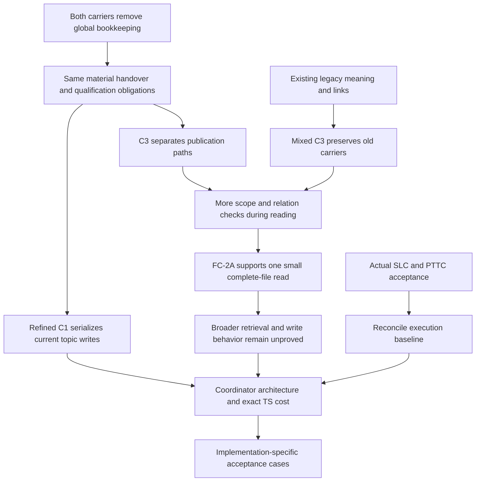

# RES — TFW_20260909-231654_TKL: Knowledge continuity after the carrier choice

> **Date**: 2026-09-13
> **Author**: robert, Researcher native task `01a0995f-6132-7c92-86d3-c5388827a8cd`, via codex
> **Status**: Research iteration 2 complete — return for Coordinator decision
> **Parent HL**: [TKL HL](../../HL-TFW_20260909-231654_TKL.md)
> **Mode**: Pipeline / focused
> **Intake basis**: `82d2b3c4485fc4f0bcfb2f80024f43df9b4a0e28`; additional dependency and consumer evidence pinned below

## Research Context

This iteration challenged C3's independent qualified records against refined C1's curated current topics through handover, replay, currentness and retention-cost cases. **Research is sufficient to return to `/tfw-plan` for architecture selection and exact TS preparation.** Conditionally prefer mixed C3: reuse existing role sources, preserve accepted legacy topics and decisions, add independent records for later qualified changes, and provide a stable entry with scope and reverse relation checks. Refined C1 remains viable and can remove the same counter, digest, inventory and marker work. The fresh consumer supports a small C3 read path; it does not establish a comparative cost advantage or a working TKL implementation. Accepted SLC was found outside this older checkout, so the next dependency action is baseline reconciliation rather than waiting for SLC delivery.

**Authority and direct return.** Selected LEAD principal `robert`, accountable human owner `saubakirov`; protected HL §4.1 mandate at re-freeze `251fbfdc1337a94099e0fbf1adfd534e9da46e6e`. This distinct Researcher/native task is `01a0995f-6132-7c92-86d3-c5388827a8cd`, host `local`; direct parent/root Coordinator and sole recipient is `01a08161-79d3-7472-a01e-8cdc957ee951`. Channel: native task messages. Autonomous from `RES`, iteration 2 only, under [dispatch 335d](../../journal/20260913-112920__dispatch__335d.md) and the parent's direct sealed-result continuation. Continuation origin is `{principal: robert, unit: 01a08161-79d3-7472-a01e-8cdc957ee951}`; exercise and research recommendation origin remains `{principal: robert, unit: 01a0995f-6132-7c92-86d3-c5388827a8cd}`. Shared attribution grants no child architecture/amendment verdict. No sibling was dispatched or contacted by this Researcher.

## Briefing

[Briefing](1_briefing.md) resolves current status/journal, the current HL and iteration registry, both byte-identical predecessor RES inputs, and the authorized focused continuation. Non-destructive merge of parent `c50f61514a9fc1c3c4e9f462fdef2faa946eb97a` preserved original iteration-1 producer `06460c5df39bc05bf16d947f15477c23e3d409bd`. The configured minimum is two iterations, maximum five. [Gather](2_gather.md) verifies accepted SLC and compares two actual design factors. [Extract](3_extract.md) records ten modeled failure/recovery cases, the complete function-retention comparison and the sealed finite consumer input/oracle. [Challenge](4_challenge.md) preserves the exact first native answer, per-criterion assessment and survivors. All four stage files were read for this synthesis; stage checkpoints returned directly and the explicit fresh-consumer wait was obeyed.

Return validation confirmed exactly five canonical iteration files, 20 local links/anchors, 12 cited commit objects and the predecessor RES blob, complete RES headings, balanced fences, unchanged seals and unchanged iteration 1. The first identity check incorrectly required every Git object to be a commit; it rejected the correctly documented predecessor blob. The corrected type-aware check passed without changing that evidence. No product test suite was run for this research-only return.

## Decisions

These are research recommendations. D1–D7 refer to [iteration 1](../iter1/RES.md); the numbering continues here to distinguish later conclusions.

| # | Decision | Rationale |
|---|---|---|
| D8 | Retain mixed C3 as the conditional preferred design and refined C1 as a real counterproposal | Independent records reduce overlapping publication paths, but add relation-aware reading. C1 can remove bookkeeping too; no measured A/B result establishes superiority |
| D9 | Preserve existing accepted topic/D meaning and sources; add later relations without converting every historical fact | Retains architecture, decisions, important artifacts, legacy replacements and Project Value access while limiting forced migration. A stable entry must explain both old and new carriers |
| D10 | Make missing, justified-none, unavailable and retain-only handovers distinct completed or outstanding obligations | A quiet source is not a return; justified reuse cites an inspected source; unavailable material that determines acceptance keeps close open. Authorized retention is valid only when resolution/publication is not owed |
| D11 | Carry explicit publication intent/identity and inspect actual accepted effects on retry | Same-identity equal retry reuses the effect; changed material intent is refused; separate equivalent sources and contradictory claims still require qualification. PTTC record recovery repairs only a missing carrier for unchanged accepted effects |
| D12 | Require scope, grounds, disposition and discoverable incoming correction/conflict relations in current use | FC-2A applied a scoped successor, preserved an unchanged claim, kept a disagreement unresolved and refused unauthorized publication. Backward-only links without an incoming lookup are insufficient |
| D13 | Replace D7's unresolved-SLC premise with the verified accepted result and a root baseline-reconciliation obligation | SLC is DONE at `c51ee0c0d7891fd165d105f3565e0e54512c1040`, with corrected Candidate `433d9db62905e16786113af9bfe126a89c21b9a5` and independent APPROVE `99198f133c0047568c1e8411bfae849239b352b1`. D7's PTTC reuse remains valid |
| D14 | Proceed to exact architecture/TS work with explicit remaining acceptance cases | The two research iterations establish alternatives, semantics and one bounded consumer result. Unimplemented producer/replay/migration behavior must be verified against the later exact implementation rather than reported as already demonstrated |

The complete proposed path remains producer handover → preserved role source or necessary fallback → qualification and completed disposition by the existing authorized Coordinator → current record when warranted → cited application after scope/relation checks → existing PTTC close verifies all material returns and actual final effects. No extra lifecycle, persistent worker or required runtime is proposed. Evidence retention does not itself accept project truth or grant operational authority.

The primary sources inform narrow parts of that path: [W3C PROV-DM](https://www.w3.org/TR/prov-dm/) supports explicit provenance, and [AWS's retry-design account](https://aws.amazon.com/builders-library/making-retries-safe-with-idempotent-APIs/) motivates intent-bearing identity. These are design references, not TKL authority or external dependencies.

## Open Questions

| # | Question | Status | Answer |
|---|---|---|---|
| Q1 | Can a fresh consumer apply current/stale/conflicting ordinary-file knowledge? | Bounded native support | All five predeclared FC-2A criteria were observed supported. One consumer read all 11 files in an 89.790-second interval with 5 read/list/search commands; no broad retrieval rate or C1 comparison was measured |
| Q2 | Does mixed C3 cost less than refined C1 while retaining current functions? | Architecture/TS discriminator | Extract E2 accounts for necessary jobs. C3 adds record/relation and mixed-reader obligations; C1 retains shared-topic serialization. Exact TKL affected paths, VALUE denominator and effort remain prospective |
| Q3 | What did SLC actually deliver? | Accepted dependency identified | Active/history separation, exact historical read access, bounded migration recovery and corrected complete-link handling. This TKL checkout still needs root reconciliation with that accepted result |
| Q4 | Do real handovers, concurrent publication and interrupted recovery satisfy the design? | Implementation acceptance open | Ten modeled cases state the required outcomes. This iteration ran no native producer/concurrent-write/crash test; FC-2A only observes reading and application |

## Hypotheses (from HL §10)

| # | Hypothesis | HL Status | RES Status | Evidence |
|---|---|---|---|---|
| H1 | Producing-role handovers checked at existing close can replace the global count without losing material knowledge | Conditional; missing/none/unavailable challenge pending | **Conditionally supported in semantics; native coverage not established** | Extract E1 distinguishes material absence, justified reuse, inaccessible context and completed retention. Existing PTTC close is actual; the proposed extension is unimplemented |
| H2 | Preserved task sources and independently addressable records remove shared inventory writes while supporting correction and parallel promotion | Conditional design; conflict/replay pending | **Conditional design support strengthened; write/replay behavior unproved** | Extract E1/E2, Challenge consistency/C3. FC-2A recognizes an unresolved conflict and supersession, but does not execute qualification, concurrent publication or recovery |
| H3 | Ordinary files and relevant access can give a fresh agent enough current knowledge at acceptable effort without central KNOWLEDGE authority | Open; only informed prior walkthrough | **Supported for one small explicit-entry fixture; broader claim remains conditional** | Challenge C1/C2: independently addressed first response, fixed input/oracle, exact sealed message and individual supported criteria. Complete fixture read, no large corpus or mixed legacy test |
| H4 | SLC/PTTC can carry the change without a new lifecycle, persistent worker or runtime | Actual PTTC support; SLC absent at prior basis | **Accepted dependency interfaces confirmed; TKL integration remains prospective** | Gather G1/G2 and Challenge C4 use actual final SLC and PTTC. No SLC/TKL product merge or adoption test occurred here |

### Native evidence and applicability

The FC-2A consumer is native Coordinator `01a09974-6716-7cc0-9916-fd6d04c91481`, first-answer turn `01a09984-79b7-7260-aaf4-ae3bb0fceaf2`. Parent dispatch is `d7487ee19a56a64d107b596a88453764982c09e6`; custody is `a4ec5f9d6397d3323a1803558d03aaac4feb60ec`. Challenge C1 contains exact task-relative Git locators, fixture location, times, complete first message and audit. Researcher reproduced its 4,996-byte UTF-8 payload SHA-256 `1037615dbfeba4d284169fb7bd88365bb561f1c17843232b4a37d2d10c83eccd`, unchanged Extract seal and all eleven dispatched file hashes. The parent's immutable custody attests transcript verification and unchanged fixture after return; prior exposure is the consumer declaration supported by the dispatch/readiness record. Exact parent preparation and total elapsed time were not supplied. No second answer was run.

The consumer supports each criterion separately: current scoped intake, positive unchanged check-in, unresolved proofreading conflict, refusal of unauthorized publication, and correct source/missing-decision reporting. Explicit entry, IDs and dispositions were part of the fixture; the run is not a G8/provider reliability trial. [Liu et al.'s long-context findings](https://aclanthology.org/2024.tacl-1.9/) provide a reason to keep generalization cautious, not a measurement of this current consumer.

## HL Update Recommendations

The Researcher classifies; the Coordinator applies or routes. No HL section was edited.

### Refinements — free sections, coordinator applies

| # | § | What to update | Source |
|---|---|---|---|
| R1 | §8 | Record actual accepted SLC close/Candidate/independent REVIEW and corrected resolver; replace a present waiting-for-delivery premise with exact execution-baseline reconciliation. Preserve the old TS_DRAFT observation as dated evidence | Gather G1; Challenge C4; D13 |
| R2 | §9 | Preserve C3's relation-discovery and mixed-carrier risks; add that this consumer read the complete tiny fixture. Do not present the result as selective large-corpus retrieval or reliable capture | Challenge consistency/C2/C3 |
| R3 | §10 | Apply qualified H1–H4 statuses above and record completion of the two-iteration research minimum without declaring architecture, implementation or universal behavior accepted | All stages; native custody and this RES |
| R4 | §10 | Carry missing/none/unavailable, duplicate/divergent intent, unresolved contradiction, accepted-effect carrier recovery and later-state refusal into exact TS acceptance design | Extract E1; Challenge C3 |
| R5 | §10 | Compare mixed C3 and refined C1 against the function-retention table before selecting exact VALUE paths/cost. Preserve legacy meaning and useful links without every-fact conversion or mandatory generated aids | Extract E2; Challenge consistency/C4 |
| R6 | §7.2 | Add exact accepted SLC and sealed consumer sources with their scope; retain primary provenance/retry/currentness references as design evidence | Gather G1/G2; Challenge C1/C2 |

### Amendment Proposals — frozen sections, resolved-ruler verdict required

**No amendment proposals.** These recommendations aim to implement the frozen outcome and constraints. No change to mandate, phase, acceptance standard, contributor authority, SLC scope or release is proposed. Architecture and exact cost remain for the existing decision route; a future need to change a frozen claim requires its own supported proposal and verdict.

## Fact Candidates

**No new fact candidates.** Conversation history was reviewed. Inputs were the parent's bounded continuation and sealed agent result; no new direct human domain/preferences briefing occurred. Consumer measurements, selector behavior and Git dependency findings are technical evidence, not human-only facts under the current knowledge workflow. Existing owner requirements stay attributed to their original HL sources.

## Strategic Insights (Research)

No strategic insights. The iteration did not receive new human-sourced strategic knowledge.

## Findings Map

The map relates evidence and remaining decisions; it does not represent measured performance or a chosen architecture.

## Iteration Status

- **Iteration:** 2 of 2 (min) / 5 (max).
- **Hypotheses tested:** H1/H2 through concrete semantic challenges; H3 through one sealed independent consumer response; H4 through current accepted SLC and PTTC evidence.
- **Hypotheses deferred:** none omitted. Native producer/replay/recovery behavior, larger/mixed retrieval and actual TKL adoption remain unproved for the reasons stated above.
- **Gaps discovered:** C3 transfers effort to currentness access; the fresh run read its full tiny corpus; comparative implementation cost is unmeasured; this checkout lacks newer accepted SLC. Original reported 27 is still not reproduced or explained by this iteration.
- **Superseded decisions:** D13 supersedes only iteration-1 D7's unresolved-SLC premise using later accepted evidence; D7's PTTC reuse remains. No frozen claim or architecture verdict is superseded.

### Open Threads (for next iteration)

No mandatory third research iteration is recommended. Remaining work is bounded decision/implementation work, with a focused research return only if the selected design reveals an unresolved discriminator.

| # | Thread | Why it matters | Suggested focus |
|---|---|---|---|
| 1 | Exact carrier/read contract and retained-function cost | Conditional C3 preference is not a costed architecture verdict | Coordinator compares mixed C3/C1 and pins prospective TS paths, scope and cost |
| 2 | Actual baseline adoption and migration | Accepted SLC evidence is available but absent from this execution tree | Root reconciles exact accepted dependency, then specs affected active/history/read/recovery obligations |
| 3 | Observable implementation behavior | Semantic walkthroughs cannot prove working handovers, parallel qualification or replay | Exact approved acceptance covers the modeled negative cases and changed mixed legacy/current consumption; retain first failures and actual outputs |

### Recommendation

- [x] **SUFFICIENT** — proceed to `/tfw-plan` to classify these refinements, resolve architecture through the existing authority, reconcile accepted SLC, and prepare exact TS with prospective cost and explicit remaining acceptance cases.
- [ ] **MORE NEEDED** — no automatic third iteration; request a bounded follow-up only for a material unanswered design question.
- [ ] **BLOCKED** — this research return is complete. Baseline reconciliation and final architecture/cost remain next-stage obligations, not waived requirements.

The Coordinator decides whether to continue research or proceed. This return authorizes no implementation and makes no independent REVIEW/approval verdict.

## Conclusion

Iteration 2 establishes that the proposed explicit C3 read contract can handle a scoped stale source, unchanged knowledge, a contradiction and an unauthorized imperative in one separately addressed consumer's first answer. It also shows why those results do not eliminate refined C1 or prove complete continuity: both carriers owe the same semantics, and C3's additional reading cost remains real. The other material discovery is accepted SLC with corrected link behavior, replacing a stale dependency premise with a concrete integration obligation. The research recommendation is mixed C3, conditional on the Coordinator's exact architecture/cost decision and implementation acceptance; the canonical stage evidence preserves the input/oracle, unchanged first answer, authored-case limits and unrun producer/recovery scenarios. Return directly to the existing Coordinator for `/tfw-plan`; this Researcher stops after the scoped committed return.

---

*RES — TFW_20260909-231654_TKL: Knowledge continuity after the carrier choice | 2026-09-13*
