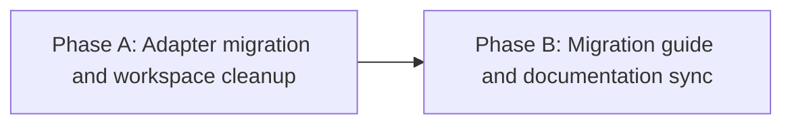

# HL — TFW_20260921-220500_AGSK: Antigravity Workflow-to-Skill Migration and Legacy .agent Retirement

> **Current filename**: `HL-TFW_20260921-220500_AGSK.md`
> **Date**: 2026-09-21
> **Author**: Antigravity Coordinator
> **Title**: Antigravity Workflow-to-Skill Migration and Legacy .agent Retirement
> **Abbreviation**: AGSK
> **Status**: 🔒 FROZEN
> **Contract**: 🔒 FROZEN — approved by saubakirov 2026-09-22
> **Frozen**: §1 · §3 · §4 · §5 · §6 · §7 — locked on owner approval
> **Free**: §2 · §7.2 · §8 · §9 · §10 · §11 — research updates these directly
> **Append-only**: §12 Amendment Log — the only channel for changing a frozen section
> **Baseline**: freeze commits — recovery form in `conventions.md` §3 rule 15

> **Project North Star**: `README.md § How It Works` · `.tfw/README.md`

---

## 1. Vision 🔒 FROZEN

Адаптер среды Google Antigravity в репозитории Steps Framework переведён на современную архитектуру навыков (`skills`), ликвидируя устаревший механизм рабочих процессов (`workflows`) и исключая разрыв ссылок при вызове команд. Каталог в единственном числе `.agent/` полностью выведен из эксплуатации и утилизирован как в исходном репозитории фреймворка, так и в сторонних проектах-потребителях через воспроизводимый протокол обновления. Командные поверхности Antigravity и Codex объединены вокруг общего канонического расположения `.agents/skills/`, устраняя избыточное дублирование файлов без потери функциональности.

**Impact:** Среда Antigravity получает нативную поддержку слэш-команд через зарегистрированные навыки, репозиторий полностью очищен от рудиментарных каталогов, а downstream-проекты получают исчерпывающее руководство по безопасной миграции собственных наработок без риска потери локальных инструкций.

> «TFW в Antigravity теперь работает через единые нативные навыки без устаревших промежуточных файлов и без малейших следов старой папки .agent».

---

## 2. Current State (As-Is) 🟢 FREE

1. **Раздвоение корневых каталогов вендора:**
   - В корне репозитория присутствует рудиментарный каталог `.agent/` (единственное число), содержащий устаревший файл `.agent/rules/agents.md` (2 649 байт).
   - Основные правила и навыки проекта уже размещены в `.agents/` (множественное число): правило `.agents/rules/tfw.md` и навыки `.agents/skills/tfw-{command}/SKILL.md`.

2. **Устаревшая поверхность рабочих процессов Antigravity:**
   - В каталоге `.agents/workflows/` сохраняются 10 файлов рабочих процессов (`tfw-plan.md`, `tfw-research.md`, `tfw-handoff.md`, `tfw-review.md`, `tfw-docs.md`, `tfw-knowledge.md`, `tfw-release.md`, `tfw-update.md`, `tfw-config.md`, `tfw-init.md`) суммарным объёмом ~68 КБ.
   - Вендор Antigravity объявил рабочие процессы устаревшими (`deprecated`), перейдя на навыки (`.agents/skills/<name>/SKILL.md`).
   - Правило `.agents/rules/tfw.md` и его шаблон `.tfw/adapters/antigravity/tfw-rules.md.template` содержат некорректную инструкцию: `For /tfw-*, open .agents/workflows/tfw-<command>.md`.

3. **Конфигурация инструментального манифеста (`.tfw/adapters/manifest.yaml`):**
   - Секция `antigravity` копирует канонические процессы в `.agents/workflows/tfw-{command}.md`.
   - Секция `codex` копирует навыки в `.agents/skills/tfw-{command}/SKILL.md`.
   - При этом формат навыков Antigravity полностью идентичен формату Codex (YAML-заголовок с `name` и `description` плюс инструкции).

4. **Проблема внешних проектов (Downstream Consumers):**
   - Проекты, использующие TFW, могут иметь локальные адаптации в `.agent/` (старые конвенции, файлы `ci-status.md`, `local-dev.md`, персональные правила). Слепое удаление каталога при обновлении приведёт к потере данных; отсутствие удаления сохраняет технический долг.

---

## 3. Target State (To-Be) 🔒 FROZEN

1. Каталог `.agent/` полностью удален из репозитория Steps Framework.
2. Каталог `.agents/workflows/` полностью удален; 10 файлов `tfw-*.md` выведены из состава репозитория.
3. Манифест `.tfw/adapters/manifest.yaml` перенаправляет команды Antigravity на целевой каталог навыков `.agents/skills/tfw-{command}/SKILL.md`.
4. Шаблон правила `.tfw/adapters/antigravity/tfw-rules.md.template` и установленный файл `.agents/rules/tfw.md` актуализированы: устранены отсылки к `.agents/workflows/`, зафиксировано обращение к соответствующему навыку команды.
5. Файл `.tfw/adapters/antigravity/README.md` актуализирован под правила и навыки в `.agents/`.
6. Опубликовано руководство по обновлению (миграции) в `.tfw/migrations/` с детальным алгоритмом переноса пользовательских артефактов из `.agent/` и безопасной утилизации старого каталога.
7. Документация репозитория (`KNOWLEDGE.md`, `README.md`, `README.ru.md`, `README.kk.md`) избавлена от упоминаний устаревших путей `.agent/` и рабочих процессов Antigravity.

### 3.1 Result Visualization

```text
БЫЛО:
steps-framework/
├── .agent/                      <-- [УСТАРЕЛ] Каталог в единственном числе
│   └── rules/agents.md          <-- Рудиментарное правило
├── .agents/
│   ├── rules/tfw.md             <-- Инструктирует открывать .agents/workflows/
│   ├── workflows/               <-- [УСТАРЕЛ] 10 файлов tfw-*.md (~68 КБ)
│   └── skills/                  <-- 10 навыков TFW (для Codex)
└── .tfw/adapters/
    ├── manifest.yaml            <-- antigravity -> .agents/workflows/
    └── antigravity/
        ├── README.md            <-- Документирует .agents/workflows/
        └── tfw-rules.md.template

СТАЛО:
steps-framework/
├── .agents/                     <-- Единственный рабочий корень адаптеров
│   ├── rules/tfw.md             <-- Правило ссылается на навыки /tfw-*
│   └── skills/                  <-- Единые навыки для Antigravity и Codex
│       ├── tfw-plan/SKILL.md
│       └── ...
├── .tfw/adapters/
│   ├── manifest.yaml            <-- antigravity -> .agents/skills/
│   └── antigravity/
│       ├── README.md            <-- Документирует .agents/skills/ и .agents/rules/
│       └── tfw-rules.md.template
└── .tfw/migrations/
    └── 3.5.0.md                 <-- Руководство по миграции и очистке .agent/
```

| Компонент / Файл | Состояние «Было» | Состояние «Стало» |
| :--- | :--- | :--- |
| Каталог `.agent/` | Присутствует, содержит `rules/agents.md` | Полностью отсутствует |
| Каталог `.agents/workflows/` | 10 файлов рабочих процессов | Полностью отсутствует |
| Манифест `antigravity.commands` | Target: `.agents/workflows/tfw-{command}.md` | Target: `.agents/skills/tfw-{command}/SKILL.md` |
| Правило `tfw.md` (Antigravity) | «open `.agents/workflows/tfw-<command>.md`» | Указание вызывать локальный навык команды |
| Руководство по обновлению | Отсутствуют указания по выводу `.agent/` | Документ с пошаговой классификацией и утилизацией |

### 3.2 Value Flow

```text
[Устаревшие workflows / рудимент .agent/]
                    │
                    ▼
   [Анализ и классификация файлов]
   ├── Системные файлы TFW (.agent/rules/agents.md, workflows/*.md) ──► Удаление
   └── Пользовательские наработки (внешние проекты) ──► Перенос в .agents/rules или README
                    │
                    ▼
[Обновление манифеста и адаптера Antigravity] ──► .agents/skills/ + актуальный шаблон правила
                    │
                    ▼
[Фиксация следов в .tfw/migrations/] ──► Воспроизводимый протокол для внешних систем
                    │
                    ▼
[Чистый репозиторий без технического долга и битых ссылок]
```

---

## 4. Phases 🔒 FROZEN

Задача выполняется в две последовательные фазы:

- **Фаза A:** Миграция адаптера Antigravity в Steps Framework, очистка репозитория от `.agent/` и `.agents/workflows/`.
- **Фаза B:** Разработка руководства по миграции для внешних проектов, обновление реестра знаний и сводной документации.

### 4.1 Coordination Selection 🔒 FROZEN

| Activation source | Accountable owner | Delegated Coordinator unit | Mandate scope / role reach | Dialogue | Reservations / controls | Amendment authority | Immutable epoch |
|---|---|---|---|---|---|---|---|
| owner-direct | saubakirov | N/A — owner-direct | Phases A and B (Coordinator, Executor, Reviewer) | tfw-gates-only | Whole-task approval, phase transitions | none | N/A |

### Phase Dependencies



| Phase | Depends on | Shared files | Can run in parallel with |
|---|---|---|---|
| Phase A | Independent | `.tfw/adapters/manifest.yaml` | — |
| Phase B | Phase A | `KNOWLEDGE.md`, `README.md` | — |

### Phase A: Adapter Migration and Workspace Cleanup 🔴

**Context for coordinator:** Изучить `.tfw/adapters/manifest.yaml`, `.tfw/adapters/antigravity/`, `.agents/rules/tfw.md`, `.agent/`.
**Key decisions:** Перенаправление команд Antigravity в `.agents/skills/`, удаление папок `.agent/` и `.agents/workflows/`.
**Deliverables:**
1. Удаление каталога `.agent/` и файла `.agent/rules/agents.md`.
2. Удаление каталога `.agents/workflows/` и 10 файлов `tfw-*.md`.
3. Модификация `.tfw/adapters/manifest.yaml`: перевод `antigravity` на целевой путь `.agents/skills/tfw-{command}/SKILL.md`.
4. Обновление шаблона `.tfw/adapters/antigravity/tfw-rules.md.template` и установленного правила `.agents/rules/tfw.md`.
5. Обновление документа `.tfw/adapters/antigravity/README.md`.
6. Прохождение базовых тестов `python -m pytest tools/tests/ docs/scripts/ -q`.

### Phase B: Migration Guide and Documentation Sync 🟡

**Context for coordinator:** Изучить прецеденты миграций в `.tfw/migrations/` (`2.2.0.md`, `3.4.0.md`), структуру `KNOWLEDGE.md`.
**Key decisions:** Формирование правил безопасного переноса пользовательских файлов из `.agent/` во внешних проектах.
**Deliverables:**
1. Создание руководства по обновлению в `.tfw/migrations/` с инструкцией по утилизации `.agent/` и переносу пользовательских конвенций/правил.
2. Актуализация сводной таблицы адаптеров в `README.md`, `README.ru.md`, `README.kk.md`.
3. Актуализация записи об адаптерах в `KNOWLEDGE.md` (удаление упоминания `.agent/workflows/`).
4. Внесение записи в `.tfw/CHANGELOG.md`.

---

## 5. Definition of Done (DoD) 🔒 FROZEN

- ✅ 1. Каталог `.agent/` и файл `.agent/rules/agents.md` полностью отсутствуют в файловой системе репозитория.
- ✅ 2. Каталог `.agents/workflows/` и все находившиеся в нём 10 файлов `tfw-*.md` полностью удалены.
- ✅ 3. Манифест `.tfw/adapters/manifest.yaml` объявляет для `antigravity` целевой путь `.agents/skills/tfw-{command}/SKILL.md`.
- ✅ 4. Правило `.agents/rules/tfw.md` и шаблон `.tfw/adapters/antigravity/tfw-rules.md.template` не содержат ссылок на `.agents/workflows/`.
- ✅ 5. Документ `.tfw/adapters/antigravity/README.md` описывает актуальную модель навыков и правил `.agents/`.
- ✅ 6. Создано руководство по миграции в `.tfw/migrations/`, содержащее исчерпывающий протокол безопасной утилизации `.agent/` для внешних проектов.
- ✅ 7. Записи в `KNOWLEDGE.md`, `README.md`, `README.ru.md`, `README.kk.md` и `.tfw/CHANGELOG.md` приведены в соответствие с новой структурой адаптера.
- ✅ 8. Автоматизированные тесты `python -m pytest tools/tests/ docs/scripts/ -q` проходят успешно (14 passed).

---

## 6. Definition of Failure (DoF) 🔒 FROZEN

- ❌ 1. Сохранение каталога `.agent/` или его содержимого в репозитории.
- ❌ 2. Сохранение каталога `.agents/workflows/` или ссылок на него в установленных правилах.
- ❌ 3. Потеря или дублирование файлов навыков в `.agents/skills/`.
- ❌ 4. Отсутствие в руководстве по миграции явных инструкций по сохранению пользовательских (не-TFW) файлов из `.agent/`.
- ❌ 5. Падение автоматизированных тестов репозитория.

**On failure:** Откат незафиксированных изменений, выявление причин расхождения с манифестом, эскалация владельцу при обнаружении непредвиденных зависимостей.

---

## 7. Principles 🔒 FROZEN

1. **Единый источник истины (Single Source of Truth)** — Манифест `.tfw/adapters/manifest.yaml` является единственным авторитетом для путей установки адаптеров; рабочие правила и документация точно воспроизводят его конфигурацию.
2. **Нулевой технический долг** — Выведенные из эксплуатации файлы и каталоги удаляются целиком, а не маскируются или переименовываются во временные копии.
3. **Безопасность внешних потребителей** — Любое деструктивное изменение сопровождается точным миграционным протоколом, защищающим пользовательские данные.
4. **Отсутствие сикофанства и плейсхолдеров** — Все создаваемые руководства и правила содержат готовый к продуктовой эксплуатации текст.

---

## 7.1 Quality Contract 🔒 FROZEN

- Команды Antigravity должны гарантированно разрешаться в те же канонические файлы рабочих процессов (`.tfw/workflows/*.md`), что и команды других адаптеров.
- Запрещается создавать промежуточные перенаправления или скрипты-обёртки, маскирующие старые пути.
- Форматирование путей в документации для пользователя адаптируется под стандарты Markdown с активными относительными ссылками.

### 7.2 Knowledge Citations 🟢 FREE

| # | Source | Item | How it applies |
|---|--------|------|----------------|
| 1 | `README.md` | § How It Works (P0) | Обеспечивает наглядную и единообразную организацию каталогов проекта. |
| 2 | `.tfw/conventions.md` | Role Lock Protocol (P1) | Регулирует разделение ролей Координатора, Исполнителя и Проверяющего. |
| 3 | `.tfw/compilable_contract.md` | §2 Reference Format (P2) | Обеспечивает компилируемость ссылок и валидность кросс-ссылок в артефактах. |
| 4 | `KNOWLEDGE.md` | Row "Adapters" (P3) | Фиксирует статус `.agents` как авторитетного корня и устаревание `.agent`. |
| 5 | `.tfw/adapters/manifest.yaml` | Секции adapters (P5) | Определяет структуру синхронизации файлов между каноном и целевыми каталогами. |

---

## 8. Dependencies 🟢 FREE

| Dependency | Status |
|---|---|
| Спецификация навыков Antigravity (`agy-customizations`) | ✅ Изучена, совместимость подтверждена |
| Каталог существующих навыков `.agents/skills/` | ✅ Навыки развёрнуты и функционируют |
| Согласование владельца по направлению миграции | ✅ Получено |

---

## 9. Risks 🟢 FREE

| Risk | Probability | Impact | Mitigation |
|---|---|---|---|
| Потеря пользовательских файлов во внешних проектах при удалении `.agent/` | Средняя | Высокая | Включение в руководство миграции обязательного шага инспекции и классификации файлов перед удалением. |
| Нарушение работы генератора документации из-за удаления `.agents/workflows` | Низкая | Средняя | Прогон `test_gen_docs.py` и `gen_docs.py` на этапе Фазы A. |
| Конфликт путей команд Antigravity и Codex в манифесте | Низкая | Низкая | Использование единого целевого пути `.agents/skills/tfw-{command}/SKILL.md`. |

---

## 10. RESEARCH Case 🟢 FREE

### Blind Spots
- Имеются ли во внешних скриптах репозитория жестко закодированные строки вида `.agents/workflows`? (Предварительный поиск по `tools/` и `docs/` показал отсутствие критических зависимостей, но требуется контрольная проверка).

### Hypotheses

| # | Hypothesis | Status |
|---|---|---|
| H1 | Среда Antigravity успешно подхватывает слэш-команды из `.agents/skills/` без необходимости сохранения `.agents/workflows/`. | confirmed (проверено на практике текущей сессии) |
| H2 | Удаление `.agents/workflows/` не ломает ни один из 14 существующих тестов репозитория. | open (будет подтверждено на Фазе A) |

### Risks of Not Researching
Поскольку архитектура навыков Antigravity уже валидирована вендором и подтверждена на практике (вызов `/tfw-plan` в текущей сессии уже отработал через навык), отдельный цикл исследования через `/tfw-research` не требуется; гипотезы носят верификационный характер и проверяются в рамках TS Фазы A.

### Why Not Just...?
- **Почему бы просто не оставить `.agents/workflows/` рядом со `skills/`?** — Это сохраняет технический долг, путает агентов, читающих дерево проекта, и поддерживает дублирование файлов.
- **Почему бы не оставить `.agent/` для совместимости?** — Это продлевает фрагментацию экосистемы вендора, о ликвидации которой прямо заявил пользователь.

---

## 11. Strategic Insights (Planning) 🟢 FREE

| # | Insight | Category | Source |
|---|---|---|---|
| S1 | Пользователь прямо указал на необходимость полной ликвидации папки `agent` и устаревших workflows Antigravity во всей экосистеме проекта с созданием четких следов миграции для остальных. | Direction | Пользовательский запрос в начале сессии |

---

## 12. Amendment Log 🟢 APPEND-ONLY

**No amendments.**

### Material handover at this return
- **Producer unit:** Antigravity Coordinator (`8888199a-c102-44c8-b661-f9c6bef8d7a6`).
- **Inspected scope:** `.agent/`, `.agents/`, `.tfw/adapters/`, `adapters/manifest.yaml`, `.tfw/migrations/`.
- **Material findings:** Подтверждена полная готовность репозитория к переходу на навыки и безопасной утилизации устаревших каталогов.
- **Continuation:** Переход к формированию спецификации Фазы A (`TS__phase-a__adapter_migration_and_cleanup.md`) после фиксации базового контракта HL.

---

*HL — TFW_20260921-220500_AGSK: Antigravity Workflow-to-Skill Migration and Legacy .agent Retirement | 2026-09-21*
