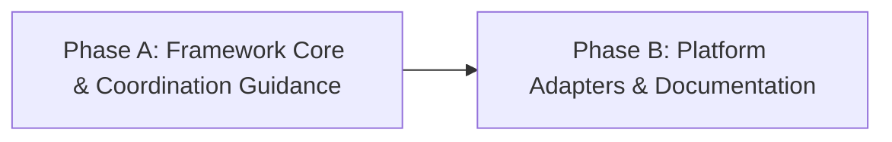

# HL — TFW_20260922-123250_CMTR: Coordinator-Assisted Model Selection, Thinking Budgeting, and Platform-Adaptive Launching

> **Current filename**: `HL-TFW_20260922-123250_CMTR.md`
> **Date**: 2026-09-22
> **Author**: Antigravity Coordinator
> **Title**: Coordinator-Assisted Model Selection, Thinking Budgeting, and Platform-Adaptive Launching
> **Abbreviation**: CMTR
> **Status**: 🔒 FROZEN
> **Contract**: 🔒 FROZEN — approved by saubakirov 2026-09-22
> **Frozen**: §1 · §3 · §4 · §5 · §6 · §7 — locked on owner approval
> **Free**: §2 · §7.2 · §8 · §9 · §10 · §11 — research updates these directly
> **Append-only**: §12 Amendment Log — the only channel for changing a frozen section
> **Baseline**: freeze commits — recovery form in `conventions.md` §3 rule 15

> **Project North Star**: `README.md § How It Works` · `.tfw/README.md #ns1 · #ns2 · #ns3`

---

## 1. Vision 🔒 FROZEN

Координатор TFW расширен возможностью интеллектуального выбора платформенной модели и калибровки глубины рассуждений (thinking budget / reasoning effort) для каждого нового запуска роли жизненного цикла. Каждый запуск скилла TFW (`/tfw-*`) — это всегда отдельный полноценный чат-агент (сессия / окно / задача), запускаемый человеком либо платформой (при наличии нативных возможностей). Механизм устраняет слепую трату токенов и квот на рутинных процедурных операциях при гарантированном сохранении максимальной когнитивной мощности на архитектурных, состязательных и исследовательских этапах.

В полностью автономном режиме координатор самостоятельно конфигурирует создаваемую независимую сессию (например, в Codex Desktop native tasks), а при участии человека выдает точные ориентиры для переключателей интерфейса нового окна/чата (модель и уровень thinking) с прозрачным обоснованием компромисса «качество / стоимость». Субагенты внутри существующих сессий принципиально отделены от ролевых чат-агентов TFW и в рамках этой задачи не рассматриваются.

**Impact:** Экономия до 50–70% токенов и квот сессий на процедурных и рутинных фазах (документация, мелкие правки, синхронизация) без деградации глубины анализа на критических развилках (планирование, ресерч, ревью). Координатор также получает способность к самодиагностике активной сессии и своевременной рекомендации человеку сменить собственную модель (upshift при нехватке мощности / downshift при избыточности).

> «Координатор теперь видит цену вычислений: на простых правках он не сжигает дорогой thinking флагманов, а на сложном анализе жестко требует максимальной концентрации, подсказывая человеку точный выбор в интерфейсе конкретной платформы».

---

## 2. Current State (As-Is) 🟢 FREE

1. **Когнитивная неизбирательность запусков и феномен overthinking:**
   - В TFW роли (Coordinator, Researcher, Executor, Reviewer) запускаются в новых чатах с той моделью и силой thinking, которая случайно оказалась активной в интерфейсе по умолчанию.
   - Для мелких правок документации (`/tfw-docs`), рутинного форматирования или механических фиксов используются тяжелые reasoning-модели с максимальным thinking, что сжигает токены, замедляет работу в 5–10 раз, исчерпывает контекстные окна и упирается в лимиты запросов (rate limits).
   - Исследование итерации 1 выявило феномен «галлюцинаций глубины» (overthinking): избыточный thinking на процедурной рутине провоцирует модель усложнять элементарные правки, выдумывать несуществующие проблемы и нарушать целостность существующих ссылок.
   - Напротив, при сложном планировании или состязательном ревью (`/tfw-review`) запуск легковесных моделей без thinking ведет к сикофантии, поверхностным проверкам и пропуску дефектов.

2. **Отсутствие ориентиров в контракте координации:**
   - В текущем `.tfw/workflows/plan.md` Шаг 5 («Coordination Selection Gate») и секции HL §4.1 фиксируют источник активации, владельца, шлюз и тип диалога (`tfw-gates-only`), но полностью игнорируют параметры когнитивного ресурса (модель, thinking budget, профиль нагрузки).
   - В шаблонах `HL.md` и `TS.md` нет выделенного поля или ориентиров, заставляющих координатора задуматься о требуемой когнитивной мощности исполнителя или исследователя.

3. **Различие платформ и интерфейсов запуска полноценных чат-агентов:**
   - **Google Antigravity:** Запуск нового окна/чата человеком через UI-селектор модели и переключатель thinking (например, Gemini 3.8 Flash vs Claude 3.7 Sonnet).
   - **OpenAI Codex:** Поддерживает выбор модели и `reasoning_effort` (`low`, `medium`, `high`) в UI сессии, а также нативное программное создание независимых задач-тредов (`task creation`).
   - **Claude Code / Desktop:** Поддерживает выбор моделей в интерфейсе и флаги CLI (`--model`, `--max-thinking-tokens`).
   - Пользователю приходится вручную угадывать, какую модель и какой уровень thinking выставить в интерфейсе перед открытием нового чата под очередную команду `/tfw-*`.

4. **Отсутствие саморефлексии координатора:**
   - Если координатор запущен на слабой модели (например, Flash без thinking) и пытается декомпозировать сложнейшую многокомпонентную систему, он не осознает нехватку ресурса и не предлагает пользователю переключить сессию на более мощную модель.

5. **Результат повторной проверки всей задачи 2026-09-22:**
   - Исходная потребность относится к каждому конкретному запуску роли, но действующий контракт классифицирует роли и фазы заранее и фиксирует профиль в HL/TS.
   - Модель и глубина рассуждения ошибочно сведены в один трехуровневый профиль. Подходящая модель и достаточный reasoning effort — два самостоятельных решения.
   - H1–H3 объявлены подтвержденными без наблюдения заявленного поведения: три заранее выбранных сценария не доказывают покрытие 95%, наличие поля TS не доказывает качество выбора, а описание самодиагностики не доказывает ее надежность.
   - Phase A Candidate `92c5ee4bb83271adbc8770af93c3c6f3e3be986b` реализует утвержденный TS, но не решает исходную задачу. Он находится в локальной истории, не прошел независимый REVIEW и не входит в `v3.5.1`; требуется последующее исправление без переписывания истории.
   - Нативная среда текущего Координатора позволяет создавать адресные Codex-задачи с явными `model` и `thinking`, отправлять сообщения, ждать возврат и проверять заголовок. Текущая модель уже открытой сессии не наблюдаема и не переключается этим механизмом.

---

## 3. Target State (To-Be) 🔒 FROZEN

1. **Расширение контракта координации без лишних сущностей:**
   - Шаг 5 процесса `plan.md` и раздел HL §4.1 органично расширены: координатор формулирует рекомендацию по классу модели и уровню thinking для фаз задачи и ролей.
   - В шаблоны `HL.md` (§4.1) и `TS.md` (раздел технического руководства / запуска) добавлены лаконичные поля с ориентирами когнитивного профиля и обоснованием.

2. **Простые и устойчивые критерии выбора:**
   - Разработаны понятные практические правила для градации задач (например, рутинные/процедурные vs стандартные инженерные vs архитектурные/состязательные) без усложненных формул и без жесткого привязывания к однодневным названиям версий моделей.
   - Каждая поддерживаемая платформа (Antigravity, Codex, Claude Code) мапит эти критерии на свои нативные переключатели и параметры.

3. **Два режима поддержки пользователя (строго для полноценных чат-сессий):**
   - **UI / Owner-Assisted запуск:** Координатор выдает четкую рекомендацию для человека при открытии нового чата/окна: какую модель выбрать в селекторе интерфейса и какой режим thinking установить, сопровождая выбор понятным обоснованием (1–2 предложения).
   - **Автономный запуск (делегированный мандат):** Если платформа поддерживает нативное создание независимых полноценных сессий/задач (например, task tools в Codex), координатор сам передает выверенные параметры модели и effort при создании сессии, фиксируя обоснование в логе/журнале.

4. **Самокалибровка координатора (Self-Calibration):**
   - Координатор оценивает сложность стоящей перед ним задачи и, в случае явного несоответствия текущей рабочей модели (избыточный оверхед на тривиальном или риск потери качества на сложном), явно рекомендует человеку переключить модель текущего окна.

5. **Обязательная граундед-инспекция платформы перед рекомендацией:**
   - Координатор обязан программно или процедурно инспектировать реальный ростер доступных моделей платформы (например, через `agy models` в Antigravity, `codex --help` в Codex, `claude --help` в Claude Code), связывая абстрактный класс сложности с реальными пунктами селектора.
   - Категорически запрещено называть модели по памяти или из статической обучающей выборки. При отсутствии инструмента инспекции координатор обязан явно декларировать ненаблюдаемость и указывать только абстрактный когнитивный класс.

### 3.1 Result Visualization

| Контекст запуска | Что видит пользователь / Что делает система | Обоснование / Ценность |
| :--- | :--- | :--- |
| **Выдача рекомендаций для нового чата в UI (Antigravity / Claude / Codex UI)** | `[Coordinator Guidance -> New Chat Session for /tfw-handoff]`<br>• Инспекция среды: выполнена `agy models`<br>• Новое окно/чат: **Открыть новый чат**<br>• Модель в селекторе UI: **Gemini 3.8 Flash (Low)**<br>• Thinking: **Low / Off**<br>• Команда: `/tfw-handoff`<br>• Обоснование: Задачи фазы чисто процедурные (обновление Markdown-таблиц). Флагман с высоким thinking создаст задержку и потратит квоту впустую. | Человек за 2 секунды кликает нужную модель в интерфейсе нового окна; экономия токенов и ускорение ответа. |
| **Сложный этап ревью в новом чате (`/tfw-review`)** | `[Coordinator Guidance -> New Chat Session for /tfw-review]`<br>• Инспекция среды: выполнена `agy models`<br>• Новое окно/чат: **Открыть независимый чат Reviewer**<br>• Модель в селекторе UI: **Claude Sonnet 4.6 (Thinking) / Gemini 3.1 Pro (High)**<br>• Thinking: **High / Extended**<br>• Команда: `/tfw-review`<br>• Обоснование: Независимое состязательное ревью кода и контракта HL требует максимальной глубины проверки граничных условий. | Защита качества проекта: исключение сикофантии и фиктивного апрува на реальных моделях платформы. |
| **Автономное создание сессии (Codex native tasks)** | Создание отдельного независимого треда с реальными параметрами платформы (например, `model="gpt-oss-120b"`, `reasoning_effort="medium"`) и записью в журнал: «Исполнитель запущен в отдельном треде на проверенной модели платформы, так как TS полностью специфицирован». | Полная автоматизация без необходимости ручного вмешательства человека. |
| **Самокалибровка координатора в текущей сессии** | `⚠️ Рекомендация координатора: Текущая сессия запущена на модели класса Flash. Для качественного планирования архитектуры TFW рекомендуется переключить селектор модели в текущем окне на Pro / High Thinking для предотвращения потери системных связей.` | Предотвращение архитектурного брака на самом раннем этапе (Inception). |

### 3.2 Value Flow

```text
[Вход: Тип задачи, Роль, Степень риска, Платформа]
                         │
                         ▼
             [Оценка сложности в Plan/Handoff]
             ├── Процедурная рутина (docs, sync, lint) ────► Fast tier / Low thinking
             ├── Стандартная реализация по TS ─────────────► Balanced tier / Medium thinking
             └── Архитектура, Inception, Review, Deep Res ──► Heavy reasoning / High thinking
                         │
                         ▼
            [Проверка режима автономности]
            ├── Есть мандат и API создания сессий (Codex task API)?
            │    └── ДА: Автономное создание нового треда с нужными параметрами + запись в лог
            └── НЕТ (Ручной UI запуск нового окна/чата):
                 └── Выдача человеку точной подсказки для селектора UI нового окна с обоснованием
```

---

## 4. Phases 🔒 FROZEN

Задача выполняется в две взаимосвязанные фазы:

- **Фаза A:** Интеграция в ядро фреймворка и шаблоны (исследование критериев, расширение `plan.md`, `HL.md §4.1`, `TS.md`, конвенций координации `conventions.md §7` и правила самокалибровки координатора).
- **Фаза B:** Адаптация под платформы и документация (спецификация поведения для Antigravity, Codex и Claude Code, синхронизация правил и обновление базы знаний).

### 4.1 Coordination Selection 🔒 FROZEN

| Activation source | Accountable owner | Delegated Coordinator unit | Mandate scope / role reach | Dialogue | Reservations / controls | Amendment authority | Immutable epoch |
|---|---|---|---|---|---|---|---|
| owner-direct | saubakirov | N/A — owner-direct | Phases A and B (Coordinator, Researcher, Executor, Reviewer) | tfw-gates-only | Whole-task approval, phase transitions, model guidance adoption | none | N/A |

### Phase Dependencies



| Phase | Depends on | Shared files | Can run in parallel with |
|---|---|---|---|
| Phase A | Independent | `.tfw/workflows/plan.md`, `.tfw/conventions.md`, `.tfw/templates/HL.md`, `.tfw/templates/TS.md` | — |
| Phase B | Phase A | `.agents/rules/tfw.md`, `.tfw/adapters/`, `KNOWLEDGE.md`, `README.md` | — |

### Phase A: Framework Core & Coordination Guidance 🔴

**Context for coordinator:** Изучить `.tfw/workflows/plan.md` (Шаг 5), `.tfw/conventions.md §7`, `.tfw/templates/HL.md`, `.tfw/templates/TS.md`.
**Key decisions:**
- Расширение существующего Шага 5 координации в `plan.md` блоком выбора модели и thinking budget для новых сессий ролей (без раздувания новых этапов).
- Добавление в шаблон `HL.md` (§4.1) и `TS.md` лаконичных строк/полей для фиксации рекомендованного профиля исполнения и его обоснования.
- Включение простого правила самокалибровки координатора (сигнал о смене собственной модели).
- Строгое разграничение: ориентир на полноценные чат-сессии/окна, исключение субагентов из рассмотрения.
**Deliverables:**
1. Результаты ресерча по простым и надежным критериям градации сложности задач и уровней thinking.
2. Обновление `.tfw/workflows/plan.md`: добавление лаконичного правила формирования когнитивных рекомендаций при планировании и передаче фаз.
3. Обновление `.tfw/conventions.md §7`: фиксация принципов выбора моделей, уровней thinking и дуального запуска сессий (автономия vs подсказка для нового окна UI).
4. Обновление шаблонов `.tfw/templates/HL.md` и `.tfw/templates/TS.md`.

### Phase B: Platform Adapters & Documentation Sync 🟡

**Context for coordinator:** Изучить `.tfw/adapters/` (antigravity, codex, claude-code), `.agents/rules/tfw.md`, документацию проекта.
**Key decisions:**
- Спецификация практических ориентиров для Google Antigravity (UI dropdown), OpenAI Codex (UI dropdown / нативные задачи `reasoning_effort`), Claude Code/Desktop (UI dropdown, CLI flags).
- Фиксация новых архитектурных решений в `KNOWLEDGE.md` и `CHANGELOG.md`.
**Deliverables:**
1. Обновление адаптеров Antigravity, Codex и Claude Code с подсказками по нативному выбору моделей в интерфейсе или при создании сессий.
2. Актуализация правила `.agents/rules/tfw.md` и корневого `AGENTS.md`.
3. Фиксация решения в `KNOWLEDGE.md` и документации фреймворка.
4. Прохождение верификационных проверок и тестов репозитория.

---

## 5. Definition of Done (DoD) 🔒 FROZEN

- ✅ 1. Исследованы и формализованы простые эвристики сопоставления типов задач/ролей с когнитивной мощностью и силой thinking для полноценных чат-агентов.
- ✅ 2. В `.tfw/workflows/plan.md` интегрирован компактный шаг оценки модели и thinking budget в рамках существующего контракта координации.
- ✅ 3. В `.tfw/templates/HL.md` (§4.1) и `.tfw/templates/TS.md` добавлены канонические поля для фиксации профиля исполнения и его обоснования.
- ✅ 4. В `.tfw/conventions.md §7` зафиксированы правила дуального запуска сессий: автономный выбор при наличии API/мандата на создание задач и явная подсказка для UI человека при открытии нового окна.
- ✅ 5. Сформулировано и внесено в конвенции правило самокалибровки координатора (рекомендация смены собственной модели в активном окне).
- ✅ 6. Адаптеры Antigravity, Codex и Claude Code актуализированы с учетом их платформенных особенностей выбора моделей в UI/сессиях.
- ✅ 7. Специфицирован и интегрирован протокол обязательной граундед-инспекции платформы: координатор проверяет доступные модели через нативные инструменты среды (например, `agy models`) перед выдачей рекомендации или явно заявляет об отсутствии механизма инспекции.
- ✅ 8. Все статические проверки и тесты репозитория (`pytest`) успешно проходят без регрессий.

---

## 6. Definition of Failure (DoF) 🔒 FROZEN

- ❌ 1. Подмена концепции полноценных чат-агентов TFW субагентами или внутрисессионными тул-воркерами.
- ❌ 2. Появление тяжелых, громоздких систем абстракций или калькуляторов токенов, перегружающих внимание координатора.
- ❌ 3. Жесткое захардкоживание конкретных преходящих версий моделей в ядро TFW без возможности их легкой замены в адаптерах платформы.
- ❌ 4. Потеря качества или состязательности на фазах планирования и ревью из-за необоснованного занижения thinking budget.
- ❌ 5. Нарушение Role Lock или попытка агента подменить полномочия человека при отсутствии автономного мандата.
- ❌ 6. Выдача только CLI-команд для сред, где основной запуск осуществляется человеком через графический интерфейс (UI нового окна).
- ❌ 7. Галлюцинирование названиями моделей из статической памяти LLM вместо реальной проверки инструментов и окружения платформы.

**On failure:** Откат правок, возврат на этап ресерча, пересмотр эвристик в сторону максимальной простоты и наглядности.

---

## 7. Principles 🔒 FROZEN

1. **Полноценные чат-агенты, а не субагенты:** Каждый скилл и слэш-команда TFW — это всегда отдельный полноценный чат-агент (сессия / окно / задача), запускаемый человеком или платформой. Субагенты принципиально не являются ролевыми юнитами TFW и здесь не рассматриваются.
2. **Естественное расширение, а не раздувание сущностей (F43, F45):** Не создавать параллельных громоздких институтов или отдельных файлов конфигурации моделей. Расширять существующий контракт координации (`conventions.md §7`, `plan.md Step 5`).
3. **Фреймворк предлагает — человек выбирает (F25):** В ручном режиме координатор дает ясную рекомендацию и контекст решения, но не блокирует человека жесткими догмами.
4. **Платформенная честность (D59):** Учитывать реальные возможности конкретной среды запуска (Antigravity UI vs Codex native tasks vs Claude Desktop), не приписывая платформе несуществующих механизмов оркестрации.
5. **Бескомпромиссность на защите ценностей (F3, D64):** Ревью и архитектурное планирование никогда не понижаются до низкоуровневых моделей без thinking — состязательность и глубина критики имеют абсолютный приоритет.
6. **Прозрачность любого выбора:** Как в автономном, так и в ручном режиме выбор модели и thinking обязательно сопровождается 1–2 предложениями четкого обоснования («почему именно этот профиль»).
7. **Граундед-инспекция вместо статической памяти:** Координатор никогда не галлюцинирует названиями моделей из обучающей выборки. Любая рекомендация опирается на актуальную инспекцию платформенных инструментов (например, `agy models`) либо оперирует исключительно абстрактными классами (Fast / Balanced / Heavy), если среда не предоставляет API инспекции.

### 7.1 Quality Contract 🔒 FROZEN

- Изменения в воркфлоу `plan.md` и шаблонах должны быть минималистичными (1–2 предложения / 1 компактный блок), следуя принципу Сент-Экзюпери.
- Документация должна приводить примеры для реальных платформ (Antigravity, Codex, Claude Code), показывая, как одна и та же абстрактная потребность реализуется в каждой среде.

### 7.2 Knowledge Citations 🟢 FREE

| # | Source | Item | How it applies |
|---|--------|------|----------------|
| 1 | `.tfw/README.md` | NS1 — Purpose | Экономия допустима только как средство; запуск обязан сохранять цель, основания, власть и возможность продолжения. |
| 2 | `.tfw/README.md` | Methodology values · Success Criteria | Выбор должен быть честным, платформенно переносимым и давать готовый к приемке результат, а не красивую рекомендацию. |
| 3 | `knowledge/philosophy.md` | F3 · F36 · F40 · F43 | Критическая независимость, различение качества и цели, точный термин вместо прозы и архитектура вместо исправления симптомов. |
| 4 | `KNOWLEDGE.md` | D59 · D64 · D78 | Доступность не равна проверенности; цель проверяется отдельно от формального соответствия; прокси-метрика не заменяет причинное доказательство. |
| 5 | `KNOWLEDGE.md` | D79 · D80 · D81 · D83 | Модель не является идентичностью или властью; запуск остается отдельной адресной единицей с человеческим корнем полномочий. |
| 6 | `.tfw/conventions.md` | HL Contract · Coordination · Design Rules · Anti-patterns | Замороженный контракт меняется только поправкой; правило должно действовать в точке запуска и не превращаться в счетчик или декоративное поле. |
| 7 | `knowledge/process.md` | F22 · F30 · F31 · F37 · F40 · F49 | Общая таблица возможностей — шум; правило без места применения не работает; неверная точка сравнения не исправляется более строгим ревью; числа без метода и поля без поведения не являются доказательством. |
| 8 | `knowledge/environment.md` | F5 · F6 | Сильные стороны моделей и топология запуска различаются по средам; Antigravity/Claude требуют собственного нативного подтверждения. |
| 9 | `knowledge/constraint.md` | F11 · F12 · F14 | Возможности измеряются на установленной поверхности; обязательство живет в проектных файлах; автономная цепочка сохраняет отдельные роли. |

---

## 8. Dependencies 🟢 FREE

| Dependency | Status |
|---|---|
| Стабильное состояние репозитория после TFW-AGSK | ✅ |
| Доступ к манифесту адаптеров и шаблонам TFW | ✅ |

---

## 9. Risks 🟢 FREE

| Risk | Probability | Impact | Mitigation |
|---|---|---|---|
| Текущий трехуровневый профиль скрывает реальные причины выбора | High | High | Оценивать конкретный запуск по неопределенности, охвату связей, силе внешней проверки и цене ошибки; не выводить выбор из имени роли. |
| Статический список моделей устаревает или не совпадает с доступностью аккаунта | High | High | Читать нативный ростер непосредственно перед запуском; при ненаблюдаемости не называть точную модель. |
| Экономия квоты понижает качество ниже необходимого | Medium | High | Сначала установить нижнюю границу качества, затем минимизировать стоимость только среди достаточных вариантов. |
| Рекомендация существует в HL/TS, но не исполняется при создании задачи | High | High | Единственная точка применения — фактический dispatch: передать параметры нативно либо выдать человеку точный двухстрочный запуск. |
| Платформенная возможность объявлена по аналогии с другой средой | Medium | High | Отдельное нативное подтверждение источника ростера, параметров создания, адресации и readback для каждой заявленной среды. |

---

## 10. RESEARCH Case 🟢 FREE

### Blind Spots
- Какой минимальный набор факторов надежно задает нижнюю границу качества конкретного запуска без ролевой таксономии?
- Какие текущие среды дают авторитетный ростер доступных моделей и поддерживаемые значения reasoning effort именно для этого аккаунта/хоста?
- Какие платформы позволяют Координатору передать модель и thinking при создании отдельной адресной задачи, а где остается только точная инструкция человеку?
- Какие наблюдаемые исходы реальных запусков позволяют корректировать следующий выбор без ложных процентов экономии и без постоянной тестовой бюрократии?

### Hypotheses

| # | Hypothesis | Status |
|---|---|---|
| H1 | Решение «нижняя граница качества → минимальная достаточная стоимость» устойчивее ролевой трехуровневой классификации на реальных TFW-запусках. | open — прежнее подтверждение 95% отозвано как недоказанное |
| H2 | Раздельный выбор способности модели и reasoning effort предотвращает ошибки, которые скрывает единый профиль. | open — требуется сравнение решений на реальных запусках |
| H3 | Применение выбора непосредственно в dispatch надежнее замороженного поля HL/TS и не требует нового постоянного артефакта. | open — требуется нативный пилот |
| H4 | Для каждой заявленной платформы можно назвать авторитетный источник доступности и точный автономный либо owner-assisted способ запуска. | open — проверяется отдельно по платформам |

### Risks of Not Researching
Без повторного исследования задача закрепит непроверенную классификацию в ядре, будет выбирать профиль не в точке запуска и создаст видимость контроля качества без наблюдаемого поведения.

### Proposed RESEARCH Focus
1. **Gather**: Для каждой среды установить нативные источники ростера, допустимые параметры модели/thinking и возможность адресного создания отдельной задачи.
2. **Extract**: Вывести минимальную функцию решения из факторов качества, а не из заранее заданных классов и названий ролей.
3. **Challenge**: Применить функцию к следующим реальным запускам CMTR, записывая выбор, основание, фактический исход и необходимость повторной работы или повышения профиля.

### Why Not Just...?
- **Почему не оставить текущие три уровня?** Они смешивают тип работы, риск, сложность, модель и thinking и потому дают уверенный ярлык без доказательства достаточности.
- **Почему не записать рекомендацию в HL/TS?** Эти документы создаются раньше запуска, быстро устаревают и не охватывают все роли; решение обязано видеть фактическую работу и платформу в момент dispatch.
- **Почему не строить калькулятор токенов?** Доступные данные неполны и зависят от платформы; достаточно прозрачного правила минимальной достаточности и наблюдаемой коррекции следующего запуска.

---

## 11. Strategic Insights (Planning) 🟢 FREE

| # | Insight | Category | Source |
|---|---|---|---|
| S1 | Пользователь подчеркнул: цель — не генерация CLI-строк терминала, а помощь человеку при выборе модели в UI нового окна/чата (селектор модели в IDE) либо прямая настройка при автономном управлении сессиями (как в Codex Desktop native tasks). | platform | User, 2026-09-22 planning session |
| S2 | Не раздувать новые сущности и термины: достаточно сделать лаконичное расширение шага координации в `plan.md` и добавить раздел в корневой HL / шаблоны — само наличие раздела в шаблоне заставит агента думать. | methodology | User, 2026-09-22 planning session |
| S3 | Координатор должен уметь рефлексировать над собственной активной сессией и рекомендовать человеку сменить модель для себя, если задача слишком сложна или слишком примитивна. | coordination | User, 2026-09-22 planning session |
| S4 | Обоснование выбора обязательно: любая рекомендация модели и thinking должна содержать лаконичное объяснение компромисса. | transparency | User, 2026-09-22 planning session |
| S5 | Субагенты ≠ полноценные чат-агенты TFW. Каждый скилл TFW и каждая слэш-команда — это всегда отдельный полноценный чат-агент (новое окно/чат человеком или платформой, если она умеет создавать сессии нативно). CMTR ориентирован строго на полноценные чат-сессии, субагенты в задаче не рассматриваются. | methodology | User, 2026-09-22 planning session |
| S6 | Запретить координатору давать рекомендации по моделям из статической памяти LLM. Обязать агента нативно инспектировать свой инструмент (например, `agy models`) и давать строго граундед-обоснование на основе реально доступного ростера платформы. | groundedness | User, 2026-09-22 planning session |
| S7 | Исходная задача сформулирована как выбор перед каждым запуском: при автономии Координатор применяет параметры сам, иначе показывает человеку точный способ запуска, модель, режим и краткое обоснование. | methodology | User restatement, 2026-09-22 task-wide replan |
| S8 | Владелец не принимает длинные формулировки, текущий нейминг и саму стратегию классификации; проблема относится ко всей задаче, а не к качеству исполнения Phase A. | stakeholder | User correction, 2026-09-22 task-wide replan |
| S9 | Проверки количества документов, наличия коммита и соблюдения внутреннего бюджета не являются контролем качества результата; постоянная проверка оправдана только защищаемым поведением или риском. | methodology | User review-system feedback preceding CMTR replan, 2026-09-22 |
| S10 | Текущий Codex-task назначен владельцем новым лидером-Координатором CMTR; operational route изменен, но делегированный мандат и право на собственные поправки не предполагаются молчанием. | coordination | Owner-direct appointment, 2026-09-22 |

---

## 12. Amendment Log 🟢 APPEND-ONLY

| # | Date | § | Type | Proposer | Proposed change | Evidence | Cost | Alternatives considered | Verdict |
|---|------|---|------|----------|-----------------|----------|------|------------------------|---------|
| A1 | 2026-09-22 | §3, §5, §6, §7 | `EXTEND` | owner: saubakirov | Обязать координатора проводить нативную граундед-инспекцию доступных моделей и режимов reasoning платформы (через CLI-команды инспекции типа `agy models`, флаги `--help`, конфигурации окружения) перед выдачей рекомендации, полностью запретив называть модели по памяти или из статической обучающей выборки. | Живой кейс CMTR: координатор галлюцинировал устаревшими моделями из обучающей выборки (Claude 3.7, o3-mini), в то время как команда `agy models` нативно выявила реальный ростер 2026 года (Gemini 3.8 Flash, Claude Sonnet 4.6, Claude Opus 4.6, GPT-OSS 120B). | Добавление одного обязательного шага инспекции среды перед рекомендацией или честной декларации ненаблюдаемости. | Попытка описать модели статически в документации TFW — отклонена из-за неизбежного устаревания списков каждые несколько месяцев. | ✅ APPROVED — saubakirov, 2026-09-22 |
| A2 | 2026-09-22 | Title, §1, §3–§7 | `SUPERSEDE` | Coordinator `codex:thread:local:01a0c400-3e48-7422-bb86-3b34fe177aa5`; origin: owner task-wide correction | Переименовать результат в **Per-Launch Model and Reasoning Selection** (ID `CMTR` сохранить); заменить трехуровневую классификацию правилом «нижняя граница качества → наименее затратный достаточный вариант» для каждого фактического dispatch; выбирать модель и thinking раздельно; держать ростер и точные команды в платформенных привязках, не в ядре; автономно передавать параметры только при нативной возможности и мандате, иначе выдавать человеку двухстрочный запуск; удалить self-calibration текущего окна и обязательные поля профиля HL/TS; Phase A сохранить как не принятый результат прежней стратегии, затем выполнить Phase B «policy + platform contracts + real launch evidence» и Phase C «forward correction + minimal integration + live pilot». Предлагаемый мандат: principal `robert`, текущий Codex-task как root Coordinator, CMTR Phases B–C и отдельные Researcher/Executor/Reviewer units, `tfw-gates-only`, право выбирать launch parameters и управлять возвратами; владелец сохраняет цель/ценность, собственные предложения Координатора, REJECT, budget/scope exceptions, release/push и иные внешние эффекты; срок — до `DONE`/`REJECTED` или отзыва. | Исходная формулировка владельца и S7–S10; повторная проверка Candidate `92c5ee4`; недоказанные H1–H3; NS1/NS2; D59, D64, D78; `knowledge/process.md` F22/F31/F37/F40/F49; нативный ростер и task controls текущего Codex. | Отказ от уже выполненной стратегии Phase A; последующий исправляющий commit вместо переписывания истории; отдельная платформенная проверка и новые реальные запуски до интеграции. | (1) Формально отревьюить Phase A по старому TS — подтвердит исполнение, но не ценность; (2) подправить три класса — сохранит неверную ось; (3) закрыть CMTR — сохранит ручную ошибку выбора при каждом запуске. | ✅ APPROVED — saubakirov, 2026-09-22 |

---

### Material handover at this return

- **Producer unit**: Coordinator `codex:thread:local:01a0c400-3e48-7422-bb86-3b34fe177aa5`
- **Source epoch**: 2026-09-22 task-wide replanning after Phase A RF.
- **Inspected scope**: Governing HL and research, Phase A TS/RF/EV/Candidate diff, current workflows/templates/conventions, P0–P6 knowledge, task routing and native Codex task controls.
- **Materiality**: The Phase A implementation is faithful to a strategy that does not satisfy the owner's per-launch need. A2 proposes replacing the strategy, phase order and coordination mandate without rewriting prior commits.
- **Uncertainty**: Provider-native inventory and launch controls remain unverified for Antigravity and Claude; real launch outcomes have not yet tested the replacement rule.
- **Continuation**: Owner verdict on A2. No Phase B, execution, review or correction dispatch is authorized before that verdict.

---

*HL — TFW_20260922-123250_CMTR: Coordinator-Assisted Model Selection, Thinking Budgeting, and Platform-Adaptive Launching | 2026-09-22*
