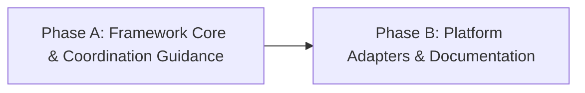

# HL — TFW_20260922-123250_CMTR: Coordinator-Assisted Model Selection, Thinking Budgeting, and Platform-Adaptive Launching

> **Current filename**: `HL-TFW_20260922-123250_CMTR.md`
> **Date**: 2026-09-22
> **Author**: Antigravity Coordinator
> **Title**: Coordinator-Assisted Model Selection, Thinking Budgeting, and Platform-Adaptive Launching
> **Abbreviation**: CMTR
> **Status**: 🔒 FROZEN
> **Contract**: 🔒 FROZEN — approved by saubakirov 2026-09-22
> **Frozen**: §1 · §3 · §4 · §5 · §6 · §7 — locked on owner approval
> **Free**: §2 · §7.2 · §8 · §9 · §10 · §11 — research updates these directly
> **Append-only**: §12 Amendment Log — the only channel for changing a frozen section
> **Baseline**: freeze commits — recovery form in `conventions.md` §3 rule 15

> **Project North Star**: `README.md § How It Works` · `.tfw/README.md #ns1 · #ns2 · #ns3`

---

## 1. Vision 🔒 FROZEN

Координатор TFW расширен возможностью интеллектуального выбора платформенной модели и калибровки глубины рассуждений (thinking budget / reasoning effort) для каждого нового запуска роли жизненного цикла. Каждый запуск скилла TFW (`/tfw-*`) — это всегда отдельный полноценный чат-агент (сессия / окно / задача), запускаемый человеком либо платформой (при наличии нативных возможностей). Механизм устраняет слепую трату токенов и квот на рутинных процедурных операциях при гарантированном сохранении максимальной когнитивной мощности на архитектурных, состязательных и исследовательских этапах.

В полностью автономном режиме координатор самостоятельно конфигурирует создаваемую независимую сессию (например, в Codex Desktop native tasks), а при участии человека выдает точные ориентиры для переключателей интерфейса нового окна/чата (модель и уровень thinking) с прозрачным обоснованием компромисса «качество / стоимость». Субагенты внутри существующих сессий принципиально отделены от ролевых чат-агентов TFW и в рамках этой задачи не рассматриваются.

**Impact:** Экономия до 50–70% токенов и квот сессий на процедурных и рутинных фазах (документация, мелкие правки, синхронизация) без деградации глубины анализа на критических развилках (планирование, ресерч, ревью). Координатор также получает способность к самодиагностике активной сессии и своевременной рекомендации человеку сменить собственную модель (upshift при нехватке мощности / downshift при избыточности).

> «Координатор теперь видит цену вычислений: на простых правках он не сжигает дорогой thinking флагманов, а на сложном анализе жестко требует максимальной концентрации, подсказывая человеку точный выбор в интерфейсе конкретной платформы».

---

## 2. Current State (As-Is) 🟢 FREE

1. **Когнитивная неизбирательность запусков:**
   - В TFW роли (Coordinator, Researcher, Executor, Reviewer) запускаются в новых чатах с той моделью и силой thinking, которая случайно оказалась активной в интерфейсе по умолчанию.
   - Для мелких правок документации (`/tfw-docs`), рутинного форматирования или механических фиксов используются тяжелые reasoning-модели с максимальным thinking, что сжигает токены, исчерпывает контекстные окна и упирается в лимиты запросов (rate limits).
   - Напротив, при сложном планировании или состязательном ревью (`/tfw-review`) запуск легковесных моделей без thinking ведет к сикофантии, поверхностным проверкам и пропуску дефектов.

2. **Отсутствие ориентиров в контракте координации:**
   - В текущем `.tfw/workflows/plan.md` Шаг 5 («Coordination Selection Gate») и секции HL §4.1 фиксируют источник активации, владельца, шлюз и тип диалога (`tfw-gates-only`), но полностью игнорируют параметры когнитивного ресурса (модель, thinking budget, профиль нагрузки).
   - В шаблонах `HL.md` и `TS.md` нет выделенного поля или ориентиров, заставляющих координатора задуматься о требуемой когнитивной мощности исполнителя или исследователя.

3. **Различие платформ и интерфейсов запуска полноценных чат-агентов:**
   - **Google Antigravity:** Запуск нового окна/чата человеком через UI-селектор модели и переключатель thinking (например, Gemini 3.8 Flash vs Claude 3.7 Sonnet).
   - **OpenAI Codex:** Поддерживает выбор модели и `reasoning_effort` (`low`, `medium`, `high`) в UI сессии, а также нативное программное создание независимых задач-тредов (`task creation`).
   - **Claude Code / Desktop:** Поддерживает выбор моделей в интерфейсе и флаги CLI (`--model`, `--max-thinking-tokens`).
   - Пользователю приходится вручную угадывать, какую модель и какой уровень thinking выставить в интерфейсе перед открытием нового чата под очередную команду `/tfw-*`.

4. **Отсутствие саморефлексии координатора:**
   - Если координатор запущен на слабой модели (например, Flash без thinking) и пытается декомпозировать сложнейшую многокомпонентную систему, он не осознает нехватку ресурса и не предлагает пользователю переключить сессию на более мощную модель.

---

## 3. Target State (To-Be) 🔒 FROZEN

1. **Расширение контракта координации без лишних сущностей:**
   - Шаг 5 процесса `plan.md` и раздел HL §4.1 органично расширены: координатор формулирует рекомендацию по классу модели и уровню thinking для фаз задачи и ролей.
   - В шаблоны `HL.md` (§4.1) и `TS.md` (раздел технического руководства / запуска) добавлены лаконичные поля с ориентирами когнитивного профиля и обоснованием.

2. **Простые и устойчивые критерии выбора:**
   - Разработаны понятные практические правила для градации задач (например, рутинные/процедурные vs стандартные инженерные vs архитектурные/состязательные) без усложненных формул и без жесткого привязывания к однодневным названиям версий моделей.
   - Каждая поддерживаемая платформа (Antigravity, Codex, Claude Code) мапит эти критерии на свои нативные переключатели и параметры.

3. **Два режима поддержки пользователя (строго для полноценных чат-сессий):**
   - **UI / Owner-Assisted запуск:** Координатор выдает четкую рекомендацию для человека при открытии нового чата/окна: какую модель выбрать в селекторе интерфейса и какой режим thinking установить, сопровождая выбор понятным обоснованием (1–2 предложения).
   - **Автономный запуск (делегированный мандат):** Если платформа поддерживает нативное создание независимых полноценных сессий/задач (например, task tools в Codex), координатор сам передает выверенные параметры модели и effort при создании сессии, фиксируя обоснование в логе/журнале.

4. **Самокалибровка координатора (Self-Calibration):**
   - Координатор оценивает сложность стоящей перед ним задачи и, в случае явного несоответствия текущей рабочей модели (избыточный оверхед на тривиальном или риск потери качества на сложном), явно рекомендует человеку переключить модель текущего окна.

### 3.1 Result Visualization

| Контекст запуска | Что видит пользователь / Что делает система | Обоснование / Ценность |
| :--- | :--- | :--- |
| **Выдача рекомендаций для нового чата в UI (Antigravity / Claude / Codex UI)** | `[Coordinator Guidance -> New Chat Session for /tfw-handoff]`<br>• Новое окно/чат: **Открыть новый чат**<br>• Модель в селекторе UI: **Gemini 3.8 Flash**<br>• Thinking: **Low / Off**<br>• Команда: `/tfw-handoff`<br>• Обоснование: Задачи фазы чисто процедурные (обновление Markdown-таблиц). Флагман с высоким thinking создаст задержку и потратит квоту впустую. | Человек за 2 секунды кликает нужную модель в интерфейсе нового окна; экономия токенов и ускорение ответа. |
| **Сложный этап ревью в новом чате (`/tfw-review`)** | `[Coordinator Guidance -> New Chat Session for /tfw-review]`<br>• Новое окно/чат: **Открыть независимый чат Reviewer**<br>• Модель в селекторе UI: **Claude 3.7 Sonnet / o3-mini**<br>• Thinking: **High / Extended**<br>• Команда: `/tfw-review`<br>• Обоснование: Независимое состязательное ревью кода и контракта HL требует максимальной глубины проверки граничных условий. | Защита качества проекта: исключение сикофантии и фиктивного апрува. |
| **Автономное создание сессии (Codex native tasks)** | Создание отдельного независимого треда с параметрами `model="o3-mini"`, `reasoning_effort="medium"` и записью в журнал: «Исполнитель запущен в отдельном треде на модели o3-mini (effort: medium), так как TS полностью специфицирован». | Полная автоматизация без необходимости ручного вмешательства человека. |
| **Самокалибровка координатора в текущей сессии** | `⚠️ Рекомендация координатора: Текущая сессия запущена на модели класса Flash. Для качественного планирования архитектуры TFW рекомендуется переключить селектор модели в текущем окне на Pro / High Thinking для предотвращения потери системных связей.` | Предотвращение архитектурного брака на самом раннем этапе (Inception). |

### 3.2 Value Flow

```text
[Вход: Тип задачи, Роль, Степень риска, Платформа]
                         │
                         ▼
             [Оценка сложности в Plan/Handoff]
             ├── Процедурная рутина (docs, sync, lint) ────► Fast tier / Low thinking
             ├── Стандартная реализация по TS ─────────────► Balanced tier / Medium thinking
             └── Архитектура, Inception, Review, Deep Res ──► Heavy reasoning / High thinking
                         │
                         ▼
            [Проверка режима автономности]
            ├── Есть мандат и API создания сессий (Codex task API)?
            │    └── ДА: Автономное создание нового треда с нужными параметрами + запись в лог
            └── НЕТ (Ручной UI запуск нового окна/чата):
                 └── Выдача человеку точной подсказки для селектора UI нового окна с обоснованием
```

---

## 4. Phases 🔒 FROZEN

Задача выполняется в две взаимосвязанные фазы:

- **Фаза A:** Интеграция в ядро фреймворка и шаблоны (исследование критериев, расширение `plan.md`, `HL.md §4.1`, `TS.md`, конвенций координации `conventions.md §7` и правила самокалибровки координатора).
- **Фаза B:** Адаптация под платформы и документация (спецификация поведения для Antigravity, Codex и Claude Code, синхронизация правил и обновление базы знаний).

### 4.1 Coordination Selection 🔒 FROZEN

| Activation source | Accountable owner | Delegated Coordinator unit | Mandate scope / role reach | Dialogue | Reservations / controls | Amendment authority | Immutable epoch |
|---|---|---|---|---|---|---|---|
| owner-direct | saubakirov | N/A — owner-direct | Phases A and B (Coordinator, Researcher, Executor, Reviewer) | tfw-gates-only | Whole-task approval, phase transitions, model guidance adoption | none | N/A |

### Phase Dependencies



| Phase | Depends on | Shared files | Can run in parallel with |
|---|---|---|---|
| Phase A | Independent | `.tfw/workflows/plan.md`, `.tfw/conventions.md`, `.tfw/templates/HL.md`, `.tfw/templates/TS.md` | — |
| Phase B | Phase A | `.agents/rules/tfw.md`, `.tfw/adapters/`, `KNOWLEDGE.md`, `README.md` | — |

### Phase A: Framework Core & Coordination Guidance 🔴

**Context for coordinator:** Изучить `.tfw/workflows/plan.md` (Шаг 5), `.tfw/conventions.md §7`, `.tfw/templates/HL.md`, `.tfw/templates/TS.md`.
**Key decisions:**
- Расширение существующего Шага 5 координации в `plan.md` блоком выбора модели и thinking budget для новых сессий ролей (без раздувания новых этапов).
- Добавление в шаблон `HL.md` (§4.1) и `TS.md` лаконичных строк/полей для фиксации рекомендованного профиля исполнения и его обоснования.
- Включение простого правила самокалибровки координатора (сигнал о смене собственной модели).
- Строгое разграничение: ориентир на полноценные чат-сессии/окна, исключение субагентов из рассмотрения.
**Deliverables:**
1. Результаты ресерча по простым и надежным критериям градации сложности задач и уровней thinking.
2. Обновление `.tfw/workflows/plan.md`: добавление лаконичного правила формирования когнитивных рекомендаций при планировании и передаче фаз.
3. Обновление `.tfw/conventions.md §7`: фиксация принципов выбора моделей, уровней thinking и дуального запуска сессий (автономия vs подсказка для нового окна UI).
4. Обновление шаблонов `.tfw/templates/HL.md` и `.tfw/templates/TS.md`.

### Phase B: Platform Adapters & Documentation Sync 🟡

**Context for coordinator:** Изучить `.tfw/adapters/` (antigravity, codex, claude-code), `.agents/rules/tfw.md`, документацию проекта.
**Key decisions:**
- Спецификация практических ориентиров для Google Antigravity (UI dropdown), OpenAI Codex (UI dropdown / нативные задачи `reasoning_effort`), Claude Code/Desktop (UI dropdown, CLI flags).
- Фиксация новых архитектурных решений в `KNOWLEDGE.md` и `CHANGELOG.md`.
**Deliverables:**
1. Обновление адаптеров Antigravity, Codex и Claude Code с подсказками по нативному выбору моделей в интерфейсе или при создании сессий.
2. Актуализация правила `.agents/rules/tfw.md` и корневого `AGENTS.md`.
3. Фиксация решения в `KNOWLEDGE.md` и документации фреймворка.
4. Прохождение верификационных проверок и тестов репозитория.

---

## 5. Definition of Done (DoD) 🔒 FROZEN

- ✅ 1. Исследованы и формализованы простые эвристики сопоставления типов задач/ролей с когнитивной мощностью и силой thinking для полноценных чат-агентов.
- ✅ 2. В `.tfw/workflows/plan.md` интегрирован компактный шаг оценки модели и thinking budget в рамках существующего контракта координации.
- ✅ 3. В `.tfw/templates/HL.md` (§4.1) и `.tfw/templates/TS.md` добавлены канонические поля для фиксации профиля исполнения и его обоснования.
- ✅ 4. В `.tfw/conventions.md §7` зафиксированы правила дуального запуска сессий: автономный выбор при наличии API/мандата на создание задач и явная подсказка для UI человека при открытии нового окна.
- ✅ 5. Сформулировано и внесено в конвенции правило самокалибровки координатора (рекомендация смены собственной модели в активном окне).
- ✅ 6. Адаптеры Antigravity, Codex и Claude Code актуализированы с учетом их платформенных особенностей выбора моделей в UI/сессиях.
- ✅ 7. Все статические проверки и тесты репозитория (`pytest`) успешно проходят без регрессий.

---

## 6. Definition of Failure (DoF) 🔒 FROZEN

- ❌ 1. Подмена концепции полноценных чат-агентов TFW субагентами или внутрисессионными тул-воркерами.
- ❌ 2. Появление тяжелых, громоздких систем абстракций или калькуляторов токенов, перегружающих внимание координатора.
- ❌ 3. Жесткое захардкоживание конкретных преходящих версий моделей в ядро TFW без возможности их легкой замены в адаптерах платформы.
- ❌ 4. Потеря качества или состязательности на фазах планирования и ревью из-за необоснованного занижения thinking budget.
- ❌ 5. Нарушение Role Lock или попытка агента подменить полномочия человека при отсутствии автономного мандата.
- ❌ 6. Выдача только CLI-команд для сред, где основной запуск осуществляется человеком через графический интерфейс (UI нового окна).

**On failure:** Откат правок, возврат на этап ресерча, пересмотр эвристик в сторону максимальной простоты и наглядности.

---

## 7. Principles 🔒 FROZEN

1. **Полноценные чат-агенты, а не субагенты:** Каждый скилл и слэш-команда TFW — это всегда отдельный полноценный чат-агент (сессия / окно / задача), запускаемый человеком или платформой. Субагенты принципиально не являются ролевыми юнитами TFW и здесь не рассматриваются.
2. **Естественное расширение, а не раздувание сущностей (F43, F45):** Не создавать параллельных громоздких институтов или отдельных файлов конфигурации моделей. Расширять существующий контракт координации (`conventions.md §7`, `plan.md Step 5`).
3. **Фреймворк предлагает — человек выбирает (F25):** В ручном режиме координатор дает ясную рекомендацию и контекст решения, но не блокирует человека жесткими догмами.
4. **Платформенная честность (D59):** Учитывать реальные возможности конкретной среды запуска (Antigravity UI vs Codex native tasks vs Claude Desktop), не приписывая платформе несуществующих механизмов оркестрации.
5. **Бескомпромиссность на защите ценностей (F3, D64):** Ревью и архитектурное планирование никогда не понижаются до низкоуровневых моделей без thinking — состязательность и глубина критики имеют абсолютный приоритет.
6. **Прозрачность любого выбора:** Как в автономном, так и в ручном режиме выбор модели и thinking обязательно сопровождается 1–2 предложениями четкого обоснования («почему именно этот профиль»).

### 7.1 Quality Contract 🔒 FROZEN

- Изменения в воркфлоу `plan.md` и шаблонах должны быть минималистичными (1–2 предложения / 1 компактный блок), следуя принципу Сент-Экзюпери.
- Документация должна приводить примеры для реальных платформ (Antigravity, Codex, Claude Code), показывая, как одна и та же абстрактная потребность реализуется в каждой среде.

### 7.2 Knowledge Citations 🟢 FREE

| # | Source | Item | How it applies |
|---|--------|------|----------------|
| 1 | `README.md` | § How It Works | Сохранение фокуса на ясности процесса и воспроизводимости для любой среды. |
| 2 | `.tfw/README.md` | #ns1, #ns2, #ns3 | Защита качества архитектурных решений при оптимизации затрат на исполнение. |
| 3 | `knowledge/philosophy.md` | F3 (Critical opponent) | Ревьювер обязан сохранять достаточную силу thinking для независимой критики. |
| 4 | `knowledge/philosophy.md` | F10 ("The thinking is the product") | Thinking budget — это прямой инструмент управления качеством мыслительного продукта. |
| 5 | `knowledge/philosophy.md` | F18 (Right name per context) | Использование нативных понятий платформы (dropdown, reasoning_effort, thinking tokens). |
| 6 | `knowledge/philosophy.md` | F25 ("Фреймворк предлагает — человек выбирает") | Координатор формирует контекст решения для человека в UI. |
| 7 | `knowledge/philosophy.md` | F43 (Architecture quality over fixes) | Интеграция в существующий контракт координации вместо нагромождения костылей. |
| 8 | `knowledge/philosophy.md` | F45 (Subtraction is preferred) | Минималистичный размер правок, отсутствие избыточных файлов. |
| 9 | `KNOWLEDGE.md` | D15 (Thin adapters) | Адаптеры платформ остаются тонкими трансляторами общих принципов. |
| 10 | `KNOWLEDGE.md` | D59 (Capability boundaries) | Четкое различение ручного выбора в UI и автономного создания сессий. |
| 11 | `.tfw/conventions.md` | §7 (Coordination) | Базовый контракт координации, в который бесшовно встраивается выбор модели. |

---

## 8. Dependencies 🟢 FREE

| Dependency | Status |
|---|---|
| Стабильное состояние репозитория после TFW-AGSK | ✅ |
| Доступ к манифесту адаптеров и шаблонам TFW | ✅ |

---

## 9. Risks 🟢 FREE

| Risk | Probability | Impact | Mitigation |
|---|---|---|---|
| Быстрое устаревание конкретных наименований моделей в LLM-индустрии | High | Medium | Опираться на 3 устойчивых уровня (Fast/Procedural, Balanced, Heavy Reasoning) и мапить их в адаптерах платформы. |
| Перегрузка внимания человека излишне сложными рекомендациями | Medium | High | Формат рекомендации строго ограничен 1–2 строками (модель, thinking, краткое "почему"). |
| Чрезмерная экономия токенов в ущерб качеству кода на этапе Hand-off | Medium | High | Четкие критерии в TS: если AC затрагивает архитектуру или внешние контракты — Balanced/Heavy обязателен. |

---

## 10. RESEARCH Case 🟢 FREE

### Blind Spots
- Какие именно 2–3 простых вопроса/критерия позволяют безошибочно определить, нужен ли задаче максимальный thinking или достаточно легковесной модели?
- Как именно модели разных платформ (Claude, Gemini, OpenAI) реагируют на изменение параметров thinking при анализе чужого кода?
- Как нативно выглядит рекомендация координатора для человека, открывающего новое окно/чат в GUI (Antigravity IDE, Claude Desktop), чтобы не раздражать и не требовать лишних движений?

### Hypotheses

| # | Hypothesis | Status |
|---|---|---|
| H1 | Разделение задач всего на 3 класса (Procedural, Standard, Critical/Adversarial) покрывает 95% потребностей без необходимости сложного математического скоринга. | open |
| H2 | При наличии четкого поля в шаблоне `TS.md` координатор естественно формулирует точную рекомендацию по модели без раздувания инструкций. | open |
| H3 | Координатор способен надежно диагностировать собственную слабость (нехватку контекста/thinking) по признакам ветвления дерева решений и предупреждать человека. | open |

### Risks of Not Researching
Без предварительного исследования высок риск предложить либо слишком абстрактные формулировки («выбирайте подходящую модель»), которые агенты будут игнорировать, либо жесткую привязку к коммерческим маркам, которая сломается через квартал.

### Proposed RESEARCH Focus
1. **Gather**: Изучить спецификации параметров моделей и режимов thinking в Antigravity, Codex и Claude Code для полноценных сессий.
2. **Extract**: Выделить минимальный набор эвристик (правило 3 уровней) для координатора.
3. **Challenge**: Протестировать эвристики на реальных сценариях TFW (тривиальный docs vs сложный рефакторинг ядра vs состязательное ревью).

### Why Not Just...?
- **Почему не оставить выбор полностью на усмотрение человека?** Человек устает вручную анализировать когнитивную сложность каждого подшага и в 80% случаев оставляет дефолтную модель, теряя деньги или качество.
- **Почему не сделать сложный калькулятор токенов и формулу в коде?** TFW — гибкая методология, а не громоздкий софт; эвристика координатора должна работать чисто в промпте и шаблоне.

---

## 11. Strategic Insights (Planning) 🟢 FREE

| # | Insight | Category | Source |
|---|---|---|---|
| S1 | Пользователь подчеркнул: цель — не генерация CLI-строк терминала, а помощь человеку при выборе модели в UI нового окна/чата (селектор модели в IDE) либо прямая настройка при автономном управлении сессиями (как в Codex Desktop native tasks). | platform | User, 2026-09-22 planning session |
| S2 | Не раздувать новые сущности и термины: достаточно сделать лаконичное расширение шага координации в `plan.md` и добавить раздел в корневой HL / шаблоны — само наличие раздела в шаблоне заставит агента думать. | methodology | User, 2026-09-22 planning session |
| S3 | Координатор должен уметь рефлексировать над собственной активной сессией и рекомендовать человеку сменить модель для себя, если задача слишком сложна или слишком примитивна. | coordination | User, 2026-09-22 planning session |
| S4 | Обоснование выбора обязательно: любая рекомендация модели и thinking должна содержать лаконичное объяснение компромисса. | transparency | User, 2026-09-22 planning session |
| S5 | Субагенты ≠ полноценные чат-агенты TFW. Каждый скилл TFW и каждая слэш-команда — это всегда отдельный полноценный чат-агент (новое окно/чат человеком или платформой, если она умеет создавать сессии нативно). CMTR ориентирован строго на полноценные чат-сессии, субагенты в задаче не рассматриваются. | methodology | User, 2026-09-22 planning session |

---

## 12. Amendment Log 🟢 APPEND-ONLY

**No amendments.**

---

### Material handover at this return

- **Producer unit**: Coordinator `antigravity:thread:local:3d06f6f4-0f5b-415d-aff2-f70c8f1acdcc`
- **Source epoch**: 2026-09-22T12:32:50+05:00
- **Inspected scope**: Входные требования владельца, `plan.md`, `conventions.md §7`, шаблоны `HL.md` и `TS.md`, философия TFW.
- **Materiality**: Проект HL для задачи CMTR актуализирован: полностью устранено смешение с субагентами, зафиксирован фокус на полноценных чат-сессиях и окнах UI/платформы, добавлен стратегический инсайт S5 и принцип 1.
- **Uncertainty**: Конкретный вид 3 эвристических уровней подлежит валидации в рамках исследовательского этапа.
- **Continuation**: Ожидание вердикта владельца по проекту HL. При одобрении — переход к исследованию (`/tfw-research`).

---

*HL — TFW_20260922-123250_CMTR: Coordinator-Assisted Model Selection, Thinking Budgeting, and Platform-Adaptive Launching | 2026-09-22*
