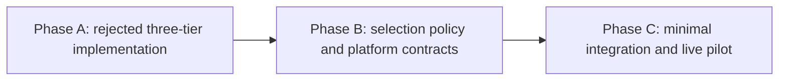

# HL — TFW_20260922-123250_CMTR: Per-Launch Model and Reasoning Selection

> **Current filename**: `HL-TFW_20260922-123250_CMTR.md`
> **Date**: 2026-09-22
> **Author**: Antigravity Coordinator; A2 applied by Codex Coordinator (robert)
> **Title**: Per-Launch Model and Reasoning Selection
> **Abbreviation**: CMTR
> **Status**: 🔒 FROZEN
> **Contract**: 🔒 FROZEN — approved by saubakirov 2026-09-22
> **Frozen**: §1 · §3 · §4 · §5 · §6 · §7 — locked on owner approval
> **Free**: §2 · §7.2 · §8 · §9 · §10 · §11 — research updates these directly
> **Append-only**: §12 Amendment Log — the only channel for changing a frozen section
> **Baseline**: freeze commits — recovery form in `conventions.md` §3 rule 15
> **Current amendment ruling**: A2 approved at `2c72ec8c6b0b21269caf95b707d26c631be5df52`

> **Project North Star**: `README.md § How It Works` · `.tfw/README.md #ns1 · #ns2 · #ns3`

---

## 1. Vision 🔒 FROZEN

Перед каждым созданием отдельной ролевой единицы TFW Координатор выбирает минимально достаточные модель и глубину рассуждения для конкретной предстоящей работы из вариантов, реально доступных на текущей платформе. Нижняя граница качества определяется неопределённостью, широтой связей, силой внешней проверки и ценой ошибки; способность модели и reasoning effort выбираются раздельно.

При делегированном мандате и нативном создании задач Координатор передаёт выбранные параметры сам. В остальных случаях он выдаёт человеку точный двухстрочный запуск: команда/роль, модель, thinking и одна причина. Ненаблюдаемая доступность не заполняется догадкой.

**Impact:** Качество защищено явной нижней границей, а токены и квоты не расходуются сверх неё без причины. Решение применяется там, где оно влияет на поведение — непосредственно при запуске отдельной ролевой единицы.

> «Перед запуском я вижу конкретный выбор и короткое объяснение; при автономной работе Координатор применяет его сам, но никогда не экономит ценой качества».

---

## 2. Current State (As-Is) 🟢 FREE

1. **Когнитивная неизбирательность запусков и феномен overthinking:**
   - В TFW роли (Coordinator, Researcher, Executor, Reviewer) запускаются в новых чатах с той моделью и силой thinking, которая случайно оказалась активной в интерфейсе по умолчанию.
   - Для мелких правок документации (`/tfw-docs`), рутинного форматирования или механических фиксов используются тяжелые reasoning-модели с максимальным thinking, что сжигает токены, замедляет работу в 5–10 раз, исчерпывает контекстные окна и упирается в лимиты запросов (rate limits).
   - Исследование итерации 1 выявило феномен «галлюцинаций глубины» (overthinking): избыточный thinking на процедурной рутине провоцирует модель усложнять элементарные правки, выдумывать несуществующие проблемы и нарушать целостность существующих ссылок.
   - Напротив, при сложном планировании или состязательном ревью (`/tfw-review`) запуск легковесных моделей без thinking ведет к сикофантии, поверхностным проверкам и пропуску дефектов.

2. **Отсутствие ориентиров в контракте координации:**
   - В текущем `.tfw/workflows/plan.md` Шаг 5 («Coordination Selection Gate») и секции HL §4.1 фиксируют источник активации, владельца, шлюз и тип диалога (`tfw-gates-only`), но полностью игнорируют параметры когнитивного ресурса (модель, thinking budget, профиль нагрузки).
   - В шаблонах `HL.md` и `TS.md` нет выделенного поля или ориентиров, заставляющих координатора задуматься о требуемой когнитивной мощности исполнителя или исследователя.

3. **Различие платформ и интерфейсов запуска полноценных чат-агентов:**
   - **Google Antigravity:** Запуск нового окна/чата человеком через UI-селектор модели и переключатель thinking (например, Gemini 3.8 Flash vs Claude 3.7 Sonnet).
   - **OpenAI Codex:** Поддерживает выбор модели и `reasoning_effort` (`low`, `medium`, `high`) в UI сессии, а также нативное программное создание независимых задач-тредов (`task creation`).
   - **Claude Code / Desktop:** Поддерживает выбор моделей в интерфейсе и флаги CLI (`--model`, `--max-thinking-tokens`).
   - Пользователю приходится вручную угадывать, какую модель и какой уровень thinking выставить в интерфейсе перед открытием нового чата под очередную команду `/tfw-*`.

4. **Отсутствие саморефлексии координатора:**
   - Если координатор запущен на слабой модели (например, Flash без thinking) и пытается декомпозировать сложнейшую многокомпонентную систему, он не осознает нехватку ресурса и не предлагает пользователю переключить сессию на более мощную модель.

5. **Результат повторной проверки всей задачи 2026-09-22:**
   - Исходная потребность относится к каждому конкретному запуску роли, но действующий контракт классифицирует роли и фазы заранее и фиксирует профиль в HL/TS.
   - Модель и глубина рассуждения ошибочно сведены в один трехуровневый профиль. Подходящая модель и достаточный reasoning effort — два самостоятельных решения.
   - H1–H3 объявлены подтвержденными без наблюдения заявленного поведения: три заранее выбранных сценария не доказывают покрытие 95%, наличие поля TS не доказывает качество выбора, а описание самодиагностики не доказывает ее надежность.
   - Phase A Candidate `92c5ee4bb83271adbc8770af93c3c6f3e3be986b` реализует утвержденный TS, но не решает исходную задачу. Он находится в локальной истории, не прошел независимый REVIEW и не входит в `v3.5.1`; требуется последующее исправление без переписывания истории.
   - Нативная среда текущего Координатора позволяет создавать адресные Codex-задачи с явными `model` и `thinking`, отправлять сообщения, ждать возврат и проверять заголовок. Текущая модель уже открытой сессии не наблюдаема и не переключается этим механизмом.

---

## 3. Target State (To-Be) 🔒 FROZEN

1. **Предмет решения — один фактический запуск.** Координатор оценивает точную следующую работу, а не назначает постоянный профиль роли, фазы или задачи.
2. **Нижняя граница качества предшествует экономии.** Она выводится из четырёх факторов: неопределённость/новизна, широта межсистемных связей, сила проверяющего oracle и цена ошибки/обратимость.
3. **Две независимые настройки.** Сначала выбирается достаточная способность модели с учётом контекста и инструментов, затем достаточный reasoning effort. Высокий effort не компенсирует неподходящую модель.
4. **Живая платформенная привязка.** Точный ростер, поддерживаемые уровни thinking и способ создания задачи читаются из нативной поверхности перед запуском. Если источник недоступен, фиксируется ненаблюдаемость и требуемая способность без выдуманного имени модели.
5. **Два наблюдаемых исхода.** При делегировании и нативной поддержке параметры передаются при создании адресной задачи и записываются в dispatch. Иначе Координатор выдаёт человеку точный двухстрочный запуск с одной причиной.
6. **Коррекция только следующего запуска.** Фактический результат, повторная работа, нерешённое противоречие или эскалация могут повысить следующий выбор. Недоступное переключение уже открытой сессии не называется самокалибровкой.

### 3.1 Result Visualization

| Режим | Готовый результат запуска | Что защищено |
| :--- | :--- | :--- |
| **Нативный автономный** | `Создать: /tfw-research CMTR Phase B · <модель из текущего ростера> · high`<br>`Причина: оспаривается архитектура и платформенные claims; слабый oracle требует глубокого независимого исследования.`<br>Параметры переданы API, адрес и основание записаны в dispatch. | Качество не зависит от случайного UI-default; человеку не нужно повторять механический запуск. |
| **Owner-assisted UI** | `Запуск: /tfw-review CMTR Phase C · <точный пункт текущего selector> · high`<br>`Причина: независимая проверка цели и нескольких платформенных контрактов.` | Человек получает короткое действие, а не классификационную лекцию. |
| **Ростер ненаблюдаем** | `Точная модель: недоступно для проверки.`<br>`Требование: модель с сильным межфайловым анализом и высокий reasoning; выберите соответствующий пункт текущего selector.` | Координатор не галлюцинирует имя и честно отделяет требование от доступности. |

### 3.2 Value Flow

```text
[Точная следующая работа]
          │
          ▼
[Нижняя граница качества]
  неопределённость · связи · oracle · цена ошибки
          │
          ├──► [Способность модели]
          └──► [Reasoning effort]
                       │
                       ▼
          [Живой ростер текущей платформы]
                       │
                       ▼
     [Наименее затратный достаточный вариант]
          ├── нативный мандат ──► создать задачу + dispatch
          └── иначе ────────────► двухстрочный запуск человеку
                       │
                       ▼
       [Исход влияет только на следующий запуск]
```

---

## 4. Phases 🔒 FROZEN

История Phase A сохраняется как отклонённая попытка. Новый результат строится в двух последовательных фазах: сначала доказуемая политика выбора и платформенные контракты, затем минимальная интеграция и живой пилот.

### 4.1 Coordination Selection 🔒 FROZEN

| Activation source | Accountable owner | Delegated Coordinator unit | Mandate scope / role reach | Dialogue | Reservations / controls | Amendment authority | Immutable epoch |
|---|---|---|---|---|---|---|---|
| delegated | saubakirov | `codex:thread:local:01a0c400-3e48-7422-bb86-3b34fe177aa5` · principal `robert` | Root CMTR Coordinator for Phases B–C; may provision distinct Researcher, Executor and Reviewer units, select per-launch model/reasoning, manage returns and commit task-owned work | tfw-gates-only | Owner retains Goal/Value, Coordinator-origin amendments, REJECT, budget/scope exceptions, release/push and other external effects; no unproved provider substitution | May rule only genuine subordinate-origin, non-reserved proposals inside the frozen Goal/Value/scope; never its own proposal | `HL-TFW_20260922-123250_CMTR.md §12 A2 @ 2c72ec8c6b0b21269caf95b707d26c631be5df52`; expires at `DONE`/`REJECTED` or owner revocation |

### Phase Dependencies



| Phase | Depends on | Shared files | Can run in parallel with |
|---|---|---|---|
| Phase A | Historical attempt | Four locally integrated core files; forward correction belongs to Phase C | — |
| Phase B | A2 approved; Phase A rejected as task solution | Master HL and `research/` only | — |
| Phase C | Phase B accepted policy and platform contracts | Exact delivery set derived by search before TS | — |

### Phase A: Rejected Three-Tier Integration ⚫

Candidate `92c5ee4bb83271adbc8770af93c3c6f3e3be986b` and its RF/EV remain inspectable history. No REVIEW is commissioned against the superseded strategy; Phase C removes or replaces its current core effects through a forward commit.

### Phase B: Selection Policy and Platform Contracts 🔴

**Requires:** A2 owner verdict and re-frozen master HL.

**Context for coordinator:** Current launch surfaces and provider-native evidence; A2; H1–H4; Candidate `92c5ee4`; D59/D64/D78; `knowledge/process.md` F22/F30/F31/F37/F40/F49.

**Key decisions:**
- Prove or refute the minimum-sufficient decision rule without assuming three classes.
- Define model capability and reasoning effort as separate selections.
- For Codex, Antigravity and Claude, name the authoritative inventory source, supported launch controls, autonomous capability and exact owner-assisted fallback; unverified capability remains explicitly unverified.
- Use actual TFW launches as evidence; do not create permanent tests for artifact counts, commits or internal ceremony.

**Deliverables:**
1. Two governed research iterations with different directly addressable Researcher units: derivation, then independent adversarial challenge.
2. A concise provider-neutral decision contract and provider-specific bindings.
3. Real dispatch evidence recording selection, reason, result and any rework/escalation without unsupported savings percentages.
4. Phase C inputs: exact integration surface, deletions/replacements and unresolved provider claims.

### Phase C: Minimal Core Integration and Live Pilot 🟡

**Requires:** Accepted Phase B policy and provider contracts.

**Key decisions:**
- Apply the rule at actual Coordinator dispatch sites; do not freeze launch profiles in HL/TS.
- Remove the three-tier/static-name/self-calibration implementation introduced by Phase A.
- Keep provider-neutral policy in core and exact provider mechanics in their owning adapter surfaces.

**Deliverables:**
1. Forward corrective implementation with no history rewrite.
2. One compact launch output for owner-assisted surfaces and native parameter passing where supported.
3. Live pilot on every provider mode claimed as working; unavailable modes remain bounded claims.
4. Independent purpose and implementation REVIEW before closure.

---

## 5. Definition of Done (DoD) 🔒 FROZEN

- ✅ 1. Перед каждым фактическим запуском Координатор применяет один короткий алгоритм: нижняя граница качества → модель → reasoning effort → наименее затратный достаточный доступный вариант.
- ✅ 2. Решение опирается на точную предстоящую работу и четыре фактора качества, а не на имя роли, фазы или трёхуровневый ярлык.
- ✅ 3. Точный выбор модели основан на авторитетном текущем ростере платформы; ненаблюдаемость не маскируется догадкой.
- ✅ 4. Автономный режим передаёт параметры при создании адресной задачи; owner-assisted режим выдаёт точный двухстрочный запуск и одну причину.
- ✅ 5. Provider-neutral core не содержит статических названий моделей, обязательных профилей HL/TS или обещания переключить уже открытую сессию.
- ✅ 6. Каждая заявленная платформенная возможность имеет собственное нативное подтверждение и не выводится по аналогии с другой средой.
- ✅ 7. Phase A Candidate исправлен последующим commit: история сохранена, а трёхуровневое правило, статические имена, шаблонные profile fields и self-calibration удалены или заменены.
- ✅ 8. Реальные launch outcomes фиксируют выбор, основание, результат и существенную повторную работу/эскалацию; неподтверждённые проценты экономии отсутствуют.
- ✅ 9. Новые постоянные тесты не добавляются без отдельного согласования владельца; существующие обязательные проверки проходят, а доказательство поведения опирается на живые запуски и независимый REVIEW.
- ✅ 10. Независимый Reviewer проверяет не только соответствие TS, но и исходную per-launch ценность по re-frozen HL и Project North Star.

---

## 6. Definition of Failure (DoF) 🔒 FROZEN

- ❌ 1. Выбор выводится из имени роли/фазы или сводится к Procedural/Standard/Critical вместо оценки конкретного запуска.
- ❌ 2. Модель и reasoning effort объединены в один профиль либо высокий effort используется как замена неподходящей модели.
- ❌ 3. Экономия снижает выбор ниже обоснованной границы качества.
- ❌ 4. Ядро содержит статический ростер моделей или точное имя названо без нативной проверки доступности.
- ❌ 5. Профиль фиксируется в HL/TS и устаревает до фактического dispatch либо не влияет на создание задачи.
- ❌ 6. Заявляется самокалибровка или переключение текущей сессии без наблюдаемого механизма.
- ❌ 7. Возможность одной платформы переносится на другую без собственного нативного подтверждения.
- ❌ 8. Субагент или скрытый worker подменяет отдельную адресную ролевую единицу TFW.
- ❌ 9. Тест существования документа, коммита, внутреннего счётчика или лимита выдаётся за контроль качества результата.
- ❌ 10. История Phase A переписывается или её Candidate молча считается принятым.

**On failure:** Остановить следующий dispatch, сохранить наблюдение и вернуть зависимое решение в Phase B research или в §12; историю не откатывать и не переписывать.

---

## 7. Principles 🔒 FROZEN

1. **Quality floor before economy:** Сначала доказать достаточность для цели и риска, затем экономить среди достаточных вариантов.
2. **Exact launch, not role taxonomy:** Предмет решения — следующая работа в её текущем контексте; название роли не является оценкой сложности.
3. **Model and reasoning are separate:** Способность модели, контекст/инструменты и глубина рассуждения — разные ограничения.
4. **Live provider truth:** Точные имена и параметры берутся из текущей нативной поверхности или честно признаются ненаблюдаемыми.
5. **Dispatch is the enforcement site:** Выбор обязан изменить фактическое создание задачи или точную инструкцию человеку; декоративное поле не считается реализацией.
6. **Two lines are enough:** Команда/роль, модель, thinking и одна причина; дополнительная проза появляется только для существенного риска или ненаблюдаемости.
7. **Distinct role units:** Researcher, Executor и Reviewer остаются отдельными адресными задачами с собственными Role Locks и вертикальными возвратами.
8. **Evidence protects behavior:** Наблюдать качество результата, повторную работу и эскалацию; не подменять их количеством файлов, коммитов, токенов или тестов процесса.

### 7.1 Quality Contract 🔒 FROZEN

- Provider-neutral core содержит только краткое правило решения и точку применения; платформенный ростер и команды принадлежат своим adapter surfaces.
- Точный delivery set определяется поиском всех мест фактического dispatch до TS; список из Phase A не наследуется автоматически.
- Никаких неподтверждённых процентов экономии, гарантий качества или универсальных сильных/слабых моделей.
- Новые постоянные тесты требуют отдельного согласования владельца и защищают только устойчивое поведение или совместимость, а не trace/артефакт/счётчик.

### 7.2 Knowledge Citations 🟢 FREE

| # | Source | Item | How it applies |
|---|--------|------|----------------|
| 1 | `.tfw/README.md` | NS1 — Purpose | Экономия допустима только как средство; запуск обязан сохранять цель, основания, власть и возможность продолжения. |
| 2 | `.tfw/README.md` | Methodology values · Success Criteria | Выбор должен быть честным, платформенно переносимым и давать готовый к приемке результат, а не красивую рекомендацию. |
| 3 | `knowledge/philosophy.md` | F3 · F36 · F40 · F43 | Критическая независимость, различение качества и цели, точный термин вместо прозы и архитектура вместо исправления симптомов. |
| 4 | `KNOWLEDGE.md` | D59 · D64 · D78 | Доступность не равна проверенности; цель проверяется отдельно от формального соответствия; прокси-метрика не заменяет причинное доказательство. |
| 5 | `KNOWLEDGE.md` | D79 · D80 · D81 · D83 | Модель не является идентичностью или властью; запуск остается отдельной адресной единицей с человеческим корнем полномочий. |
| 6 | `.tfw/conventions.md` | HL Contract · Coordination · Design Rules · Anti-patterns | Замороженный контракт меняется только поправкой; правило должно действовать в точке запуска и не превращаться в счетчик или декоративное поле. |
| 7 | `knowledge/process.md` | F22 · F30 · F31 · F37 · F40 · F49 | Общая таблица возможностей — шум; правило без места применения не работает; неверная точка сравнения не исправляется более строгим ревью; числа без метода и поля без поведения не являются доказательством. |
| 8 | `knowledge/environment.md` | F5 · F6 | Сильные стороны моделей и топология запуска различаются по средам; Antigravity/Claude требуют собственного нативного подтверждения. |
| 9 | `knowledge/constraint.md` | F11 · F12 · F14 | Возможности измеряются на установленной поверхности; обязательство живет в проектных файлах; автономная цепочка сохраняет отдельные роли. |

---

## 8. Dependencies 🟢 FREE

| Dependency | Status |
|---|---|
| Стабильное состояние репозитория после TFW-AGSK | ✅ |
| Доступ к манифесту адаптеров и шаблонам TFW | ✅ |

---

## 9. Risks 🟢 FREE

| Risk | Probability | Impact | Mitigation |
|---|---|---|---|
| Текущий трехуровневый профиль скрывает реальные причины выбора | High | High | Оценивать конкретный запуск по неопределенности, охвату связей, силе внешней проверки и цене ошибки; не выводить выбор из имени роли. |
| Статический список моделей устаревает или не совпадает с доступностью аккаунта | High | High | Читать нативный ростер непосредственно перед запуском; при ненаблюдаемости не называть точную модель. |
| Экономия квоты понижает качество ниже необходимого | Medium | High | Сначала установить нижнюю границу качества, затем минимизировать стоимость только среди достаточных вариантов. |
| Рекомендация существует в HL/TS, но не исполняется при создании задачи | High | High | Единственная точка применения — фактический dispatch: передать параметры нативно либо выдать человеку точный двухстрочный запуск. |
| Платформенная возможность объявлена по аналогии с другой средой | Medium | High | Отдельное нативное подтверждение источника ростера, параметров создания, адресации и readback для каждой заявленной среды. |

---

## 10. RESEARCH Case 🟢 FREE

### Blind Spots
- Какой минимальный набор факторов надежно задает нижнюю границу качества конкретного запуска без ролевой таксономии?
- Какие текущие среды дают авторитетный ростер доступных моделей и поддерживаемые значения reasoning effort именно для этого аккаунта/хоста?
- Какие платформы позволяют Координатору передать модель и thinking при создании отдельной адресной задачи, а где остается только точная инструкция человеку?
- Какие наблюдаемые исходы реальных запусков позволяют корректировать следующий выбор без ложных процентов экономии и без постоянной тестовой бюрократии?

### Hypotheses

| # | Hypothesis | Status |
|---|---|---|
| H1 | Решение «нижняя граница качества → минимальная достаточная стоимость» устойчивее ролевой трехуровневой классификации на реальных TFW-запусках. | open — прежнее подтверждение 95% отозвано как недоказанное |
| H2 | Раздельный выбор способности модели и reasoning effort предотвращает ошибки, которые скрывает единый профиль. | open — требуется сравнение решений на реальных запусках |
| H3 | Применение выбора непосредственно в dispatch надежнее замороженного поля HL/TS и не требует нового постоянного артефакта. | open — требуется нативный пилот |
| H4 | Для каждой заявленной платформы можно назвать авторитетный источник доступности и точный автономный либо owner-assisted способ запуска. | open — проверяется отдельно по платформам |

### Risks of Not Researching
Без повторного исследования задача закрепит непроверенную классификацию в ядре, будет выбирать профиль не в точке запуска и создаст видимость контроля качества без наблюдаемого поведения.

### Proposed RESEARCH Focus
1. **Gather**: Для каждой среды установить нативные источники ростера, допустимые параметры модели/thinking и возможность адресного создания отдельной задачи.
2. **Extract**: Вывести минимальную функцию решения из факторов качества, а не из заранее заданных классов и названий ролей.
3. **Challenge**: Применить функцию к следующим реальным запускам CMTR, записывая выбор, основание, фактический исход и необходимость повторной работы или повышения профиля.

### Why Not Just...?
- **Почему не оставить текущие три уровня?** Они смешивают тип работы, риск, сложность, модель и thinking и потому дают уверенный ярлык без доказательства достаточности.
- **Почему не записать рекомендацию в HL/TS?** Эти документы создаются раньше запуска, быстро устаревают и не охватывают все роли; решение обязано видеть фактическую работу и платформу в момент dispatch.
- **Почему не строить калькулятор токенов?** Доступные данные неполны и зависят от платформы; достаточно прозрачного правила минимальной достаточности и наблюдаемой коррекции следующего запуска.

---

## 11. Strategic Insights (Planning) 🟢 FREE

| # | Insight | Category | Source |
|---|---|---|---|
| S1 | Пользователь подчеркнул: цель — не генерация CLI-строк терминала, а помощь человеку при выборе модели в UI нового окна/чата (селектор модели в IDE) либо прямая настройка при автономном управлении сессиями (как в Codex Desktop native tasks). | platform | User, 2026-09-22 planning session |
| S2 | Не раздувать новые сущности и термины: достаточно сделать лаконичное расширение шага координации в `plan.md` и добавить раздел в корневой HL / шаблоны — само наличие раздела в шаблоне заставит агента думать. | methodology | User, 2026-09-22 planning session |
| S3 | Координатор должен уметь рефлексировать над собственной активной сессией и рекомендовать человеку сменить модель для себя, если задача слишком сложна или слишком примитивна. | coordination | User, 2026-09-22 planning session |
| S4 | Обоснование выбора обязательно: любая рекомендация модели и thinking должна содержать лаконичное объяснение компромисса. | transparency | User, 2026-09-22 planning session |
| S5 | Субагенты ≠ полноценные чат-агенты TFW. Каждый скилл TFW и каждая слэш-команда — это всегда отдельный полноценный чат-агент (новое окно/чат человеком или платформой, если она умеет создавать сессии нативно). CMTR ориентирован строго на полноценные чат-сессии, субагенты в задаче не рассматриваются. | methodology | User, 2026-09-22 planning session |
| S6 | Запретить координатору давать рекомендации по моделям из статической памяти LLM. Обязать агента нативно инспектировать свой инструмент (например, `agy models`) и давать строго граундед-обоснование на основе реально доступного ростера платформы. | groundedness | User, 2026-09-22 planning session |
| S7 | Исходная задача сформулирована как выбор перед каждым запуском: при автономии Координатор применяет параметры сам, иначе показывает человеку точный способ запуска, модель, режим и краткое обоснование. | methodology | User restatement, 2026-09-22 task-wide replan |
| S8 | Владелец не принимает длинные формулировки, текущий нейминг и саму стратегию классификации; проблема относится ко всей задаче, а не к качеству исполнения Phase A. | stakeholder | User correction, 2026-09-22 task-wide replan |
| S9 | Проверки количества документов, наличия коммита и соблюдения внутреннего бюджета не являются контролем качества результата; постоянная проверка оправдана только защищаемым поведением или риском. | methodology | User review-system feedback preceding CMTR replan, 2026-09-22 |
| S10 | Текущий Codex-task назначен владельцем новым лидером-Координатором CMTR; operational route изменен, но делегированный мандат и право на собственные поправки не предполагаются молчанием. | coordination | Owner-direct appointment, 2026-09-22 |

---

## 12. Amendment Log 🟢 APPEND-ONLY

| # | Date | § | Type | Proposer | Proposed change | Evidence | Cost | Alternatives considered | Verdict |
|---|------|---|------|----------|-----------------|----------|------|------------------------|---------|
| A1 | 2026-09-22 | §3, §5, §6, §7 | `EXTEND` | owner: saubakirov | Обязать координатора проводить нативную граундед-инспекцию доступных моделей и режимов reasoning платформы (через CLI-команды инспекции типа `agy models`, флаги `--help`, конфигурации окружения) перед выдачей рекомендации, полностью запретив называть модели по памяти или из статической обучающей выборки. | Живой кейс CMTR: координатор галлюцинировал устаревшими моделями из обучающей выборки (Claude 3.7, o3-mini), в то время как команда `agy models` нативно выявила реальный ростер 2026 года (Gemini 3.8 Flash, Claude Sonnet 4.6, Claude Opus 4.6, GPT-OSS 120B). | Добавление одного обязательного шага инспекции среды перед рекомендацией или честной декларации ненаблюдаемости. | Попытка описать модели статически в документации TFW — отклонена из-за неизбежного устаревания списков каждые несколько месяцев. | ✅ APPROVED — saubakirov, 2026-09-22 |
| A2 | 2026-09-22 | Title, §1, §3–§7 | `SUPERSEDE` | Coordinator `codex:thread:local:01a0c400-3e48-7422-bb86-3b34fe177aa5`; origin: owner task-wide correction | Переименовать результат в **Per-Launch Model and Reasoning Selection** (ID `CMTR` сохранить); заменить трехуровневую классификацию правилом «нижняя граница качества → наименее затратный достаточный вариант» для каждого фактического dispatch; выбирать модель и thinking раздельно; держать ростер и точные команды в платформенных привязках, не в ядре; автономно передавать параметры только при нативной возможности и мандате, иначе выдавать человеку двухстрочный запуск; удалить self-calibration текущего окна и обязательные поля профиля HL/TS; Phase A сохранить как не принятый результат прежней стратегии, затем выполнить Phase B «policy + platform contracts + real launch evidence» и Phase C «forward correction + minimal integration + live pilot». Предлагаемый мандат: principal `robert`, текущий Codex-task как root Coordinator, CMTR Phases B–C и отдельные Researcher/Executor/Reviewer units, `tfw-gates-only`, право выбирать launch parameters и управлять возвратами; владелец сохраняет цель/ценность, собственные предложения Координатора, REJECT, budget/scope exceptions, release/push и иные внешние эффекты; срок — до `DONE`/`REJECTED` или отзыва. | Исходная формулировка владельца и S7–S10; повторная проверка Candidate `92c5ee4`; недоказанные H1–H3; NS1/NS2; D59, D64, D78; `knowledge/process.md` F22/F31/F37/F40/F49; нативный ростер и task controls текущего Codex. | Отказ от уже выполненной стратегии Phase A; последующий исправляющий commit вместо переписывания истории; отдельная платформенная проверка и новые реальные запуски до интеграции. | (1) Формально отревьюить Phase A по старому TS — подтвердит исполнение, но не ценность; (2) подправить три класса — сохранит неверную ось; (3) закрыть CMTR — сохранит ручную ошибку выбора при каждом запуске. | ✅ APPROVED — saubakirov, 2026-09-22 |

---

### Material handover at this return

- **Producer unit**: Coordinator `codex:thread:local:01a0c400-3e48-7422-bb86-3b34fe177aa5`
- **Source epoch**: Owner-approved A2 at `2c72ec8c6b0b21269caf95b707d26c631be5df52`.
- **Inspected scope**: Governing HL and research, Phase A TS/RF/EV/Candidate diff, current workflows/templates/conventions, P0–P7 knowledge, current Codex task controls and local principal binding.
- **Materiality**: A2 is applied: the task now selects model and reasoning per actual launch, separates both decisions, moves enforcement to dispatch, rejects the Phase A strategy and establishes bounded Robert coordination for Phases B–C.
- **Uncertainty**: Provider-native inventory and launch controls remain unverified for Antigravity and Claude; the replacement rule has not yet passed two independent research iterations or live launch evidence.
- **Continuation**: Re-freeze this HL, update authoritative status/phase state, initialize Phase B research and dispatch `/tfw-research` to a separate Researcher unit.

---

*HL — TFW_20260922-123250_CMTR: Per-Launch Model and Reasoning Selection | 2026-09-22*
