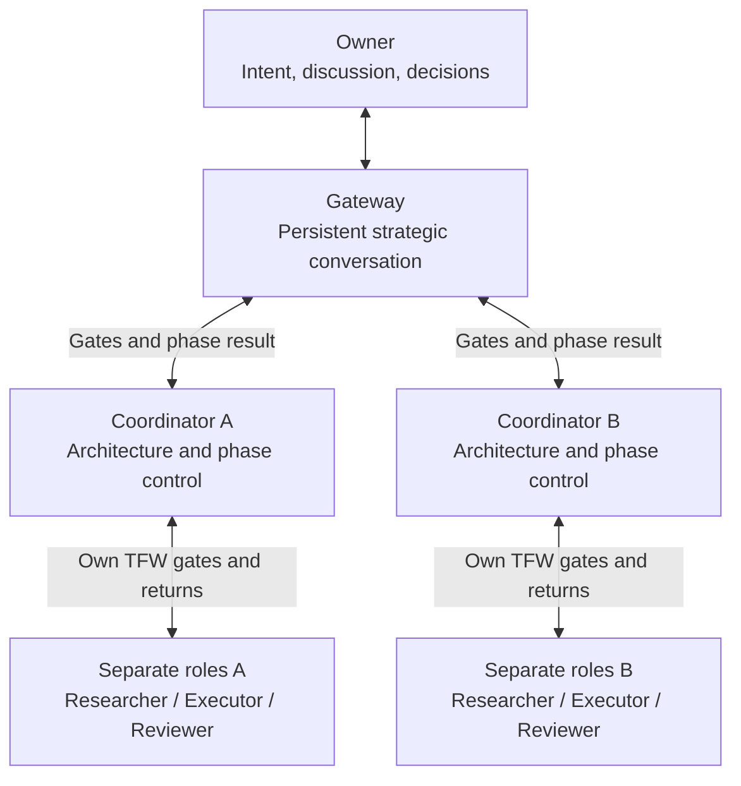
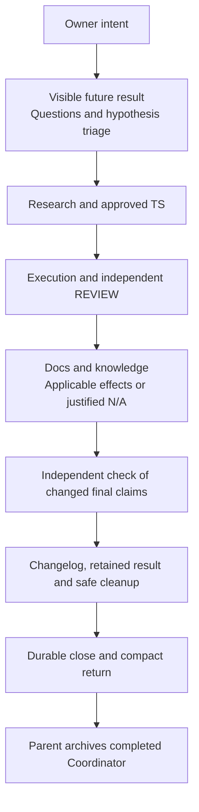

# HL — TFW_20260922-192606_PCUX: Provider-specific coordinator UX and autonomy guidance

> **Date**: 2026-09-23
> **Author**: Codex Coordinator, owner-direct task `01a0c980-4552-7ed3-b2aa-3c5cc46bc7bc`
> **Title**: Provider-specific coordinator UX and autonomy guidance
> **Abbreviation**: PCUX
> **Status**: ✅ Approved by owner on 2026-09-23 — research pending
> **Contract**: 🔒 FROZEN — approved by saubakirov 2026-09-23
> **Frozen**: §1 · §3 · §4 · §5 · §6 · §7 — locked on owner approval
> **Free**: §2 · §7.2 · §8 · §9 · §10 · §11 — research updates these directly
> **Append-only**: §12 Amendment Log — the only channel for changing a frozen section
> **Baseline**: freeze commits — recovery form in `conventions.md` §3 rule 15
> **Project North Star**: [`README.md` opening and `How It Works`](../../../README.md#how-it-works) · [`.tfw/README.md` NS1](../../../.tfw/README.md#ns1) · [NS2](../../../.tfw/README.md#ns2) · [NS3](../../../.tfw/README.md#ns3)

---

## 1. Vision 🔒 FROZEN

The owner can choose practical autonomy in Codex, Claude Code, and Antigravity from one understandable TFW contract. In Codex, a persistent GATEWAY protects the owner's context, launches a separate Coordinator for each phase, and receives only Coordinator-level gates and results. Each Coordinator launches the same TFW commands the owner would launch manually. A small one-phase task can run the full TFW role cycle through platform subagents when each role's skill, evidence, return, and independent acceptance requirements can be met; otherwise the provider profile names the remaining owner action.

**Impact:** The owner has one clean place to discuss the task, receive phase status, and make reserved decisions. Phase work continues without mechanical owner launches, startup registration ceremonies, or working conversations accumulating in GATEWAY.

In every launch and dialogue mode, the Coordinator remains a Strategic Architect: it structures the owner's ideas, exposes assumptions and consequences, asks decision-changing questions, challenges with reasons, and makes the intended result visible. Autonomy changes who performs mechanical launches, not the quality of thought or the rigor of the TFW cycle.

The owner can change the operating mandate before or after research without restarting planning. Each completed task leaves a truthful changelog entry; each phase/task close completes its documentation and knowledge obligations before disposing of temporary resources and archiving finished role sessions, without losing accepted work or the owner's persistent context. Working Backwards, consequential questions and critique, visible hypothesis selection, and Saint-Exupery judgment remain explicit parts of the Coordinator's mental model, separately inspected by the owner in the actual revised `plan.md`.

> “I work through one Gateway. It starts the phase Coordinators, they start the TFW roles, and I return for decisions that are mine.”

## 2. Current State (As-Is) 🟢 FREE

| Area | Observed state on 2026-09-23 | Consequence |
|---|---|---|
| Core | `conventions.md` §7 defines direct role addresses, vertical gate traffic, durable returns, and transcript isolation. `plan.md` Step 5 asks for a four-part capability report. | The method has one provider-neutral authority and routing boundary. |
| Adapters | The Codex, Claude Code, and Antigravity persistent adapters already contain platform-specific coordination text. | Practical advice is mixed into entry files and is difficult to extend without duplication. |
| Codex | This task can create separate visible tasks, send to an exact task, wait for task events, set and read back a title, and manage sidebar Sections. The current adapter does not guide task grouping. | Role navigation can be improved without changing task authority. |
| Claude | The owner supplied a 2026-09-23 Helpdesk field report: Desktop click-created chats require a nonempty initial prompt; local launch shares the current checkout; isolated launches in that setup used a different base; native subagent creation exists. Exact selected observations and limits are retained below. | The tested surface does not support an empty pre-created pool. Use the command as the initial prompt at the valid role gate; preserve the separate compact-role question. Desktop observations do not automatically describe the CLI or every Claude surface. |
| Antigravity | On 2026-09-23 the owner confirms that full agent chats have no spawn route and must be created manually. Earlier reports mention subagents and unavailable title changes; existing sessions can communicate. | Manual full-session creation does not suppress required Coordinator-directed gate returns. A compact subagent is not evidence of full-chat spawn; title support is rechecked on the relevant live surface. |
| Formal role model | Current `AGENTS.md` and `conventions.md` exclude hidden subagents as holders of directly addressable TFW roles. The Reviewer must independently assess the result. | The requested full subagent role cycle requires an evidenced compatibility decision and possibly an explicit core-contract amendment. |
| Original GATEWAY/activation design | [FRATS master HL](../TFW_20260920-223357_FRATS/HL-TFW_20260920-223357_FRATS.md) §1, §2.6 and §7 preserved a clean owner ingress, one skill invocation and task-file context, but tied GATEWAY to iterative dialogue. Its [Phase A TS](../TFW_20260920-223357_FRATS/phase-a/TS__phase-a__explicit_coordination_gateway_and_session_identity.md) AC-4 also required early unit/address provenance; [native evidence](../TFW_20260920-223357_FRATS/phase-a/evidence/provider-native.md) reached only partial Codex P3. | Two independent concerns became coupled: protecting owner context with allowing dialogue, and launching authorized work with already knowing the child's native address. A4 corrects both. |
| Current GATEWAY inconsistency | `conventions.md` Session identity and `plan.md` Identity require an iterative grant for a GATEWAY title. `tools/tfw_state.py` only enforces the opposite implication: iterative dialogue needs a gateway; it accepts gateway plus gates-only. Iter2 Gather G3/G4 and corrected Challenge C4 verify this asymmetric coupling. | The target removes both implications: gates-only GATEWAY is valid, and an exact bounded peer grant does not require GATEWAY. Preserve the narrow peer grant and independent Reviewer; correct rules, workflows, titles, validator and relevant copies together. |
| Live mandate and shared workspace | `conventions.md` freezes the actual delegation mandate in HL and requires each delegated mutating run to have its own worktree. `status.md` already owns current routing, while journal events are immutable. | Easy operating-mode changes and Claude's one-workspace route need focused shared-contract changes, not contradictory provider advice. |
| Current selection and late identity readers | Iter2 Gather G1–G4 identifies a closed five-field routing spine, no explicit reporting/current-selection carrier, and readers requiring the destination address before material work and an unchanged spine on continuation. | Target status remains the sole current choice, backed by an immutable owner decision and frozen ceiling. Later truthful child identity, historical valid activation and current launch permission are distinct; existing readers do not yet implement this. |
| Closure | Current closing rules require checked final effects and safe worktree removal after landing, but do not give this task the owner's complete temporary-resource and per-task changelog obligation. This project's release contract names `.tfw/CHANGELOG.md`. | Add explicit ownership, disposal, changelog and residual-reporting behavior; no release, version, publication or global cleanup is implied. |

The initial owner authorization to create role sessions was recorded as provisioning only. On 2026-09-23 the owner clarified that, for this task's gates-only autonomous mode, the Coordinator should create a role task whose first message is only its exact `/tfw-*` command and task ID, without a waiting prompt, briefing, or extra owner message. The role must obtain mandate, scope, route, and evidence from task-local TFW files. Amendments A1–A4 record the corrected launch and GATEWAY decisions; A5–A6 fix the invariant strategic role and the three behavioral modes. The first Researcher task had already been requested with a provisioning-only prompt; that unused incorrect launch must not be used for research and should be retired if it becomes addressable.

### Owner-Supplied Claude Desktop Field Report — 2026-09-23

Selected source: `C:/tmp/tfw-claude-desktop-spawn-report.md`, supplied by the owner after a live probe in `D:/projects/research/helpdesk`, branch `beta` at `9ef4f54`. Source SHA-256: `66bea5b7b4271f27189264f471dbe0cbc68f239a0ad2be9e2f361d9df583b1d6` (15,403 bytes). This Coordinator read the returned report, not the producing session. These are owner-supplied field observations, not independently reproduced PCUX results or a governed RES. The external source is not a versioned repository attachment; the bounded observations below remain in this HL if that temporary path disappears. Exact-source verification requires the supplied file and matching digest.

| Report scope | Reported observation | Coordinator disposition / remaining limit |
|---|---|---|
| §1: initial prompt | Missing `prompt` fails validation; empty `prompt` returns `prompt is required and cannot be empty.` Searches did not expose `start_session` or `hand_off_to_session`. | Resolves Q3's empty-session question for the tested mechanisms. Put only `/tfw-* <task/phase>` in the initial prompt; keep routing in task files, not the report's suggested extra routing prose. No waiting prompt or premature Executor/Reviewer activation. |
| §2–3: clicked full chat | Owner chooses local versus new worktree. Local launch used the main checkout on `beta`, saw its uncommitted files, and inherited the parent's model/effort. A session address appears after creation. | Supports the selected shared-local route and late address recording. It does not establish direct launch into any arbitrary existing worktree, model suitability, or a complete TFW run. Do not silently change model/cost settings. |
| §3–5: isolation | Both tested isolated chat/subagent launches based their trees on `e424ef7` (`origin/master`), not working `beta` at `9ef4f54`. Entering a prepared tree was shown only from an already isolated subagent and only under `.claude/worktrees/`; the first shell attempt was rejected, a later attempt succeeded. | This is a setup-specific stale-context hazard, not a universal base rule. Do not turn the report's merge, worktree migration or unconditional retry suggestions into task requirements. The chosen local route avoids this detour; a reported rejected probe does not justify blindly replaying a mutating command. |
| §4: subagents | `Agent` launches without the Desktop click; without isolation the reported working directory was the main checkout. Named agents are described as addressable. | Supports feasibility of a compact mechanism, not H1's complete-role/independent-review claim. Browser access, actual skill loading, return/continuation and cumulative context cost remain untested here. |
| §6: disposal | Unclicked cards can be dismissed; archive ran without a card in the reported bypass mode; permanent deletion requires owner confirmation. Archival left the worktree and branch for possible restoration. | Archive is not worktree/branch cleanup. Do not delete an archive's restoration dependency and still promise reversibility. Retain it with the specific reason or expose the remaining owner-dependent disposal decision; no automatic deletion or permission-mode change follows from this report. |
| §7–8: communication | The report describes addressed sends by name/sessionId and metadata-only inspection; `list_events` exposes another session's transcript. Its conclusion groups provision and addressed send together as owner-assisted. | Separate them: full-chat creation needs the owner click; native sends to an existing exact address are reported available. No P3/P4 gate-series proof or exact title readback is supplied. Transcript availability never grants permission to inspect it. |

Q3's mechanical unknown is answered; shared-writer sequencing and independent fixed-candidate review remain design work. On this surface, the evidence-compatible full-chat offer is a command-bearing card at each ready role gate with an owner click and local launch. An upfront empty pool is unavailable through the tested mechanisms; §3.5 already requires reporting this precise limitation instead of a prose workaround. Future unattended full-session completion therefore cannot be promised while later creation clicks remain. Frozen claims, the actual mandate and the owner's intent snapshot at `03388b6f32c72d349b99b7d7bd75143dd7aeea87` are unchanged.

Research iteration 1 return, 2026-09-23: [RES D1–D6](research/iter1/RES.md#decisions) at `a2c3c717311cf5e02dcd8018284b7e8613de2326` supports a small status/owner-decision extension, command-first provenance, independent topology/dialogue choices, conditional compact roles, the Claude ready-gate/local route and reuse of existing close records. These are design recommendations, not implemented behavior or native full-cycle proof. The selected report remains the original digest above; the announced browser addendum is still unselected and was not consumed.

## 3. Target State (To-Be) 🔒 FROZEN

Three concise provider profiles sit under the respective `.tfw/adapters/` directories. The relevant persistent adapter directs the Coordinator to its profile at the Plan coordination gate. Each profile turns available evidence and live capability inspection into a concrete offer: available navigation, role provisioning, addressed returns, autonomy suitable for the task, owner actions, and honest unavailable states. Profiles contain provider mechanics; the core retains role locks, authority, lifecycle, transcript isolation, and acceptance rules. For this planning/research stage, the owner's dated Claude Desktop and Antigravity observations are the working baseline, not an alleged independent native trial. Research checks coherence and available evidence; unavailable cross-platform field trials are not prerequisites to describing those routes. Operational reliability remains to be established in actual use and is never inferred from an installed instruction file.

The Codex offer includes optional grouping of this task's known role sessions into one Section. Claude offers click-assisted full chats and a separate bounded compact route for small one-phase work; Antigravity's current full-chat route is manual, with earlier compact-subagent observations kept as separately labelled research input. Any admitted compact route runs complete Researcher, Executor, and Reviewer role units, each with its own exact `/tfw-*` activation, Role Lock, trace, return, and independent verdict. If those obligations cannot be met, name the precise limit and remaining owner action. Browser access, model suitability, creation, messaging, continuation, and title support are checked on the active surface before claiming local availability; unavailable surfaces retain the dated owner-report label. The compact route accounts for the Coordinator's context cost and chat noise.

GATEWAY selection and dialogue permission are independent. In the selected Codex gateway mode, the owner talks to one persistent GATEWAY. It launches a planning Coordinator when the task needs an initial plan, and a separate Coordinator for each execution phase. The planning Coordinator returns the approved phase/dependency map; each phase Coordinator owns that phase's planning, role launches, TFW gates and close. GATEWAY uses the approved map to activate ready phases and presents their material status and reserved decisions to the owner. Worker roles never address GATEWAY. All agent-to-agent links are `tfw-gates-only` unless the owner explicitly grants a bounded dialogue; selecting GATEWAY grants no dialogue permission. A one-phase task has one phase Coordinator.

Every new role task starts with only the applicable `/tfw-*` command and exact task or phase reference. The receiving unit reads scope, mandate, parent return route, lifecycle and prior evidence from TFW files. The launching parent learns the child's native address from the creation receipt or a later gate/status return and records it when available. Prior knowledge of that child address, an address-binding handshake, an activation ticket, or a second launch message is not a prerequisite for authorized role work. An exact destination is needed when a later addressed send or continuation actually uses it; missing addresses are never invented.

GATEWAY receives compact phase-level gates, material blockers, decisions and completed results only from Coordinators. It does not receive raw role progress, inspect worker conversations, or repeat phase work. Normal coordination is driven by returned gates and artifacts. As an optional fallback after silence, the immediate parent may schedule a single liveness check about five minutes after launch using native metadata only; an unchanged live signal produces no owner update or instruction to the worker. Provider profiles state the available mechanism and limits, without exporting Codex capability claims to other platforms.

### 3.1 Result Visualization

**Working Backwards press-release preview — hypothetical finished result, not a shipping claim.**

**Headline:** TFW gives the owner a strategic partner while phase teams complete work quietly.

**Finished-state story:** Six months after release, the owner describes a tangled idea in one conversation. The Coordinator turns it into a recognizable goal and a visible future result, challenges the consequential assumptions and shows which unknowns are worth researching. The owner answers one hypothesis from experience and discards another as immaterial. After research, the owner switches to gates-only autonomy without rewriting the plan. Phase teams use their exact TFW commands, return only through their Coordinator, and preserve independent review. At the end, the owner sees the accepted result, updated documentation and qualified knowledge, a changelog entry and the disposition of temporary resources. The same method remains recognizable in Codex, Claude and Antigravity, with each platform's necessary clicks stated honestly.

**Visible impact:** Owner attention goes to intent and consequential decisions instead of session setup, message carrying, repeated explanations and post-task housekeeping. Autonomy does not replace architectural thought or hide incomplete work.

> **Imagined owner quote:** “I see the result before we spend on it, I can challenge the research, and I return to a finished, explained task rather than a pile of chats and worktrees.”

**Example final owner view — intended Codex outcome, not the live PCUX status:**

```text
PCUX | Complete
Result       Strategic planning preserved; selected phase work independently reviewed
Your choices Manual start -> gates-only autonomy after research; no peer dialogue
Decisions    No unresolved owner gate
Docs         Applicable documentation updated; exact changes linked
Knowledge    Selected findings qualified and consolidated; dispositions linked
Changelog    Task change recorded once
Cleanup      Task-owned role chats archived; disposable resources removed
Kept         Accepted result, TFW trace, shared project and your persistent Gateway
```

Six months after release, the owner starts the same small task in each tool and sees this kind of route card:

| Active tool | Coordinator's offer | Owner-visible result |
|---|---|---|
| Codex | “You can work through one GATEWAY. I can start each phase Coordinator with its TFW command, let it run its role chain, and show you the resulting gates and phase status.” | One clean owner conversation, a separate Coordinator per phase, and optional grouping of this task's sessions in `TFW · PCUX`. |
| Claude | “Choose full agent chats requested by GATEWAY and created with your clicks, optionally prepared together in one local workspace, or a compact full-role subagent cycle for this eligible small task.” | One readiness roll call, then command-only activations and Coordinator-directed gates; no per-agent workspace proliferation or claim that future required clicks are autonomous. |
| Antigravity | “You create full agent chats manually; each activated role still reports its TFW gates to its Coordinator. I will check naming support on this surface and state any remaining action.” | Manual creation with routed reporting; no invented full-chat spawn or rename success. |

**Value in the same view:** The owner can choose a practical route without reading another agent's transcript, and the status plus durable artifacts still explain what happened after the interface changes.

**First message in a newly launched Researcher task:** `/tfw-research TFW_20260922-192606_PCUX`. All other activation facts are recovered from the selected task's TFW files, not added as advice in the message.

### 3.2 Value Flow

The owner-facing diagram is stored here as actual renderable source, not only described or left in chat. It shows permitted communication, not worker-to-worker execution or automatic creation in manual mode. Chat uses the same structure with translated labels; material changes to the picture must reach both surfaces.



Workers have no route to GATEWAY or other workers without the separately bounded dialogue grant. The phase-to-value path is:



### 3.3 Invariant Coordinator Contract

| Responsibility in every mode | Required behavior | Boundary |
|---|---|---|
| Strategic architecture | Distill the owner's flow into intent, value, stakeholders, constraints, options, decisions and unknowns. Show the expected result, alternatives, costs and consequential risks; recommend with reasons and challenge contradictions. | Do not become a passive secretary, command dispatcher or gate clerk. Do not invent owner wishes or discard useful tension for brevity. |
| Decision support | Ask questions that can change the decision; offer concrete defaults for ordinary gaps. Discuss and visualize the plan with the owner or return a compact decision package through GATEWAY. | Gates-only limits agent-to-agent traffic, not the owner's conversation. Do not ask again for settled choices or already-delegated mechanical actions. |
| TFW governance | Own HL/TS and Coordinator rulings; select the next valid role command; enforce Role Lock, approved scope, research gates, independent review, correction continuity and required closure. | Never perform another role's workflow, replace artifacts with chat, fabricate approval, or repeat another role's work solely from distrust. |
| Resource-aware launch selection | Preserve `conventions.md` Launch selection: establish the task's quality floor, select model and reasoning effort separately from current options, and apply the choice when native and authorized or provide the exact owner-assisted launch advice. | The direct launcher owns this decision: GATEWAY for its Coordinator, Coordinator for its own roles. Selecting settings never authorizes a launch, peer dialogue, hidden repricing or managing another Coordinator's workers. |
| Autonomous progress | Use the selected platform's available mechanisms to complete authorized work, consume durable returns and launch the next ready role without a new owner message. | Delegation does not silently approve HL/TS, change frozen authority or erase owner reservations. An unresolved reserved decision stops its dependent work, not unrelated authorized work. |
| Communication discipline | Route actual gates, material blockers, required status and durable results through the permitted edges. Keep evidence and proposals attributable. | No unsolicited progress dialogue, solution briefing, transcript inspection or micromanagement. A gate must affect a real workflow checkpoint; renaming chatter a gate does not permit it. |

When GATEWAY is selected, the owner must still have this quality of strategic conversation at the owner-facing boundary. GATEWAY helps clarify the owner's intent, compare options and understand decisions; the responsible Coordinator owns the resulting HL/TS and phase-level architectural work. GATEWAY passes material owner direction through the proper decision/artifact route and presents compact Coordinator questions and results. It is neither a dumb relay nor a second operational Coordinator: it does not run Plan, privately pre-solve worker tasks, maintain a duplicate phase plan or absorb role conversations.

#### 3.3.1 Protected Mental Model and Owner Check

The existing `plan.md` Strategic Architect mindset, Frame/distill/challenge, Future-State Gate and Saint-Exupery Gate are protected semantic requirements, not expendable introduction text. Preserve their other governing read, role, authority and continuation boundaries while changing provider coordination. The resulting canonical workflow must make the following behavior explicit:

| Thinking obligation | What the owner must see |
|---|---|
| Working Backwards | Start from the stakeholder-visible finish and work back to necessary decisions and work. Present an Amazon-style future press-release preview: finished-state story, benefit, impact and an explicitly imagined stakeholder quote, together with a concrete rendered outcome. It is a planning device, not an actual release or fabricated evidence. |
| Distill without flattening | An owner-recognized structure of intent, people, value, constraints, options, decisions and unknowns; retain useful tension and distinguish the owner's decisions from the Coordinator's recommendations. |
| Short devil's-advocate pass | Up to five consequential questions, not a quota or debate performance. Expose the assumption, credible alternative and consequence; the owner may already know the answer or reject the premise. |
| Visible research triage | Before initial research spend, show each proposed question/hypothesis, the decision it can change, what changes if it is false, and why it needs investigation instead of an owner answer or an ordinary implementation check. Give the owner a meaningful opportunity to answer, reject or narrow it. Preserve the disposition in HL; do not silently research a rejected hypothesis. |
| Saint-Exupery judgment | For every proposed section, phase, requirement, gate and artifact ask which named value, necessary proof, boundary or freedom it protects. Remove duplication and speculative control, not meaning. A shorter document that loses an owner decision or essential distinction fails this test. |
| Visualization parity | Put the actual finished-result preview and diagrams in both the owner's conversation and HL, with the same meaning. A link to a file, a promise to visualize later, or only a process diagram is insufficient. |

A known owner answer is recorded at its actual evidence level; it is not converted into an independently observed fact. A hypothesis with no decision consequence is removed from research. Reopen the owner discussion for a material new uncertainty or changed research direction, not for each routine step of an already authorized investigation. In unattended operation, the selected mandate controls whether an in-scope question can proceed or an owner-reserved gate must wait; silence never proves the owner's preference.

**Separate owner acceptance checkpoint:** when the Executor returns the revised canonical `.tfw/workflows/plan.md` as a durable implementation candidate through its named gate, present its actual complete mental-model/critical-thinking/preview/hypothesis-triage/Saint-Exupery passages, their exact candidate reference and a before/after explanation to the owner. Do not inspect unreturned work to discover that it is ready. The owner inspects the real text, not a paraphrase or a verbal assurance that it survived. Record an explicit owner verdict before accepting this task's final result or distributing the revised workflow. Recheck a later material change to those accepted passages; this checkpoint does not replace independent technical review. It is a required delivery gate, not permission for this planning Coordinator to implement `plan.md` now.

#### 3.3.2 Preserve Existing TFW Behavior

The owner's highlighted requirements are additions and explicit changes to an existing system, not an exhaustive replacement specification. Existing obligations remain in force unless an approved change explicitly supersedes them. For each affected workflow/rule/adapter and its consumers, carry its baseline obligations into the result; preserve meaning when relocating or shortening text. A conflict or proposed removal is made visible through the existing decision route, never silently justified by absence from this conversation. Executor ONB/RF and independent REVIEW retain exact before/after references for affected obligations; reuse their existing evidence instead of adding a framework-wide audit, new registry or permanent tests merely to satisfy this clause.

In particular, retain the full Launch selection algorithm, not only model names: quality floor from uncertainty, dependencies, assurance and consequences; separate model/effort choice; a plausible lower-resource alternative with its concrete risk or explicit `not compared`; native/authorized application or the existing exact fallback advice; and separation of requested/effective settings, delivery, outcome and rework. A default or inherited setting is not evidence of a justified choice. Provider controls and authority may limit application; never invent effective settings or silently change cost/effort. Settings and their rationale belong in native parameters and normal dispatch/owner advice, not prose added to the command-only first role message. No permanent model roster or automatic escalation to the strongest setting is implied.

### 3.4 Launch and Dialogue Modes

Launch delegation, agent dialogue permission and owner-context topology are independent selections. A selected GATEWAY may be used in gates-only or explicitly permitted dialogue work; it never joins worker dialogue. The default offer is manual launch with gateway-style vertical gate reporting, not complete manual message forwarding. At inception, show today's platform capabilities, limits, available mandates, remaining owner actions and reserved decisions, then ask the owner to select. No response grants autonomy. Existing work keeps its explicitly selected mode unless the owner changes it; do not reopen the question on every continuation. These are behavioral selections to express through task state and authority, not a separate maintained mode registry.

| Owner selection | Who launches | What proceeds without the owner | What does not change |
|---|---|---|---|
| Autonomous, gates-only | Within the approved mandate, GATEWAY starts the required Coordinator and each phase Coordinator starts its own role units. | Command-only launches, role work, durable gate returns, authorized corrections, subsequent ready roles and required close. No per-role launch confirmation or artificial wait for an owner message. | Only vertical TFW traffic; strategic owner discussion remains available; undelegated decisions remain real gates. |
| Manual launch, gates-only — default | The owner creates the selected sessions and issues the exact commands provided by the Coordinator. The Coordinator never creates an agent or subagent behind this choice. | Each activated role performs its authorized workflow and MUST send its required gates/status/returns to its own Coordinator through the available native channel; only Coordinators report upward to the owner-facing gateway. | Same planning quality, TFW roles, artifacts, review and close. Manual creation never implies silence or waiting for the owner to ask for a report. |
| Fully manual — explicit exception | The owner controls both launches and transfer of gate messages/results between the selected units. | Each role still performs its activated workflow and writes all required artifacts/status; it presents the exact gate/return for the owner's chosen manual transfer. | No unsolicited inter-agent send, no hidden launch, no skipped gate or missing trace. This exception must be visible to every role and is never inferred merely from manual session creation. |
| Explicit bounded dialogue | Launch remains manual or delegated as separately selected. Dialogue permission alone never grants creation or execution authority. | Only the named participants discuss the approved question within its boundary and stop condition, then consolidate the result in its owned trace. | First launch stays command-only; all other links stay gates-only; no transcript snooping or bypass of independent review. GATEWAY receives the useful consolidated return through the responsible Coordinator, not the conversation. |

For an initially unplanned Codex task in the delegated route, GATEWAY starts a planning Coordinator with `/tfw-plan` and the exact task reference; in the manual-launch route the owner performs that launch. That Coordinator develops the HL and returns the approved phase/dependency map through the required decision gates. A multi-phase plan then gets one separate Coordinator per execution phase; the planning unit does not become an obligatory operational supervisor of those phases. A one-phase plan needs only its one responsible Coordinator. For a phase already planned, launch starts at its actual lifecycle checkpoint instead of replaying inception.

The role cycle is identical in all operating modes:

```text
Coordinator: HL / decisions
  → Researcher: /tfw-research → RES
  → Coordinator: assess research, repeat when required, prepare approved TS
  → Executor: /tfw-handoff → ONB, work, evidence, RF
  → independent Reviewer: /tfw-review → REVIEW
  → Coordinator: route any correction to the same Executor and Reviewer
  → /tfw-docs and /tfw-knowledge dispositions and applicable effects
  → independent check of changed final claims
  → changelog, safe cleanup and durable close → compact phase result

Each role returns to its own Coordinator; the arrows are lifecycle order,
not permission for worker-to-worker messages.
```

Every new Coordinator, worker session or admitted role subagent receives only its exact `/tfw-*` command and task/phase reference as its first task message. Native launch settings and truthful later address recording remain outside that message. No copied conversation, inherited planning dialogue, role briefing, preferred answer, provisional waiting instruction or second activation ceremony substitutes for task-file context. A gate answer or a permitted bounded dialogue later in the run is not a new-role briefing and cannot retroactively widen authority.

Unless fully manual transfer was explicitly selected, required gate reporting is an obligation of every role, including owner-created sessions and subagents, not an optional response to a parent poll. A worker reports only to its own Coordinator; a phase Coordinator reports only through its recorded parent/owner gateway. Native delivery failure is an explicit limitation with an exact recovery action, never permission for transcript inspection or silent loss. Only the deliberately chosen Claude pre-creation route adds the one transport-only readiness exchange specified below; it is not ongoing dialogue or a universal pre-work registration gate.

Unattended operation means no owner presence is required for already-authorized mechanics and work. If an owner-reserved decision remains, the responsible Coordinator preserves one actionable gate with the decision, alternatives and consequences; GATEWAY presents it without repeated reminders or fabricated consent. Work dependent on it waits. The profile must not claim an uninterrupted end-to-end route while a required human click, unavailable continuation mechanism or ungranted decision remains.

### 3.5 Platform Route and Compact-Task Boundary

Use the strongest valid autonomy available under the owner's selected route, rather than falling back to manual launches by habit. Before promising unattended completion, distinguish current capability from demonstrated operation and state any remaining owner action. Model suitability concerns the task's quality floor, not a permanent provider/model ranking.

- **Codex:** the requested GATEWAY route uses separate visible phase Coordinators and role tasks, with optional task-only Section grouping. Subagents do not silently replace that topology. Command-only launches and returned gates drive the chain; GATEWAY never watches every worker.
- **Claude, full visible chats:** under the selected click-assisted mandate, GATEWAY requests the known task/phase role chats and the owner confirms each required Desktop creation click. The owner may prepare the needed pool in one sitting. Each role remains accountable to its phase Coordinator; a creation request through GATEWAY is provisioning, not a worker-to-GATEWAY work channel. One readiness roll call to that Coordinator may establish actual address, role slot, return route and selected workspace, with no task reasoning or solution advice. Creating a pool is optional, task-scoped and not an excuse to invent extra agents. First workflow activation is still only the exact slash command at the proper lifecycle gate; pre-creation must not require a prose waiting prompt or out-of-phase execution. After readiness, use only TFW commands, required gates and durable returns. The creation receipt/first normal gate may supply readiness without a redundant handshake. If native prompt/continuation constraints prevent this combination, state the precise limitation for field verification instead of contaminating the first message.
- **Claude workspace:** all full-chat task roles use one selected local checkout/worktree; no automatic separate tree or branch per role. Serialize repository mutations with one active mutation owner and exact-path commits; preserve unrelated work. Review consumes the committed candidate while Executor mutation is stopped. Independent roles and review do not require separate copies of the files. Concurrent conflicting phase work must be sequenced in that shared workspace, not silently moved into more worktrees. This is an explicit amendment to the current blanket separate-mutator-worktree rule, not permission for concurrent unsynchronized writers. The same constraint applies to a compact chain's shared repository.
- **Claude, compact subagents:** for a genuinely small one-phase task or debt/fix, a capable Coordinator may run the complete skill-driven TFW role chain through subagents under the compact criteria below. This is a separate offer from click-created full chats, not a claim that the Desktop creation click disappeared.
- **Antigravity:** the current full-chat route is manual creation only, as confirmed by the owner. Existing roles still owe native Coordinator-directed gates unless fully manual transfer was explicitly chosen. Earlier compact-subagent input remains separately bounded research material, never a full-chat spawn claim. Check title support at the relevant run, report unsupported naming once, and do not claim a successful rename without readback.
- **Compact eligibility is shared:** only a genuinely small, bounded one-phase task, including a small one-phase debt/fix left by another task. Every subagent is a separate TFW role with its own exact skill, required artifacts and gates; the Reviewer remains independent. Required tools, continuation, returns, Coordinator capability and cumulative context/noise must fit the route. A large task is not eligible merely because it was labelled one phase; a multi-phase task is not made eligible by launching its phases through successive subagents. Reassess if scope or context cost grows.
- **Unavailable capability is an explicit limit:** browser access is checked only when needed and never inferred from another platform or from the fact that a unit is a subagent. If any required role cannot finish its obligations, name the precise limitation and offer the valid visible-session route; do not weaken TFW, hide the missing role or request unrelated owner intervention.

### 3.6 Live Mandate Selection and Switching

The owner-facing startup card names the active platform/surface, native versus click-assisted versus unavailable actions, viable launch routes, default gate reporting, any requested dialogue, reserved decisions and cleanup effects. It asks for a mandate before delegated action, rather than asking about each later mechanical launch. A known absent capability is stated, not replaced with a speculative promise; dated owner reports remain labelled as such until observed locally.

The owner may say, for example, “after research, continue autonomously with gates only” or “return to manual launches.” The Coordinator resolves the existing task/phase and applies that explicit selection at its stated checkpoint without repeating inception, recreating roles, replaying completed research or silently changing the dialogue policy. A conditional future instruction takes effect at its named gate, not immediately. Revocation stops new delegated actions; any current action is brought to a safe boundary, preserves its work and returns its actual state. Pending gates, role identities and independent review survive the switch.

| Carrier | Responsibility |
|---|---|
| HL | Stable goal, behavioral invariants, allowed boundaries, reservations and acceptance/cleanup obligations; not a repeatedly edited operating-mode selector. |
| `status.md` | The current launch/reporting/dialogue selection and exact Coordinator/gateway routes, referencing its current immutable owner decision. All role workflows read it at activation and relevant continuation gates. |
| Existing task/phase `journal/` | Append-only owner decision: source, previous/new selection, affected scope and roles, effect/checkpoint, reservations, expiry and authority epoch. A conditional selection becomes active only when its named condition is met. |

Changing an offered operating mode within unchanged HL boundaries must not require an HL amendment/re-freeze. Changing the goal, frozen constraints, acceptance or reserved authority still uses the HL amendment route. Status is the current selection, not self-issued permission; the immutable direct-owner decision supplies authorization. Research selects the smallest compatible schema/event and reader changes, including the fully manual reporting exception, without adding a second status file, runtime registry or launch ticket. Current PCUX status remains on its valid existing schema until those changes are implemented; describing this target does not enact a mode switch or a new grant.

### 3.7 Changelog and Resource-Complete Close

**Docs and knowledge are explicit close obligations.** After independent review, route applicable documentation updates through `/tfw-docs` and selected knowledge qualification/consolidation through `/tfw-knowledge`, with their existing role owners and gates. Both dispositions must be present: Applied with actual effect references, or N/A with a substantive reason. Deferred/pending is not complete. Do not create filler documents or knowledge facts merely to tick a box; do not use cleanup or changelog as substitutes for either workflow. For PCUX this includes the affected method/provider guidance and the selected reusable findings from the completed work. Independently check any accepted claims changed by these final effects before declaring close. Keep required sessions, evidence and workspace available until those obligations and possible corrections are finished.

Every task leaves a durable entry in the project's selected changelog; phase closure supplies its attributable accepted change record and task closure ensures it is included once, without duplicating phase entries. For this repository the target is `.tfw/CHANGELOG.md`. State the actual change, task/phase reference and material limitations; if no deliverable changed, say so rather than inventing a shipped feature. A changelog entry does not authorize a version bump, tag, merge, push, release or publication. Record obligations in the approved work/close route so the writing role can complete them before final acceptance, not as an unreviewed last-minute rewrite by GATEWAY.

Cleanup is part of phase/task closure in every mode. The responsible Coordinator accounts for resources created or adopted for that scope using existing dispatch/work/evidence records: exact session/resource identity or path, ownership and intended disposal. No global inventory or new standing cleanup registry is required. A parent disposes of its completed child; workers never clean unrelated peers, and GATEWAY receives a compact close result rather than inspecting their work.

| Resource | Required disposition and safety boundary |
|---|---|
| Role sessions, agents and pending helpers | Stop completed task-owned helpers and archive finished role chats, including unused pre-created slots, after durable returns and the last possible correction. Preserve the same Executor/Reviewer until returns are no longer due. Prefer recoverable archive to permanent conversation deletion; report unavailable archive/delete honestly. |
| Phase/planning Coordinator and sidebar grouping | Deliver durable final state and the compact return before the parent archives the completed Coordinator. Retire a task-only empty Section when no longer useful. Preserve a persistent/shared owner GATEWAY unless its own closure is selected. |
| Temporary worktrees and branches | Remove only task-owned disposable worktrees/branches after accepted outputs are integrated or otherwise safely retained under the approved delivery route, exact reviewed commits remain reachable, no unpreserved changes exist and no live role uses them. Never remove the saved project, a shared local checkout, current/shared branch or sole copy of a result. |
| Docker, processes, temporary files | Stop/remove exact task-owned containers and disposable networks/volumes, background servers, monitors and temporary files when unused. Persistent data, shared infrastructure and unrelated resources are excluded; no machine-wide prune or broad recursive cleanup. |

The close sequence is: complete applicable docs/knowledge effects and their independent final-claim checks; preserve reviewed results and changelog; finish required integration; dispose of no-longer-needed worker resources; record actual final state and return; let the parent archive the reporting Coordinator and release its remaining disposable workspace. Parent/child ordering must not demand that a session delete its own only working copy before it can report. Each resource is removed/archived, intentionally retained with a specific reason, or explicitly pending with a named next actor/action. A required unavailable or unsafe disposal remains an open close obligation: accepted work may be reported, but the task must not be described as fully cleaned/closed. The final owner-facing return names the result, docs/knowledge dispositions, changelog, cleanup outcome and any retained resources. No task completion permits deleting unrelated data or erasing the TFW record.

## 4. Phases 🔒 FROZEN

### 4.1 Coordination Selection 🔒 FROZEN

The task began owner-direct. Under owner-approved Amendments A1–A4, accountable owner `saubakirov` delegates role activation to the exact Coordinator unit `codex:thread:local:01a0c980-4552-7ed3-b2aa-3c5cc46bc7bc` for task `TFW_20260922-192606_PCUX`, Phase A, and its Researcher, Executor, and independent Reviewer runs and same-unit continuations. At the proper lifecycle gate, a new role task's first message is only the exact `/tfw-*` command and task/phase reference; mandate, scope, parent return route and evidence come from TFW files. The child address is recorded when learned, as specified by A4, and is not a prerequisite to starting the authorized role. `dialogue: tfw-gates-only`; `owner_gateway: owner:saubakirov`; no stable agent principal and no delegated amendment grant. The mandate expires on task `DONE`/`REJECTED` or explicit owner revocation. Owner-reserved decisions remain HL and TS approval, changes to frozen claims or authority, and acceptance or rejection of a route that would weaken formal role independence. The status routing spine cites the re-freeze commit as the immutable mandate epoch.

### Phase A: Provider profiles and coordinator route 🔴

- Investigate current provider surfaces and the Helpdesk compact-task observation, including what subagents could and could not do.
- Resolve whether subagents can hold complete TFW roles, including independent review, exact gate returns, and task closure; propose the necessary common-contract adjustment only if those obligations remain enforceable.
- Make authorized command-only launch work without prior discovery or registration of the child's native address; record the actual address when a receipt or gate supplies it.
- Make GATEWAY available with gates-only communication, preserve its owner context, and give each phase its own Coordinator and isolated role chain. Cover initial task planning and the transition to phase Coordinators.
- Preserve the Strategic Architect contract across autonomous gates-only, manual and bounded-dialogue operation; make launch authority, communication permission and owner-context topology independent. Cover unattended continuation and the exact remaining human decisions/actions.
- Preserve existing model/effort launch selection and all other affected TFW obligations under §3.3.2; show semantic continuity in normal implementation/review evidence, not a parallel assurance process.
- Add the default manual-launch/gateway-reporting route, explicit fully manual exception, startup capability/mandate card and checkpoint-safe operating-mode switching through status and immutable owner decisions.
- Support Claude Desktop's owner-click full-chat pool and one readiness roll call in a single local workspace with serialized mutation; keep its compact-subagent route distinct and Antigravity full-chat creation manual.
- Make task changelog and scoped resource cleanup mandatory parts of phase/task close, with safe parent-owned archival, result preservation and honest unresolved disposal.
- Preserve and explicitly present the Coordinator's Working Backwards, distillation, short devil's-advocate questions, owner-visible hypothesis triage and Saint-Exupery judgment in the actual revised `plan.md`; obtain the owner's separate mental-model verdict on that candidate before final acceptance/distribution.
- Store actual future-result/press-release previews and renderable diagrams in HL as well as chat; finish applicable docs/knowledge effects and their independent final checks before cleanup and close.
- Deliver three provider profiles for Codex, Claude Code, and Antigravity; connect their installation and Plan-time reads without duplicating the core workflow.
- Make Codex Section grouping task-scoped and optional; make Antigravity title checks and owner-assisted launches explicit; make every capability claim conditional on current evidence.
- Verify on available relevant surfaces and preserve adapter install/update parity. Carry the owner's Claude/Antigravity observations as dated baseline input; mark unavailable field trials for real use, without claiming those trials passed or making their immediate reproduction a planning blocker.

## 5. Definition of Done (DoD) 🔒 FROZEN

- ✅ 1. A Coordinator on each of the three platforms reaches only its matching profile at the coordination checkpoint and can render a concrete offer from the mechanisms exposed in that session.
- ✅ 2. Codex can offer grouping of only this task's known role sessions in one Section; grouping failure does not change task state or authority.
- ✅ 3. The profiles distinguish Claude Desktop's click-assisted full chats, its bounded small one-phase full-role subagent option, and Antigravity's manual full-chat creation. Each role owns its exact TFW skill, artifacts, gates and independent acceptance obligations. Owner-reported behavior, source inspection and demonstrated native operation are labelled separately; unperformed field trials are not presented as proof or made a prerequisite to documenting the owner-described route.
- ✅ 4. No provider path uses another role's transcript, terminal, hidden reasoning, or unreturned work as coordination evidence; status, addressed gates, and returned artifacts are sufficient to continue.
- ✅ 5. The source profiles, adapter entry points, installed copies, and receiver update route agree; observed behavior is distinguished from untested platform claims.
- ✅ 6. An authorized new role starts from only `/tfw-*` plus the exact task/phase reference and reads its context from TFW files. An initially unknown child address does not block work or require registration, a briefing, or a second launch message; the parent records the address when it learns it and uses an exact address for any later directed operation.
- ✅ 7. Codex offers GATEWAY with `tfw-gates-only`: a persistent owner-facing task launches separate phase Coordinators, receives only their compact gates and phase returns, and receives no worker traffic. Every agent-to-agent dialogue requires its own explicit permission. Initial planning returns a phase map without making one Coordinator carry all later phases.
- ✅ 8. Progress comes through gates and returned artifacts; an optional delayed liveness check uses native status only and reports only an actionable failure. GATEWAY does not monitor phase workers, collect their reasoning or repeat their work.
- ✅ 9. In every mode, the Coordinator structures and critically develops the owner's intent, visualizes consequential alternatives and enforces the full TFW cycle. With GATEWAY selected, the owner retains a strategic interlocutor while phase planning and operations remain with the responsible Coordinator.
- ✅ 10. The mode comparison in §3.4 is preserved in shared rules and all three profiles: manual creation is respected, delegated mechanical steps need no repeated owner prompt, and bounded dialogue changes only its authorized communication edges. First messages remain command-only in every route, including Coordinators and admitted subagents.
- ✅ 11. Compact eligibility is limited as in §3.5 to genuinely small one-phase work or a small one-phase debt/fix, not a renamed large or multi-phase task. Every promised unattended route accounts for required tools, continuation, context cost, independent review and remaining owner gates; no missing capability is concealed by a completion claim.
- ✅ 12. Startup always presents current platform capabilities/limits and asks for the operating mandate. The default offer is manual creation with required vertical gate reporting; only explicit fully manual transfer disables native inter-agent reporting. All role entry/continuation readers enforce the selected behavior.
- ✅ 13. The owner can switch an existing task before or after research, including a named future checkpoint, using current status plus an immutable owner-decision record without amending an otherwise unchanged HL. Completed work, pending gates, role continuity and reservations survive; no new launch registry or per-role confirmation is introduced.
- ✅ 14. Claude's selected full-chat route can describe a task-scoped owner-click pool and one readiness roll call, then command-only activation and gates-only operation in one local workspace. Common rules permit serialized shared-workspace mutation with independent review; they do not force a separate worktree per role or pretend untested delivery/continuation is reliable.
- ✅ 15. Every task has a truthful attributable changelog entry, and every phase/task close accounts for its temporary agents/chats, branches/worktrees, Docker/process resources and files. Disposal preserves accepted outputs and shared resources; remaining required disposal is explicit and prevents a false fully-clean closure claim. Parent archival follows the child's durable return.
- ✅ 16. The actual revised `plan.md` preserves the protected mental model in §3.3.1, including Working Backwards, constructive challenge, visible decision-changing hypothesis triage and Saint-Exupery judgment. Its complete relevant candidate passages and before/after meaning are separately shown to the owner and explicitly accepted before task acceptance/distribution; independent review remains required.
- ✅ 17. HL and chat both contain the actual finished-result visualization, future press-release preview and matching architecture/value-flow diagrams. They distinguish intended outcome from live status and implementation from owner-observable value.
- ✅ 18. Every close explicitly resolves both docs and knowledge obligations through their applicable workflows, with actual Applied/N/A grounds; final changed claims are independently checked. Pending capture or correction prevents premature cleanup and terminal closure. PCUX's final return includes these dispositions alongside changelog and resource cleanup.
- ✅ 19. Every direct launcher retains the full existing model/effort selection contract in §3.3.2 across applicable visible-role and compact routes. GATEWAY selects its Coordinator; each Coordinator selects its own roles. Native settings or exact fallback advice, quality rationale and observed limits remain explicit without contaminating the command-only first message or claiming unobserved effective settings.
- ✅ 20. The result preserves existing TFW obligations beyond the owner's highlighted requirements. The TS identifies affected source/consumer surfaces; Executor evidence and independent REVIEW compare their relevant baseline obligations with the candidate and distinguish preserved/relocated semantics from explicitly approved changes. An unapproved loss is unresolved work, not an accepted simplification; no unrelated framework-wide rewrite or duplicate audit is required.

## 6. Definition of Failure (DoF) 🔒 FROZEN

- ❌ 1. A provider profile grants authority, changes a Role Lock, or treats a UI affordance as activation.
- ❌ 2. Hidden subagents are counted as independently addressable TFW roles or an independent Reviewer without an approved and evidenced change to that contract.
- ❌ 3. A Coordinator reads, searches, resumes, or summarizes another active unit's conversation, terminal, logs, or unreturned work to monitor or direct it.
- ❌ 4. A capability report repeats a dated platform assertion as current fact without checking the active surface, including Antigravity title support and Claude subagent browser access.
- ❌ 5. Section grouping moves unrelated tasks or becomes a condition for substantive TFW work.
- ❌ 6. The profiles require a new maintained runtime registry, extra mandatory user interruptions, or provider-specific changes to the common authority model without an explicit decision.
- ❌ 7. A launch mode disables strategic planning, silently creates units in manual mode, requires repeated mechanical approvals in delegated mode, or treats dialogue permission as unlimited communication or wider execution authority.
- ❌ 8. A new role receives a prose briefing, copied/inherited agent conversation, solution hints or a waiting instruction instead of the command-only first message; or a compact chain skips TFW roles/gates, exceeds the small one-phase boundary, or uses a participating producer as its own independent Reviewer.
- ❌ 9. A manually created role omits required Coordinator-directed gates because nobody asked for status; a default is treated as owner authorization; or a mode switch loses pending work, grants itself authority or silently enables dialogue.
- ❌ 10. The selected Claude shared-workspace route silently creates per-role worktrees, permits concurrent conflicting writes, turns readiness into task discussion, or routes worker results to GATEWAY because it requested their creation.
- ❌ 11. Closure omits its changelog or abandons task-owned temporary resources without an explicit disposition; cleanup destroys the sole result, required trace, shared workspace or unrelated resource; or a pending disposal is reported as complete.
- ❌ 12. Provider/coordination work removes the protected planning mindset, hides or researches a rejected/decision-irrelevant hypothesis, substitutes a process-only picture for the outcome preview, leaves the visualization only in chat, bypasses the owner's actual `plan.md` checkpoint, or closes/archives before owed docs/knowledge and final verification effects.

**On failure:** Preserve the observed limitation, return the contested design to the Coordinator/owner decision route, and withhold the unsupported autonomy claim.

## 7. Principles 🔒 FROZEN

1. **Core authority, local ergonomics** — Provider guidance describes how to use current mechanisms; task-local TFW state and human authority decide what work is valid.
2. **Capability claims are dated and scoped** — Observe the exact surface at the relevant gate, distinguish available from demonstrated, and state the limit of a test.
3. **Selected trace over transcript** — Progress and continuation use addressed messages, status, and returned artifacts; private in-progress conversations are outside the coordination surface.
4. **Proportional autonomy** — Offer a compact full-cycle path only for a bounded small one-phase task when uncertainty, tool needs, independent review, owner decisions, and the Coordinator's context load fit the proven route.
5. **Human-visible navigation** — Titles and Sections help the owner locate role work; failure to organize the UI never fabricates status or blocks the task.
6. **Protect owner context** — GATEWAY preserves the long-lived owner conversation; each phase Coordinator absorbs its phase's operational context. This separation is useful with gates-only traffic and grants no dialogue permission.
7. **Strategic thought is invariant** — Every mode retains the Coordinator's architectural judgment, constructive challenge and visible decision support. Communication restraint removes agent noise, not thinking or discussion with the owner.
8. **Automate mechanics, preserve decisions** — Use available platform capability within the selected mandate; never add owner clicks by habit or remove a reserved decision by inference. Commands launch roles; TFW artifacts carry their context.
9. **A live mode is not a new plan** — Ask at inception, preserve the owner's current choice and switch it explicitly at the requested checkpoint. HL holds durable constraints; state and immutable owner decisions hold operation and authorization.
10. **Leave the result, remove the scaffolding** — Changelog and TFW evidence survive; disposable task resources do not accumulate. Safe, scoped cleanup belongs to completion, not to an unspecified later user chore.
11. **Think backwards, challenge visibly, subtract with judgment** — Preserve the owner's meaning while removing unnecessary work. Research exists to change a decision, not to rediscover the owner's settled intent or prove diligence by volume.
12. **Extend without silent regression** — The owner names important additions, not everything worth keeping. Preserve existing obligations by default, including resource-aware model/effort selection; replace an obligation only through an explicit approved change. Brevity and provider convenience do not authorize semantic loss.

### 7.2 Knowledge Citations 🟢 FREE

| # | Source | Item | How it applies |
|---|--------|------|----------------|
| P0 | [`README.md` opening](../../../README.md), [`.tfw/README.md` NS1](../../../.tfw/README.md#ns1) | Human-governed, inspectable continuation | Provider convenience must leave a durable, explainable result and a human decision route. |
| P1 | [`.tfw/README.md` NS2 and Methodology values](../../../.tfw/README.md#ns2) | Selected Trace; human authority; portability | Profiles may improve UX but cannot make one vendor's chat the project memory. |
| P2 | [`knowledge/philosophy.md` F25, F34, F35](../../../knowledge/philosophy.md) | Offer decision context; pursue usable results; autonomy needs a bounded contract | The Coordinator gives viable choices and pursues completion within the approved scope. |
| P3 | [`KNOWLEDGE.md` D59, D73, D79, D83](../../../KNOWLEDGE.md) | Capability distinctions; adapter topology; navigation-only titles; direct role units | Keep provider claims, adapter loading, titles, and role identity separate. |
| P4 | [`.tfw/conventions.md` Coordination, Design Rules, Tool Adapter Pattern](../../../.tfw/conventions.md) | Transcript isolation; progressive disclosure; canonical workflow | Profiles load at their checkpoint and cannot repeat or overrule the common algorithm. |
| P5 | [`knowledge/convention.md` F4](../../../knowledge/convention.md) | A reference needs an algorithmic step | Plan-time profile loading must be an exact step, not an optional pointer. |
| P6 | [`knowledge/process.md` F47, F49](../../../knowledge/process.md) | Bounded autonomy; research unresolved design choices | Compact role semantics are a research hypothesis before a final implementation decision. |
| P7 | [`knowledge/stakeholder.md` F14–F16](../../../knowledge/stakeholder.md), [`knowledge/constraint.md` F11–F12](../../../knowledge/constraint.md), [`knowledge/environment.md` F6](../../../knowledge/environment.md) | Owner-visible roles, honest provider evidence, navigable titles, file-based obligations | New Helpdesk evidence may narrow earlier limits but does not erase role or trace obligations. |

Research sources: [iter1 Gather G1–G3](research/iter1/2_gather.md#findings), [Extract E1–E3](research/iter1/3_extract.md#findings) and [corrected Challenge C1–C4](research/iter1/4_challenge.md#findings) identify the current status/event templates, `tools/tfw_state.py`, Plan/role/close readers and exact official provider/Git references inspected at their stated epochs. Use these as bounded source findings, not a new rule or native-trial claim; [RES D1–D6](research/iter1/RES.md#decisions) carries their synthesis. Existing P0–P7 obligations remain unchanged.

Iteration 2 sources: [Gather G1–G4](research/iter2/2_gather.md), [Extract E1–E4](research/iter2/3_extract.md), [corrected Challenge C1–C4](research/iter2/4_challenge.md) and [RES D1–D7](research/iter2/RES.md#decisions), returned at `f3f754fc22fdc7139d22443e8c3ebc6f00842fcb`, resolve the source-design questions on status/event authority, scoped phase projection, late identity, same-unit continuation and affected readers/copies. Their Microsoft/Git/OWASP comparisons clarify event replay, object verification and authorization boundaries; they are neither project authority nor provider-native trials.

## 8. Dependencies 🟢 FREE

| Dependency | Status |
|------------|--------|
| Owner approval of this HL and a committed freeze before governed research | ✅ Approved through A12; existing model/effort selection and non-regression are explicit alongside protected thinking/visualization, live mandates, provider routes and complete close |
| Provider and Helpdesk field evidence | ◐ Owner-supplied Claude Desktop spawn report selected in §2; empty-prompt and local-workspace questions answered for that setup. Compact full-cycle, browser, continuation and independent-review evidence still missing; no PCUX end-to-end trial claimed |
| Announced browser addendum to the owner report | ⬜ Owner is preparing it; not yet returned or inspected. It informs the tool-dependent compact-route decision, not HL freezing or unrelated research questions |
| Current adapter install/update behavior and receiver paths | ✅ Existing sources inspected; target behavior still to verify |
| Governed research before TS | ✅ Two configured iterations accepted: iter1 `a2c3c717311cf5e02dcd8018284b7e8613de2326`, iter2 `f3f754fc22fdc7139d22443e8c3ebc6f00842fcb`. H5/H6/H7 design is sufficient for TS; no third iteration without a material new contradiction |
| Implementation and native reliability | ⬜ Exact status/event/reference grammar, reader/validator/copy parity and implementation checks remain owed. H3/H4 are implementation checks; unperformed P3/P4 trials remain real-use evidence gaps, not prerequisites to conditional provider guidance |

## 9. Risks 🟢 FREE

| Risk | Probability | Impact | Mitigation |
|------|-------------|--------|------------|
| A small-task success is generalized into an unsupported autonomous Full chain | High | High | Inspect exact role skills, artifacts, addresses or equivalent direct returns, review independence, and closure in research. |
| Subagent traffic exhausts or obscures the Coordinator's context | High | Medium | Limit compact offers to small one-phase tasks and verify concise gate returns rather than chat relays. |
| Provider features change or differ by host and model | High | Medium | Inspect the active surface at the checkpoint and preserve dated evidence levels. |
| Three profiles drift from the core or installed copies | Medium | High | Give each rule one owner and verify the receiver installation/update path. |
| UI grouping or title changes distract from durable task progress | Medium | Medium | Keep navigation optional and state-independent. |
| Extra capability questions recreate frequent owner interruptions | Medium | Medium | Batch the route offer and ask only at actual TFW authority gates. |
| Administrative launch checks recreate the owner's mechanical work | High | High | Authorized command starts the role; destination identity is recorded when observed. Do not introduce launch tickets, pre-registration or mandatory dormant sessions. |
| GATEWAY accumulates all worker progress and loses the owner's long-lived context | High | High | Separate phase Coordinators, compact Coordinator-only gate returns, and immediate-parent liveness checks. |
| Gates-only is interpreted as passive planning, or autonomy/dialogue permissions are conflated | High | High | Apply the invariant Strategic Architect contract and the three behavioral mode scenarios; separate owner discussion from agent traffic. |
| "One phase" disguises a large task or accumulated compact-role context | Medium | High | Check actual scope, uncertainty, tool needs and context load; a phase count alone never admits compact execution. |
| Shared Claude workspace admits conflicting writes or a moving review candidate | High | High | One mutation owner at a time, exact-path commits and an immutable reviewed candidate; sequence conflicting phases without per-role worktrees. |
| A runtime switch is treated as self-granted authority or applies before its requested gate | Medium | High | Iter2 D1/D3–D5: validate the immutable owner source and exact effective checkpoint; project only covered phase/role scope into that phase's current state. Preserve prior valid activation, same-unit continuity and reservations; revoke new launches without claiming an unobserved remote halt. |
| Conflicting late identity, partial legacy state or one-sided GATEWAY repair admits the wrong route | Medium | High | Iter2 Challenge C1–C4: refuse ambiguous/foreign directed operations; absent new fields grant nothing; correct both dialogue/topology implications without broadening the exact peer grant. Check these negative cases against readers and validator, not prose alone. |
| Cleanup destroys evidence or leaves invisible operational debris | Medium | High | Identify exact owned resources in existing traces; preserve reviewed result reachability, not merely object existence. Distinguish archive restoration dependencies from disposable resources, order parent archival after return, and expose unresolved disposal (iter1 D6). |
| Coordination mechanics displace strategic planning or turn research into a ritual | High | High | Protect the actual mental-model passages, show decision consequences before research, and obtain the owner's separate verdict on the revised `plan.md`. |
| Chat visualization or late docs/knowledge obligations vanish from the durable contract | Medium | High | Store the rendered preview and matching diagrams in HL; keep both close dispositions and final-effect checks explicit before archival. |

## 10. RESEARCH Case 🟢 FREE

### Blind Spots

- On 2026-09-23 the owner announced a browser addendum to the selected Claude report and requested the current HL freeze meanwhile. Read the completed addendum when the owner returns it, record its new source epoch/digest, and preserve the already selected observations. Do not consume an in-progress rewrite, infer a browser result, or count the promised addendum as a completed research iteration. Only browser-dependent compact eligibility awaits that input; independent questions can proceed.
- The exact Helpdesk task, model, subagent permissions, role artifacts, independent review, and closure evidence behind the reported small-task success are not yet selected or verified.
- It is not yet established whether Claude Code or Antigravity subagents can satisfy Full TFW's direct-address, continuation, and independent-return requirements, or which exact core rule would need to change to admit them without weakening the cycle.
- The selected Claude Desktop field report in §2 answers empty-session provisioning and supplies local-workspace/archive observations. Exact TFW skill activation, gate returns, continuation, title readback and subagent browser permissions remain unproved; manual Antigravity full-chat creation remains owner-reported. No duplicate Claude spawn probe is needed absent a concrete contradiction or changed surface.
- The Codex Researcher request made with a provisioning-only prompt remains an unused failed launch; its setup outcome is unresolved. A new launch must use the approved command-only form.
- The owner has resolved the design choice: a child's native address may become known after work starts. Research must find the smallest changes to existing dispatch/provenance readers needed to preserve truthful later recording, without a startup handshake.
- GATEWAY plus gates-only is already representable in the status schema but conflicts with title and Plan instructions. Initial planning, per-phase Coordinator creation and bounded parent returns need one coherent workflow route.
- Current event kinds and HL-bound mandates do not yet implement the selected live-mode switch. Research must identify the minimum truthful owner-decision carrier and role readers, including conditional activation and the explicit fully manual reporting exception.
- Claude's chosen single-workspace route contradicts the current blanket separate-worktree requirement. Define shared-write sequencing and fixed-candidate review without extra runtime coordination chatter.
- Cleanup needs exact resource ownership and a parent/child close order that preserves results before disposal; the project changelog obligation must remain distinct from separately authorized release effects.
- Iter2 resolves those H5/H6/H7 source-design interactions: one current local selection, an exact immutable owner source, constrained ancestor scope, prior-launch/current-choice separation, conservative legacy interpretation and independent dialogue/topology in both directions. Exact grammar, implementation and native reliability still require TS/acceptance checks; no repeat provider probe or third iteration is justified by the present record.

### Hypotheses

| # | Hypothesis | Status |
|---|------------|--------|
| H1 | Subagents can run separate `/tfw-*` role skills with attributable artifacts, bounded gate returns, independent review, and valid closure despite their nested session topology. The result determines whether and how the common role-unit rule can be amended. | Iter1: conditional full-role design supported; complete native cycle unproved. Conditional description is permitted now; actual case eligibility remains checked |
| H2 | Claude and Antigravity expose enough current subagent capability for some small tasks, but browser use, continuation, or other tool-dependent checks may require owner-assisted visible sessions. The result determines each offer and fallback. | Iter1: conditional offer supported; required tools/continuation and browser eligibility remain case-specific, with the browser addendum unselected |
| H3 | The selected three-profile topology must load at the intended gate and survive init/update. This is now routed to ordinary implementation/integration verification; reopen a research question only if a concrete source conflict changes that design. | removed from research queue; not yet verified |
| H4 | Task-scoped Codex Section grouping must use current native mechanisms without granting authority. This is an implementation/UX check, not an independent research hypothesis; absence/failure already has an agreed nonblocking fallback. | removed from research queue; not yet verified |
| H5 | Existing task authority and trace carriers can support command-only launch with later child-address recording from a native receipt or gate, without adding a launch ticket, registry or handshake. The result selects the smallest changes to activation and producer-recording rules. | Iter2: design-supported for receipt/first-gate identity; exact reader implementation and current native origin/identity verification remain owed |
| H6 | Existing `owner_gateway`, `dialogue` and task/phase routes can express gates-only GATEWAY, initial planning and a separate Coordinator per phase without a new mode field or obligatory extra Coordinator layer. The result determines the minimal workflow and reader changes that protect GATEWAY context. | Iter2: design-supported with phase-local scoped choice. Dialogue/topology independence works both ways; exact peer grant remains mandatory. Reader/validator/copy parity is not yet implemented |
| H7 | Current status plus an immutable owner-decision journal record can express initial/manual/delegated selection, the fully manual reporting exception and immediate or checkpoint-conditional switching without an HL amendment for an unchanged contract. The result selects the smallest schema/event and role-reader changes; it does not reconsider the owner's switching requirement. | Iter2: S1 design-supported, including future effect, revocation, legacy baseline and same-unit continuation. TS must bind exact grammar/reference validation; native effect is not presumed |
| H8 | Claude's owner-click pool, one readiness exchange and one shared local workspace can preserve command-only first activation, vertical returns, serialized writes and independent candidate review. The result selects the shared/provider changes and explicitly names any native continuation question left for field use. | Iter1: bounded command-at-ready-gate/local route, serialized writes and fixed-candidate review specified as design; tested empty pool unsupported and full native cycle unproved |
| H9 | Existing work/return/close artifacts can account for docs/knowledge dispositions, exact disposable resources and changelog effects, with independent final-effect checks and parent-owned teardown after durable return, without a separate resource registry or loss of reviewed commit reachability. The result selects the minimum close and role obligations. | Iter1: design-supported; actual docs/knowledge/changelog, final acceptance, reachability and resource dispositions remain implementation/close obligations |

### Owner-Visible Hypothesis Triage

Coordinator proposal at this return, not Researcher findings. The owner can answer, reject or narrow a question before research begins. H3/H4 were removed from the research queue because their selected behavior needs verification, not another owner design decision. Group the remaining hypotheses into four decision-changing questions:

| Question / hypotheses | If supported | If false or contradicted | Cheap owner contribution / disposition |
|---|---|---|---|
| Q1 — Can existing authority/routing carriers support command-first launch and live switching with a minimal owner-decision event? H5/H6/H7 | Reuse status/routes and make focused event/reader changes; no parallel registry. | Specify the smallest necessary schema/reader extension while retaining the agreed no-handshake and no-routine-HL-amendment behavior. | Technical source question; owner intent is already settled and must not be re-litigated. Awaiting owner triage, not additional permission for the existing task. |
| Q2 — Which genuinely small tasks can complete all TFW roles through subagents with their required tools and independent review? H1/H2 | State a precise compact eligibility boundary and supported obligations. | Exclude the affected task/tool case and use visible roles; do not discard the entire compact option by provider analogy. | The §2 report supports Claude subagent creation/shared-local mechanics, not complete TFW execution. Browser, independent review and continuation remain unknown; do not inspect another agent's conversation. |
| Q3 — Can Claude's pre-created full-chat pool preserve a command-only first activation and a single selected workspace? H8 | Use the one-time readiness route and later commands with serialized shared-workspace mutation. | Expose the precise native prompt/workspace/continuation restriction and the remaining creation click at the actual role gate; no briefing workaround. | Answered in part by the owner-supplied §2 report: no empty prompt/session through tested mechanisms; local shared checkout works. Do not re-ask or repeat that probe. Specify the already-permitted limitation/fallback and remaining shared-writer/review semantics. |
| Q4 — Can the existing close records preserve docs/knowledge, reviewed commits and resource ownership through safe parent-after-return teardown? H9 | Reuse current records and extend the close order, without a new resource registry. | Add only the missing disposition/ownership reference to the existing owned trace and retain the resource until it is safe to dispose. | The §2 report adds a concrete archive/restoration dependency: archive can leave a tree/branch, while permanent deletion needs owner confirmation. Desired cleanup remains settled; resolve actual safe retention/disposal without pretending archive removed disk resources. |

These questions do not reopen command-only starts, the strategic mental model, required gates, provider baseline reports, docs/knowledge, changelog or cleanup. The owner has supplied the selected §2 field report in response to the initial triage; consume it and investigate only the remaining decision-changing gaps. A later material new direction returns through the selected gate; an already authorized investigation does not ask for approval on every routine substep.

### Risks of Not Researching

The project could ship an autonomy claim that hides a missing independent Reviewer, or omit a usable compact route because an older provider observation was treated as permanent.

### Proposed RESEARCH Focus

1. **Gather:** inspect FRATS intent and current rules/readers, the native command-first creation surface, address metadata returned later, gate delivery and optional liveness scheduling. Consume the owner-supplied Claude spawn report selected in §2 without repeating its answered probes or importing its recommendations as authority. A separately supplied Helpdesk full-cycle return would answer different questions; do not retrieve its transcript. Keep provider, host and date attached.
2. **Extract:** map the minimum shared changes for late address recording and independent GATEWAY/dialogue selection. Compare visible role chains and compact subagent chains against skill execution, parent gates, review independence, browser needs and context cost. Map initial task planning to distinct phase Coordinators and estimate the changed source/copy surface before TS.
3. **Challenge:** exercise command-only launch with a delayed address; GATEWAY plus gates-only; two phases with separate Coordinators; worker attempts to address GATEWAY; silence followed by one metadata check; and provider-specific unavailable browser/title/creation cases. Compare autonomous gates-only, owner-created manual and explicitly bounded-dialogue runs against §3.3–§3.5, including strategic decision support, no repeated mechanical approvals, independent review and compact-scope growth. A role must not stop solely because its parent does not yet know its address.
4. **Operating lifecycle:** examine startup selection, a switch before/after research, a conditional future switch and revocation; distinguish manual creation from fully manual message transfer. For the tested Claude surface, follow a command-bearing card at the ready role gate, owner click/local launch, shared-workspace execution, independent review, changelog and safe disposal; retain the explicit empty-pool limitation. Include unknown/dirty/shared resources, unavailable archival, restoration-dependent retained worktrees and parent-after-child teardown. Use static/source checks where possible; label unperformed native trials instead of requiring access to another platform now.

### Why Not Just...?

- Why not add more prose to the three root adapter files? — It would keep discovery simple but increase always-loaded text and mix evolving UX guidance with entry routing. Three selected profiles cost more files and an exact loading step; research must verify that the net behavior improves.
- Why not mandate separate visible sessions everywhere? — That preserves the current role contract but may impose unnecessary owner clicks on a small task. Research must price this against the evidence, context, and independence cost of full TFW roles carried by subagents.
- Why not accept the Helpdesk success as proof? — It is valuable field input, but task completion, review independence, and provider-wide reliability are different claims.
- Why not require a dormant session or a pre-authorized launch ticket? — The owner explicitly rejected this startup ceremony. Authorized skill invocation and task files supply the work; the parent can learn the address from the provider receipt or the child's first gate.
- Why not allow GATEWAY only with iterative dialogue? — Context protection is needed in gates-only work too. Requiring dialogue to obtain a clean owner ingress couples independent decisions and contradicts the desired Codex behavior.
- Why not send all worker statuses to GATEWAY? — That moves the entire operational context back into the owner's conversation. Each phase Coordinator owns its workers and returns only its phase's useful gates and results.
- Why not keep changing HL to switch autonomy? — Goal/acceptance changes belong there, but an operating selection inside those boundaries is current state. Re-freezing the plan for every owner mode choice recreates the friction being removed; a bare mutable flag would lose authority, so pair status with the immutable owner decision.
- Why not give every Claude agent a worktree? — The owner explicitly rejects the resulting synchronization cost. One workspace trades write parallelism for simple continuity; independent review is preserved through role separation and a stable candidate, not through duplicate checkouts.
- Why not clean everything at once on completion? — A global purge cannot distinguish accepted evidence, shared infrastructure and disposable resources. Exact task ownership and parent-after-return ordering retain the result while removing only its temporary scaffolding.

## 11. Strategic Insights (Planning) 🟢 FREE

| # | Insight | Category | Source |
|---|---------|----------|--------|
| S1 | The owner wants provider-specific convenience without making the TFW core dependent on any one tool; the Coordinator should present available actions, unavailable actions, and owner actions together. | stakeholder | Owner, PCUX planning conversation, 2026-09-22 |
| S2 | Codex task Sections would make a role chain easier to follow from the sidebar if only this task's known sessions are grouped. | stakeholder | Owner, PCUX planning conversation, 2026-09-22 |
| S3 | The owner reports a small Helpdesk one-phase task completed through Claude subagents and wants the same compact possibility considered for Claude and Antigravity, subject to their actual capabilities. | environment | Owner, PCUX follow-up, 2026-09-23 |
| S4 | This Coordinator may create role sessions for the current task, but material communication must remain `tfw-gates-only`. | process | Owner, PCUX follow-up, 2026-09-23 |
| S5 | For a small one-phase task, the owner wants a strong main Coordinator to launch subagents as full TFW roles with their own skill commands; Coordinator context and chat noise are the limiting costs, while browser access is unverified. | stakeholder | Owner, PCUX clarification, 2026-09-23 |
| S6 | In gates-only autonomous mode, the owner expects the role task's first message to contain only its slash skill command and task ID. The agent reads everything else from task-local TFW files; a provisional wait prompt or solution-biased briefing defeats the method. | process | Owner, PCUX correction, 2026-09-23 |
| S7 | The owner wants Coordinator and GATEWAY behavior designed in this task as a replacement for their manual TFW launches. The later clarification rejects early-address registration as a prerequisite. | stakeholder | Owner, PCUX directions, 2026-09-23 |
| S8 | The original FRATS intent already had one exact skill invocation, task artifacts as the context source, and no prompt briefing; the present correction restores that intent rather than creating a new communication mode. | process | [FRATS master HL](../TFW_20260920-223357_FRATS/HL-TFW_20260920-223357_FRATS.md) §1, §2.6, S2/S33 and [Phase A TS](../TFW_20260920-223357_FRATS/phase-a/TS__phase-a__explicit_coordination_gateway_and_session_identity.md) AC-4, 2026-09-20–21 |
| S9 | The owner manually opens a role and sends its TFW command plus task; the automated parent should do the same and may learn the child address later from a gate/status return. A delayed liveness check is an acceptable fallback. | process | Owner, PCUX manual-equivalence clarification, 2026-09-23 |
| S10 | GATEWAY exists to preserve the owner's context. It creates separate phase Coordinators; only Coordinators report to it, workers report to their own Coordinator, and all agent links remain gates-only without explicit dialogue permission. | architecture | Owner, PCUX GATEWAY clarification, 2026-09-23 |
| S11 | In every mode the Coordinator must act as a strategic architect: structure and challenge the owner's ideas, ask useful questions, visualize choices and rigorously govern TFW. Launch autonomy and agent dialogue must never turn it into a passive dispatcher. | stakeholder | Owner, PCUX mode-contract instruction, 2026-09-23 |
| S12 | The owner requests the autonomous gates-only, manual-launch and permitted-dialogue behavior to be visibly explained and frozen in HL before further work. All platforms use exact TFW commands and roles; compact subagents are limited to genuinely small one-phase work or a small debt/fix. | process | Owner, PCUX mode-contract instruction, 2026-09-23 |
| S13 | The default is manual session creation with mandatory Coordinator-directed gate reporting, not fully manual message forwarding. Every role must report without being asked unless the owner explicitly selects the fully manual exception; casual dialogue remains prohibited. | process | Owner, PCUX lifecycle/mandate instruction, 2026-09-23 |
| S14 | Claude Desktop full-chat creation requires owner clicks; GATEWAY may request a known pool ahead of time and it may perform one readiness roll call with its Coordinator. All those task agents must share one local workspace. Antigravity full chats are manually created; compact Claude subagents are a distinct route. | environment | Direct owner confirmation, 2026-09-23; native cross-platform trial not performed here |
| S15 | At startup show today's platform possibilities and ask for the mandate. The owner frequently grants autonomy before or after research and wants switching through live state, without rewriting the high-level plan. | stakeholder | Owner, PCUX lifecycle/mandate instruction, 2026-09-23 |
| S16 | Phase/task closure must remove temporary agents/chats, branches/worktrees, Docker resources and other debris while preserving the result, and every task must leave a changelog entry. | stakeholder | Owner, PCUX lifecycle/mandate instruction, 2026-09-23 |
| S17 | The current Coordinator mental model is valuable and must survive the coordination changes: Working Backwards, consequential questions and critique, a short devil's-advocate pass, decision-changing hypotheses shown to the owner, and Saint-Exupery judgment. The owner wants to inspect the actual revised `plan.md` separately when ready. | stakeholder | Owner, PCUX final mental-model instruction, 2026-09-23 |
| S18 | The owner requires the future-result visualization and Amazon-style press-release preview in HL as well as chat, and explicitly names docs/knowledge as part of the common ending before cleanup and close. | process | Owner, PCUX final mental-model instruction, 2026-09-23 |
| S19 | The owner will manually fork this conversation at the frozen intent baseline and leave that clone outside ongoing work. After the team reports DONE, the owner will ask it for a hard comparison of the delivered result against the original intent, including losses, distortions, unnecessary additions and changed goals or values. | stakeholder | Owner, PCUX intent-snapshot experiment, 2026-09-23 |
| S20 | The owner fears that TFW procedure may dissolve an already-understood idea. Formal compliance and completed artifacts are not sufficient evidence of success; the result must preserve the intended experience and remove unnecessary operational burden. The current Coordinator's own additions are also open to critique. | stakeholder | Owner, PCUX intent-snapshot experiment, 2026-09-23 |
| S21 | The owner is highlighting important new requirements, not supplying an exhaustive inventory of existing behavior. Existing model/thinking selection is specifically valuable, and the owner must not have to remember and restate every TFW obligation to prevent its loss. | stakeholder | Owner, PCUX preservation clarification during HL freeze, 2026-09-23 |

### Owner-Held Intent Snapshot Experiment

This is an owner-run diagnostic after the task's normal DONE report, not a new TFW role, mandatory stage or substitute for independent REVIEW and the separate `plan.md` owner checkpoint. The owner creates and later questions the clone. The team neither creates nor activates it, supplies progress briefings, reads its conversation, nor treats it as a source of authority. It is deliberately retained owner context, outside the task's disposable agent/session set; cleanup must not archive it. No native address or registration ceremony is needed for this experiment.

The immutable HL at intent-snapshot commit `03388b6f32c72d349b99b7d7bd75143dd7aeea87` and the conversation snapshot preserve the starting point even as working files change. At completion the normal owner-facing return identifies the final durable result and evidence; the owner may give those exact references to the clone. A later approved amendment is made visible as a change from the baseline, never silently substituted for it. The snapshot provides a perspective not immersed in implementation, not a guarantee of objectivity: it inherits the original interpretation and may expose errors in that interpretation too. The owner remains the judge; a subsequent criticism does not fabricate a different past verdict or silently rewrite terminal state.

The following is a non-exhaustive memory aid, not a scoring rubric that replaces the owner's words:

- Preserve a strategic architect and thought partner: Working Backwards, meaningful challenge, owner-visible research choices, concrete previews and Saint-Exupery judgment.
- Replace the owner's mechanical work with exact TFW commands and real platform capabilities, without briefings, micromanagement, transcript snooping or invented permissions.
- Keep the owner-facing context clean: phase Coordinators absorb operations, roles return through actual gates, and autonomy/dialogue/manual choices remain understandable and switchable.
- Honor the specific provider experience, including Codex full visible roles, Claude click-created shared-workspace roles or bounded small-task subagents, and manual Antigravity full chats.
- Finish the actual result with independent review, docs, knowledge, changelog and safe cleanup; a pile of formally complete records is not the outcome.
- Challenge unnecessary complexity, repeated questions, ritual checks and work that protects no named value, including complexity introduced by this Coordinator and by the original HL itself.

The experiment adds no implementation dependency, recurring monitor, clone briefing, project-wide rule or additional pre-DONE approval. Its purpose is to test whether the method preserved the owner's meaning, not to make the method unchallengeable.

## 12. Amendment Log 🟢 APPEND-ONLY

| # | Date | § | Type | Proposer | Proposed change | Evidence | Cost | Alternatives considered | Verdict |
|---|------|---|------|----------|-----------------|----------|------|------------------------|---------|
| A1 | 2026-09-23 | §4.1 | `SUPERSEDE` | saubakirov, direct owner | Replace `owner-only` child-role activation with a bounded mandate for the exact Coordinator to launch Researcher, Executor, and independent Reviewer for this task and Phase A at their lifecycle gates; keep `tfw-gates-only` and all owner-reserved decisions. | Owner's direct correction in this Coordinator task on 2026-09-23: create the role task with its skill and task immediately, without another owner message. The earlier provisioning-only Researcher request exposed the unwanted extra step. | Coordinator maintains exact dispatch, worktree separation, and durable gate returns; initial Researcher request now needs one follow-up activation when addressable. | Keep `owner-only` and ask the owner to start every role: explicitly rejected because it defeats the selected autonomy mode. Treat creation alone as activation: rejected because it loses exact skill, task, and authority. | ✅ APPROVED — saubakirov, 2026-09-23 |
| A2 | 2026-09-23 | §4.1 | `SUPERSEDE` | saubakirov, direct owner | Supersede A1's proposed follow-up activation: each new role task begins with only `/tfw-* <task ID>`; the role resolves activation authority and context from task-local files. Do not use the earlier provisioning-only Researcher task for research. | Owner's explicit correction in this Coordinator task on 2026-09-23; current `conventions.md` Activation wording requires a lineage source and must be reconciled with command-only launch. | The erroneous task must be retired when addressable, and research launch cannot claim this route until authority resolution is valid. | Send an extra activation or briefing to the existing task, or add mandate prose to the initial prompt: both rejected because the first message would not be only the owner's TFW command and task ID. | ✅ APPROVED — saubakirov, 2026-09-23 |
| A3 | 2026-09-23 | §3, §4, §5 | `EXTEND` | saubakirov, direct owner | Make command-only first-message activation and task-file-derived authority a deliverable for Coordinator and separately authorized GATEWAY launches; resolve address timing and provenance without extra owner or agent chatter. | Owner's direct direction in this Coordinator task on 2026-09-23; the failed provisioning-only attempt and the current activation-source rule expose a concrete design gap. | Research must test a launch/dispatch race and may require a focused common-contract change alongside provider profiles. | Keep the requirement only as informal provider advice: rejected because current pre-work validation could still force a second message. Launch immediately without resolving provenance: rejected because it would weaken the TFW trace. | ✅ APPROVED — saubakirov, 2026-09-23 |
| A4 | 2026-09-23 | §1, §3, §4, §5, §7; supersedes A3's early-address condition | `SUPERSEDE` | saubakirov, direct owner | Authorized command plus task starts work; the parent records the child address later from a native receipt or gate/status. Offer Codex GATEWAY independently of dialogue, with separate phase Coordinators, Coordinator-only compact returns, gates-only agent links and optional delayed native liveness checks. | Owner's direct instruction in this task: reproduce their manual command-only launch, learn the address later, preserve GATEWAY context and give every phase its own Coordinator. Current Plan/title rules incorrectly require iterative dialogue while the status validator already accepts gates-only GATEWAY. | Focused corrections to shared launch/topology rules, task/phase readers, titles and provider copies; retain actual later provenance and operator-required exact addressing. No new launch registry or required startup handshake. | Early address binding or pre-authorized tickets: explicitly rejected as unnecessary management. GATEWAY only for dialogue or raw worker status at GATEWAY: rejected because both defeat owner-context protection. | ✅ APPROVED — saubakirov, 2026-09-23 |
| A5 | 2026-09-23 | §1, §3, §4, §5, §7 | `EXTEND` | saubakirov, direct owner | Freeze the invariant Strategic Architect responsibility and concrete autonomous gates-only, manual-launch and bounded-dialogue behavior. Separate launch authority, agent dialogue and GATEWAY topology; preserve command-only launches, strategic owner conversation, full TFW roles and the small one-phase compact boundary on every platform. | Owner's explicit instruction in this task to visualize these situations and strictly fix the behavior in HL before proceeding; current Plan already states the Strategic Architect mindset but the PCUX acceptance contract did not require it across modes. | Shared workflow and provider-profile changes must demonstrate mode-independent planning quality, honest unattended progress and bounded compact execution; no new mode registry or per-role permission ritual. | Provider conveniences alone: insufficient because mode interpretation would remain ambiguous. Disable initiative in gates-only or make dialogue a prerequisite for autonomy: rejected because communication permission and work authority are independent. | ✅ APPROVED — saubakirov, 2026-09-23 |
| A6 | 2026-09-23 | §6 | `RESTRICT` | saubakirov, direct owner | Add explicit failures for passive mode-dependent planning, unauthorized manual-mode launches, repeated delegated launch approvals, unbounded dialogue, contaminated first messages and compact chains that lose role independence or exceed genuinely small one-phase work. | Owner's mode-contract instruction and earlier command-only correction in this task; the exclusions make those requirements directly rejectable at acceptance. | Scenarios must expose these failures; unsupported routes cannot be advertised as full autonomy. | Leave exclusions implicit in descriptive prose: rejected because the owner specifically requires a strict behavior contract before further work. | ✅ APPLIED — no owner verdict required; direct owner instruction recorded, 2026-09-23 |
| A7 | 2026-09-23 | §3, §4, §5, §7 | `SUPERSEDE` | saubakirov, direct owner | Refine the mode/provider contract: ask for a mandate at inception; default to manual launch plus required vertical gate reporting, with an explicit fully manual transfer exception. Allow owner-directed live switching through status and immutable decisions without changing an otherwise unchanged HL. Define Claude Desktop click-created full-chat pools, one readiness exchange and a shared local workspace; retain a separate compact route and manual Antigravity full-chat creation. | Owner's direct lifecycle/mandate instruction in this task; current HL-bound mandates and blanket separate-worktree rule conflict with the requested behavior. Claude/Antigravity observations are owner-confirmed, not independently trialled here. | Focused authority/state/event and role-reader changes, serialized shared-workspace mutation and exact provider/surface evidence labels. Native cross-platform reliability will be checked in real use. | Re-freeze HL on every mode switch, disable reports in manual-launch mode, or give every Claude role a worktree: rejected as needless owner/synchronization cost. A mutable status flag without owner-decision history is not sufficient authority. | ✅ APPROVED — saubakirov, 2026-09-23 |
| A8 | 2026-09-23 | §1, §3, §4, §5, §7 | `EXTEND` | saubakirov, direct owner | Require an attributable task changelog and phase/task resource-complete closure: preserve reviewed work, archive finished role sessions, dispose of exact task-owned temporary branches/worktrees, Docker/process resources and files, and let the parent archive its completed Coordinator after return. | Owner explicitly requires cleanup and changelog in the same instruction; existing close/worktree rules cover only part of this outcome. | Add resource ownership/disposition to existing work/return/close records and verify safe disposal; unavailable actions remain explicit obligations, not hidden debris. No global inventory, release or publication is authorized. | Leave cleanup to the owner later: rejected. Purge broadly or delete before preserving the return/result: rejected because it can destroy evidence, shared data or the sole deliverable. | ✅ APPROVED — saubakirov, 2026-09-23 |
| A9 | 2026-09-23 | §6 | `RESTRICT` | saubakirov, direct owner | Add failures for missing mandatory reports, implicit/self-granted mode changes, per-role Claude workspace proliferation, conflicting writes, readiness chatter, missing changelog and unsafe/incomplete cleanup. | Owner's explicit lifecycle/mandate requirements and the concrete current-rule conflicts recorded in §2. | Reject nonconforming route/close claims and preserve an exact remaining action when safe completion is unavailable. | Leave these limits as non-binding convenience notes: rejected because every role and close route must enforce them. | ✅ APPLIED — no owner verdict required; direct owner instruction recorded, 2026-09-23 |
| A10 | 2026-09-23 | §1, §3, §4, §5, §7 | `EXTEND` | saubakirov, direct owner | Protect the actual `plan.md` mental model: Working Backwards, distillation, consequential questions/critique, short devil's-advocate and owner-visible hypothesis triage, and Saint-Exupery judgment. Require a separate owner verdict on the revised candidate text, actual outcome/press-release previews and diagrams in HL plus chat, and explicit docs/knowledge dispositions and final-effect verification before cleanup/close. | Owner explicitly requests these final contract additions and separate inspection of the ready mental model. The current canonical Plan already contains the core mindset and gates; existing closing rules already require applicable docs/knowledge, but the PCUX preview/acceptance contract left them insufficiently visible. | Preserve and demonstrate semantic continuity, provide the actual candidate passages and mirrored diagrams, and keep sessions/evidence until final capture and corrections finish. No invented new role, speculative research or duplicate closing artifact. | Rely on an introductory slogan, chat-only picture or generic 'records' in the ending: rejected because these allow the valuable behavior to disappear during implementation. | ✅ APPROVED — saubakirov, 2026-09-23 |
| A11 | 2026-09-23 | §6 | `RESTRICT` | saubakirov, direct owner | Reject loss of the protected mindset, hidden/rejected/decision-irrelevant research, process-only or chat-only previews, bypass of the owner's actual `plan.md` check, and close/archival before owed docs/knowledge and final checks. | Direct owner instruction and the gaps in the prior owner-facing preview. | Explicit semantic/close acceptance checks; do not equate brevity, technical review or cleanup with satisfying them. | Leave the requirements implicit in existing workflow references: rejected by the owner request to fix them visibly in this HL. | ✅ APPLIED — no owner verdict required; direct owner instruction recorded, 2026-09-23 |
| A12 | 2026-09-23 | §3, §4, §5, §7 | `EXTEND` | saubakirov, direct owner | Explicitly preserve the existing model and reasoning-effort selection obligation for the unit performing each direct launch, and require preservation of existing TFW obligations beyond the owner's highlighted additions. Carry affected baseline rules into implementation and independent review; only explicitly approved changes may replace them. | Owner's direct instruction while freezing HL: model/thinking selection is already a required feature, and mentioning new priorities must not cause other existing behavior to be lost. Current `conventions.md` Launch selection and Plan Step 5 define the selection and fallback contract. | Preserve the existing algorithm and check affected semantic continuity in normal ONB/RF/REVIEW evidence; no new role, registry, standalone preservation document or permanent test suite. Model/effort controls remain subject to live capability and authority. | Treat this HL as an exhaustive replacement specification: rejected by the owner. Re-copy or re-test the whole framework: unnecessary; inspect affected rules and consumers against the implementation baseline, with exact existing-trace references. | ✅ APPROVED — saubakirov, 2026-09-23 |

### Material handover at this return

Producer: Codex Coordinator `01a0c980-4552-7ed3-b2aa-3c5cc46bc7bc`, originally owner-direct and now acting within §4.1. Source and epoch: owner instructions, this HL through A12, intent snapshot `03388b6f32c72d349b99b7d7bd75143dd7aeea87`, and the owner-supplied 2026-09-23 Claude Desktop report at the exact path/digest recorded in §2. Previously inspected Plan/HL/Coordination, status/event, worktree/close, release/changelog and FRATS sources remain the planning basis; the preceding return read the supplied report in full, not another unit's session or Helpdesk working tree. This return re-read current Launch selection and preserved its five-step obligation explicitly under A12.

Material update: Q3's empty-session question is answered for the tested mechanisms, and local shared-checkout behavior is reported observed. H8 remains partial: command-at-ready-gate fallback, shared-writer semantics and independent review still need integration; H1/H2's full compact cycle and browser/continuation boundaries are not proved. H9 now has a concrete archive/restoration dependency to handle. Provision, existing-session send and transcript access must not be conflated; recommendations in the supplied report are not owner authorization to merge, migrate worktrees, change settings or retry mutations. A12 explicitly adds preservation of model/effort selection and existing affected TFW obligations; it changes no mandate, phase set or prior amendment. The supplied report is not a completed governed iteration. This unit remains the task Coordinator, not GATEWAY; the Researcher is now active as recorded below. No provider switch, workflow implementation or release occurred.

Continuation: the authorized separate Researcher was requested through `/tfw-research TFW_20260922-192606_PCUX` to consume the narrowed pending entry, with no launch briefing or duplicated answered probe. Record the actual unit address when native delivery makes it available, then use cursor-based status/wait and durable returns only. This Coordinator assesses returned RES, prepares TS for reserved approval, routes implementation and independent review, presents the actual `plan.md` candidate at the owner's separate gate, and resolves docs/knowledge, changelog and safe closure. H3/H4 remain implementation checks; settled owner requirements are not hypotheses to reapprove. The owner-held clone stays outside this chain and cleanup.

Freeze return, 2026-09-23: the owner explicitly requested freezing this current HL while preparing the browser addendum, then required preservation of existing model/thinking selection and other TFW behavior. The final snapshot includes A12, the selected spawn observations and the still-pending browser input; the grant remains unchanged. At that freeze the lifecycle was RES with iteration 1 pending and the configured minimum of two iterations, not two already completed runs. The separate owner-held intent snapshot remains at `03388b6f32c72d349b99b7d7bd75143dd7aeea87`; a later field-evidence update in a free section does not itself require another HL approval.

Launch return, 2026-09-23: [the dispatch record](journal/20260923-025833__dispatch__2aed.md) preserves the clean native launch, actual source/parent/destination, authority, model/effort limits and permitted channel. Researcher `codex:thread:local:01a0cb19-cbf2-7603-8775-c776f52660d4` returned a MODE gate; this Coordinator selected the configured `focused` mode and native wait confirmed active work. Iteration 1 was in progress at this launch return. The short-lived setup automation `pcux` was deleted after that return, and the role was grouped in `TFW · PCUX`; no continuing timer is owed. The Researcher's gate reported a new browser-addendum epoch, but owner completion/return is still pending, so browser-dependent acceptance remains unresolved. Continue through returned gates and named durable artifacts; do not read an in-progress source rewrite, transcript or unreturned role work.

Iteration 1 assessment, 2026-09-23: this Coordinator inspected the named stage returns and RES at `a2c3c717311cf5e02dcd8018284b7e8613de2326`, then landed their unchanged Git history. R1–R5 are free-section refinements: original report epoch/pending browser boundary retained, exact research source routes added, design versus implementation/native evidence separated, switching/cleanup risks refined and hypothesis statuses updated. No amendment proposal or frozen-contract change results. The compact-offer correction is preserved in the returned Challenge, not applied by editing the Researcher's work. Iteration 1 is accepted; the same Researcher is the recipient of the prepared iteration 2 on H5/H6/H7's remaining authority/reader interactions. Current mandate, owner reservations, model/effort obligation and intent-clone baseline are unchanged; TS approval and the actual `plan.md` owner checkpoint remain owed.

Iteration 2 assessment, 2026-09-23: this Coordinator inspected the named stage returns and RES at `f3f754fc22fdc7139d22443e8c3ebc6f00842fcb` and landed the five returned artifacts unchanged in merge `991a0da91d97196f1233cfbafd3851edc6f66f8e`. D1–D7 are accepted as bounded source-design findings; R1–R5 update only free sections. No amendment, new human Fact Candidate or Strategic Insight was proposed. Research is sufficient after two iterations. Continuation is the single Phase A TS and its reserved owner approval, then exact `/tfw-handoff TFW_20260922-192606_PCUX` in a separate visible Executor, independent review, actual `plan.md` owner verdict and full close. The browser addendum remains unselected, current mandate and frozen sections are unchanged, and no implementation or final acceptance is claimed. Existing iteration-1 Fact Candidates remain for the applicable knowledge workflow; do not substitute this assessment for their source.

---

*HL — TFW_20260922-192606_PCUX: Provider-specific coordinator UX and autonomy guidance | 2026-09-23*
