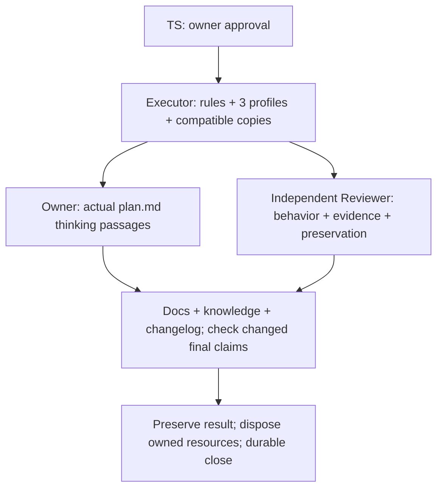

# TS — TFW_20260922-192606_PCUX / Phase A: Provider profiles and coordinator route

> **Date:** 2026-09-23
> **Author:** Codex Coordinator `codex:thread:local:01a0c980-4552-7ed3-b2aa-3c5cc46bc7bc`
> **Status:** ✅ Approved by owner saubakirov on 2026-09-23; execution may be dispatched
> **Approval:** [owner gate](journal/20260923-091327__gate_answer__dbea.md) accepts this TS's substantive content at `a5f3b31c9a015a1847ecc7d92b5da0d72f9e14c7`, including the immutable 38-file / 3,200-LOC denominator; the separate actual-Plan-text verdict remains reserved
> **Parent HL:** [HL-TFW_20260922-192606_PCUX](HL-TFW_20260922-192606_PCUX.md), frozen through A12 at `5259851e6f07206a07d022db11ef1cbc91dca775`
> **Basis:** accepted [RES iter1](research/iter1/RES.md) at `a2c3c717311cf5e02dcd8018284b7e8613de2326` and [RES iter2](research/iter2/RES.md) at `f3f754fc22fdc7139d22443e8c3ebc6f00842fcb`; two configured iterations complete

## 1. Objective

Deliver the owner's understandable choice of autonomy without weakening TFW or turning its Coordinator into a dispatcher. Three selected provider profiles explain today's usable routes and limits. Authorized roles start with exactly the owner's command and obtain context from task files; gates drive continuation. A persistent Codex GATEWAY protects owner context through separate phase Coordinators. Launch authority, dialogue and owner-context topology remain independent. The owner can change operation without rebuilding the plan, and receives reviewed work with the protected planning mindset, documentation, knowledge, changelog and safe resource disposal.

The owner-visible finished-result preview and value-flow diagrams remain in frozen HL §§1/3.1/3.2; this execution specification does not replace them with a process picture. The delivery/acceptance map below is also presented in chat:

Arrows show dependencies, not permission for role-to-role messages. All role returns use their own Coordinator. The actual mental-model gate and independent review are both required; neither replaces the other.

## 2. Scope

### In Scope

- One coherent Phase A at task root: shared coordination/state rules, exact selected profile discovery, the three profiles, affected role/close readers and shipped/installed parity.
- Minimal current-selection extension specified in AC-2; command-first/later identity, independent GATEWAY/dialogue, safe continuation and conservative compatibility.
- Strategic planning and full model/effort selection preservation; conditional small-task full-role subagent admission without a weakened Reviewer or invented native proof.
- Task-level changelog and resource-complete phase/task closure, including docs/knowledge dispositions and final-effect checking. Apply those obligations to PCUX itself through their proper roles.

### Out of Scope

- A new scheduler, launch ticket, session/resource registry, provider-neutral SDK, permanent model roster, or fourth UX profile. Existing Cursor compatibility is preserved, not expanded into a fourth platform product.
- Transcript, terminal, raw global/session-state or unreturned working-tree inspection; inherited conversation or hints in first role messages; dialogue in the current PCUX run.
- Automatic release, version bump, tag, publication, push, settings migration, another project's update, or user data cleanup. The owner-held intent clone and unrelated dirty files are excluded.
- New permanent tests without prior owner agreement. No large/multi-phase subagent trial, artificial role proliferation, or access to another platform as a prerequisite to documenting a conditional route.
- The unfinished Claude browser addendum. Only its already-selected spawn-report epoch in HL §2 is input; a later owner-returned complete source requires explicit selection, not silent file rereading.

## 3. Principles Check

| HL §7 | Enforced by | Gate |
|---|---|---|
| P1 Core authority, local ergonomics | AC-1/2/6 | Profile selection, authority and reader parity |
| P2 Dated, scoped capability claims | AC-6/7 | Separate owner report, source proof and live observation |
| P3 Selected trace, not transcript | AC-3/4 | Exact launch/return surfaces and forbidden-edge cases |
| P4 Proportional autonomy | AC-6 | Small-task eligibility and growth refusal |
| P5 Human-visible navigation | AC-7 | Task-only grouping; unavailable title/grouping fallback |
| P6 Protect owner context | AC-4 | Separate phase Coordinators; no worker-to-GATEWAY edge |
| P7 Strategic thought invariant | AC-5 | Complete actual passages and explicit owner verdict |
| P8 Automate mechanics, preserve decisions | AC-2/3/4 | Mode cases and remaining owner gates |
| P9 Live mode is not a new plan | AC-2 | Immediate/conditional/revoked selection and continuity |
| P10 Leave result, remove scaffolding | AC-9 | Capture, final claims, reachability and exact disposal |
| P11 Work backwards, challenge, subtract | AC-5 | Consequential questions, owner triage, result preview |
| P12 Extend without silent regression | AC-3/8/10 | Launch selection and affected baseline obligations |

## 4. Affected Files and Value-Bearing Accounting

Paths are repository-relative. Classify the whole changed file; no freehand subtraction. Installed copies are VALUE because parity is an accepted output. The following is the prospective surface, not an instruction to edit an unchanged file merely to match a count.

| File / deterministic selector | Action | Class | Required result |
|---|---|---|---|
| `.tfw/conventions.md` | MODIFY | VALUE | Shared activation, selection, role units, launch choice, topology, workspace and close contract |
| `.tfw/glossary.md` | MODIFY | VALUE | Consistent terms and authority pointers |
| `tools/tfw_state.py` | MODIFY | VALUE | Compatible closed schema and checks; never grants authority from syntax alone |
| `.tfw/templates/HL.md` | MODIFY | VALUE | Independent selection and durable thinking/preview obligations |
| `.tfw/templates/status.md` | MODIFY | VALUE | Current selection, baseline and compatibility form |
| `.tfw/templates/journal/event.md` | MODIFY | VALUE | Immutable owner-selection event and truthful late dispatch |
| `.tfw/templates/ONB.md` | MODIFY | VALUE | Relevant baseline obligations and owned resources in existing trace |
| `.tfw/templates/RF.md` | MODIFY | VALUE | Returned result, preservation, close disposition and settings evidence |
| `.tfw/templates/REVIEW.md` | MODIFY | VALUE | Independent affected-claim/close checks and reporting exception |
| `.tfw/workflows/plan.md` | MODIFY | VALUE | Strategic thinking, selected profile, launch/topology/mode algorithm |
| `.tfw/workflows/research/base.md` | MODIFY | VALUE | Current selection versus prior activation; mandatory returns |
| `.tfw/workflows/handoff.md` | MODIFY | VALUE | Role continuity, workspace and result/resource evidence |
| `.tfw/workflows/review.md` | MODIFY | VALUE | Independent stable-candidate acceptance and correct return channel |
| `.tfw/workflows/docs.md` | MODIFY | VALUE | Explicit real disposition and final-effect obligations |
| `.tfw/workflows/knowledge.md` | MODIFY | VALUE | Qualified capture/N/A and safe close sequencing |
| `.tfw/workflows/init.md` | MODIFY | VALUE | Selected profile installation/read contract |
| `.tfw/workflows/update.md` | MODIFY | VALUE | Compatible selection migration and source/receiver parity |
| `.tfw/adapters/codex/AGENTS.md.template` | MODIFY | VALUE | Thin exact selected-profile route and shared boundary |
| `.tfw/adapters/claude-code/CLAUDE.md.template` | MODIFY | VALUE | Same, without duplicating provider guidance |
| `.tfw/adapters/antigravity/tfw-rules.md.template` | MODIFY | VALUE | Same, with exact current adapter discovery |
| `.tfw/adapters/cursor/tfw.mdc.template` | MODIFY | VALUE | Preserve common compatibility; no fourth UX profile |
| `.tfw/adapters/codex/coordinator.md` | CREATE | VALUE | Codex-only practical route and evidence limits |
| `.tfw/adapters/claude-code/coordinator.md` | CREATE | VALUE | Distinct click/full-chat and compact routes |
| `.tfw/adapters/antigravity/coordinator.md` | CREATE | VALUE | Manual full-chat route, bounded compact and naming limits |
| `.tfw/adapters/README.md` | MODIFY | VALUE | Profile ownership/discovery and receiver verification explanation |
| `AGENTS.md` | MODIFY | VALUE | Updated managed block only |
| `CLAUDE.md` | MODIFY | VALUE | Updated managed block only |
| `.agents/rules/tfw.md` | MODIFY | VALUE | Exact installed persistent rule |
| `.claude/commands/tfw-plan.md` | MODIFY | VALUE | Exact canonical copy |
| `.claude/commands/tfw-research.md` | MODIFY | VALUE | Exact canonical copy |
| `.claude/commands/tfw-handoff.md` | MODIFY | VALUE | Exact canonical copy |
| `.claude/commands/tfw-review.md` | MODIFY | VALUE | Exact canonical copy |
| `.claude/commands/tfw-docs.md` | MODIFY | VALUE | Exact canonical copy |
| `.claude/commands/tfw-knowledge.md` | MODIFY | VALUE | Exact canonical copy |
| `.claude/commands/tfw-init.md` | MODIFY | VALUE | Exact canonical copy |
| `.claude/commands/tfw-update.md` | MODIFY | VALUE | Exact canonical copy |
| `KNOWLEDGE.md` | MODIFY | VALUE | Applicable final technical/reference/index effect through close workflow |
| `knowledge/records/TKL-*.md` | CREATE or MODIFY | VALUE | Changed direct-child records selected by qualified PCUX close effects; plan assumes one |
| `.tfw/CHANGELOG.md` | MODIFY | TRACE | One truthful attributable task entry; log, not a release authorization |
| `workspace/2026/TFW_20260922-192606_PCUX/**` | CREATE or MODIFY | TRACE | Governing plan, control, role reports, EV and close records; no product hidden here |
| Exact task-owned temporary checks/fixtures, identified in ONB/EV and disposed at close | CREATE then remove | ASSURANCE | Focused verification only; no new permanent test suite |
| Reproducible documentation build output | Generate if relevant | DERIVED | Not independently accepted; never conceal product changes as build output |

### Prospective accounting contract

| Fact | Value proposed for owner approval |
|---|---|
| Subject / VALUE selector | Single Phase A; whole-file union of the 38 VALUE rows above, with `knowledge/records/TKL-*.md` matching direct children only and all changed matches counted. No other exclusions inside selected files |
| Baseline | `991a0da91d97196f1233cfbafd3851edc6f66f8e`, clean selected product surface after unchanged RES2 landing |
| Selector/approval epoch | This exact TS as named by the subsequent owner verdict and its immutable approval record. Its own future commit is not guessed here; no implementation before that ref exists |
| Candidate | First tested immutable Executor commit containing required VALUE+ASSURANCE, before EV/RF/REVIEW/final transition. Excluded-only later records do not move it; later VALUE, including material close documents, requires a replacement Candidate, recomputation and affected independent check |
| Planned logical VALUE files | **38**; rename counts as one; unused selected paths do not count as touched |
| Planned touched text LOC | **2,000 additions + 1,200 deletions = 3,200**. Estimate, not measured output or a target to consume; numeric numstat fields only, non-text per-file N/A |
| Configured prompts | **50 files / 5,000 LOC**. Forecast is below both; crossing prompts a prospective cause/cost/assurance/split/authority ruling, not an automatic quality veto |
| Multiplier / authority | **2×** immutable plan: owner ruling before work at or above **76 files or 6,400 LOC**, or from a planned-zero measure. Below that, only necessary constituents with all governing boundaries unchanged may be prospectively ruled by Coordinator; no silent selector widening or denominator ratchet |
| Failure | Missing, mutable, mismatched or late baseline/approval/selector/Candidate is BLOCKED. N/A is only a genuinely inapplicable measure; DEFERRED is not terminal. There is no unresolved phase allocation |

Reproduce with `git diff --name-status --find-renames=50% -z` and `git diff --numstat --find-renames=50% -z`, using the full Baseline/Candidate SHAs and precisely the approved VALUE path union. RF binds the result/deviations; one EV accounting row records commands and totals; REVIEW independently recomputes without inventing authority. A newly necessary path requires its actual class/selector ruling before work, not a broad catch-all.

**Actions, not budget dimensions:** plan 34 modified VALUE files, three new profile files and one qualified knowledge record (new or updated); no planned product deletion. TRACE/ASSURANCE/DERIVED do not create shadow budgets. Preserve affected known historical references rather than rewriting history.

**Prospective scope ruling proposed:** retain one phase. These changes share one authority/reader contract; a split by provider would repeat core integration and permit contradictory intermediate readers. Costs are source/copy synchronization and focused behavioral verification. Splitting by later task is justified only by a genuinely independent output, not a file-count target. The owner decides this proposal with the exact TS/denominator approval. No hard file/LOC cap is proposed.

### Task-local hard boundaries

| M1 harm | M2 protected object/risk | M3 direct check | M4 before action | M5 why later review is insufficient | M6 change authority |
|---|---|---|---|---|---|
| Contaminated role judgment and polluted owner context | First messages, permitted edges, independent Reviewer, selected artifacts | Exact payload/route/producer facts; no prose/forked context, forbidden transcript reads or peer-to-GATEWAY traffic | Validate launch/read/send against current mandate and role | Disclosure cannot undo read context or an already-sent briefing | Owner for frozen intent/independence; Coordinator only within current grant |
| Lost work or false complete claim | Exact owned chats/worktrees/branches/processes/files and accepted Candidate | Ownership, clean/inactive state, retained reachable ref, capture/acceptance and disposal outcome | Check exact target and parent-after-return sequence before each disposal | A later report cannot recover a destroyed sole result | Owner for expanded/destructive authority; parent only for already-authorized safe owned cleanup |

## 5. Acceptance Criteria

### AC-1: Selected provider guidance, not vendor logic in the core

- [ ] Exactly three `coordinator.md` profiles own provider mechanisms, limitations and offers. Shared rules own authority, roles, gates and mode semantics; no permanent provider/model roster or duplicated workflow algorithm.
- [ ] A selected persistent adapter supplies one exact profile path. Plan/GATEWAY reads that selected profile at the capability/selection or relevant changed-capability checkpoint, not on every role invocation and never by reading every profile or the tooling manifest. Missing/ambiguous profile selection is reported without guessed identity or widened authority.
- [ ] No new runtime registry or always-preloaded profile body is introduced. Thin command wrappers still fully load their one canonical workflow.

Gate: source ownership/read-order comparison and representative selected/missing/ambiguous entry cases. Evidence: exact installed receiver paths and the available Codex route; other hosts explicitly unobserved, not required to claim only source/receiver conformance. Covers HL DoD 1/5.

### AC-2: One current selection with an immutable human source

- [ ] Add `reporting: native-gates | owner-transfer` and `selection_ref: baseline | <relative-journal-event-path> @ <40-hex-commit>` to the current complete status form. `baseline` means the validated initial choice in `coordination_authority`, not permission inferred from a default. Existing `activation`, `dialogue`, `owner_gateway` and `coordinator_route` retain their distinct purposes; no extra composite mode field.
- [ ] Add one immutable event kind, `coordination_selected`, for an actual owner operating choice. Preserve the existing event envelope, attribution and contained `refs`; no lifecycle pair. Its body records the actual human source/evidence, old and selected values, exact task/phase/role scope, reservations, effective `now` or named checkpoint, and revocation/continuation consequences. `on_behalf_of` alone is not evidence of human approval. The selected launch policy is recorded without a self-referential/fabricated SHA; after commitment, status can cite the actual decision epoch.
- [ ] The frozen HL is the ceiling; current status is the only effective selection. A pending event changes nothing before its named checkpoint. Effective adoption validates owner source, content, commit, scope and condition, then updates current status truthfully; no replay-derived parallel state or routine HL amendment for an unchanged ceiling.
- [ ] A phase uses its own current status. The only ancestor exception is `selection_ref` to a journal event of its exact governing ancestor task, validated through phase lineage, same project/task containment, immutable content and explicitly covered phase/roles/effect. Sibling/foreign/arbitrary traversal refuses; journal `refs` containment does not change. Do not continuously consult root live state for worker permission.
- [ ] Initial default is manual creation plus required native vertical gates. Fully manual transfer requires explicit owner selection. Non-revoking switches retain units, pending gates and prior valid activation; current choice controls new launches/reporting/routes. Revocation stops new delegated launches and safely returns active work; unavailable delivery is an open action, never a claimed remote halt.
- [ ] No original routing fields: legacy read-only. Partial original or partial new form: refuse. Valid complete old five-field state: preserve its actual authority with baseline/native reporting compatibility, infer no new delegation/dialogue/owner-transfer, and truthfully migrate before applying new semantics. Old immutable events remain unchanged; unavailable object/source verification blocks only dependent authority, not historical readability. Neither optional Python nor Git becomes a receiver workflow prerequisite.

Gate: focused synthetic valid/invalid state and event cases for baseline, immediate/future selection, revocation, ancestor scope, missing/mismatched immutable source, legacy/partial forms and same-unit continuation. Demonstrate validator/reader agreement and identify checks that require actual authority evidence rather than syntax. Evidence: PCUX's real current mandate remains unchanged; migration may preserve it but must not manufacture a new owner choice. Other mode cases are labelled synthetic unless actually observed. Covers DoD 10/12/13.

### AC-3: Command-first launch and resource-aware choice

- [ ] Every new Coordinator/worker/admitted subagent receives exactly `/tfw-* <task[/phase]>` as first task message, using actual repository command syntax. No briefing, copied/inherited conversation, hints, wait instruction or second activation ceremony. Existing continuation references remain permitted at their valid gate.
- [ ] Actual launcher/native origin, mandate, skill, lifecycle and parent route are validated from native context and task files. An initially unknown child address does not block authorized start. Receipt or first normal gate supplies the address; record dispatch only as known, distinguish request receipt from actual unit, and refuse subsequent foreign/ambiguous addressed operations. No fake pre-start timestamp, launch ticket or universal registration exchange.
- [ ] Every direct launcher preserves the full Launch selection algorithm: prerequisites and quality floor; separate model/effort choice; plausible lower-resource alternative with concrete risk or `not compared`; authorized native parameters or exact existing two-line launch advice; requested/effective settings, delivery, outcome and rework distinguished. GATEWAY chooses its Coordinator, each Coordinator its own roles. Defaults are not justified choices; provider restrictions are honoured and unobserved settings remain unknown. Rationale stays out of the first message.

Gate: first-message/late-ID/duplicate/foreign-ID cases plus each of the five launch-selection obligations traced to candidate text. Evidence: use named existing PCUX clean-launch/gate artifacts at their actual level and subsequent authorized role launches; do not create a dummy role merely to manufacture evidence or claim a retrospective pre-start receipt. Covers DoD 6/19.

### AC-4: Independent topology and dialogue; useful autonomy

- [ ] Gates-only GATEWAY and bounded dialogue without GATEWAY are both valid. Iterative dialogue still requires an exact immutable grant for exactly two peers, purpose, boundary, consolidator, durable output and stop; the independent Reviewer is neither peer nor consolidator. No grant widens unrelated edges or launch/execution authority.
- [ ] Codex GATEWAY is a distinct persistent owner interface, not renamed root Coordinator. Unplanned work gets a planning Coordinator; multi-phase work gets a separate Coordinator per phase without an obligatory planning-supervisor layer. One-phase work needs one responsible Coordinator. GATEWAY never runs Plan or watches workers; only responsible Coordinators return upward.
- [ ] Autonomous gates-only advances ready authorized roles/corrections without another owner message; manual creation never spawns behind the owner, but each active role still owes native vertical gates. Only explicit owner-transfer disables inter-agent sends and presents exact manual returns. Reserved owner decisions stay actionable gates in every mode.
- [ ] No unsolicited dialogue, transcript/terminal/log/unreturned-tree inspection or distrust-driven repeat work. Same Executor and independent Reviewer continue corrections. Liveness is at most an optional immediate-parent metadata check after about five minutes of unexplained silence, with backoff/no unchanged narration; no GATEWAY worker polling or permanent monitor by default.

Gate: a single scenario matrix covers autonomous/manual/full-manual/bounded-dialogue, initial/two-phase/already-planned routes, prohibited edges and unresolved owner gate. Evidence: current PCUX remains Coordinator + owner, gates-only; structural GATEWAY scenarios are not falsely described as an executed native topology. Covers DoD 4/7/8/10/12.

### AC-5: Strategic thinking survives in the actual Plan text

- [ ] Actual canonical Plan preserves HL §3.3/3.3.1: Working Backwards finished-state story, benefit/impact, explicitly imagined stakeholder quote and concrete outcome rendering; distillation without flattening; at most five consequential devil's-advocate questions, not a quota; visible hypothesis/decision/false-case triage before initial research with meaningful owner answer/rejection opportunity; Saint-Exupery removal of duplication/control without lost value, proof, boundary or freedom.
- [ ] Owner discussion remains thoughtful in every mode and at GATEWAY, without a second operational plan. Rejected/irrelevant hypotheses are not secretly researched; routine authorized research does not repeatedly seek mechanical approval. Actual outcome previews and diagrams appear in both HL and chat, not only links or a process diagram.
- [ ] After a durable Executor return, Coordinator presents the complete relevant revised passages, exact Candidate and before/after semantic explanation. Explicit owner acceptance is recorded before final task acceptance/distribution; later material changes return to that gate. Independent review is still required. This is not permission to inspect unfinished work.

Gate: passage-level baseline/HL/Candidate comparison, including examples of a consequential versus irrelevant hypothesis. Evidence: actual owner-facing passage package and explicit verdict; **required and still pending**, not N/A and not satisfied by TS approval. Covers DoD 9/16/17.

### AC-6: Honest, usable Claude and Antigravity routes

- [ ] Claude full chats remain owner-click-created in one selected local workspace. The selected report's nonempty initial prompt means exact command at the ready role gate, not an empty pool or a waiting prompt. A pool is only a conditional option on a surface that genuinely permits command-only later activation; receipt/first gate may fulfil a single transport-only readiness need. No extra compulsory handshake or worker-to-GATEWAY results channel.
- [ ] Shared workspace has one active mutation owner, exact-path commits, preserved foreign work and an immutable independent review Candidate while mutation is stopped. Conflicting phase work is serialized, not moved into per-role worktrees. Codex's distinct visible-role/worktree route remains separately specified.
- [ ] Compact Claude/Antigravity is a conditional complete TFW role/skill/artifact/gate cycle only for genuinely small one-phase or small debt/fix work. Check actual tools including browser when needed, attributable direct returns, continuation, capable Coordinator, cumulative context/noise and independent Reviewer. Reject disguised large/multi-phase work and re-evaluate growth; never silently degrade roles or introduce hidden substitutes in Codex.
- [ ] Antigravity full-chat creation stays owner-manual according to the dated report. Required gate reporting still applies. No full unattended claim while a required click, role/tool/continuation gap or reserved decision remains. Absence of a P3/P4 trial does not prohibit describing the conditional route, and partial observations do not prove that trial.

Gate: route/eligibility cases including unavailable browser, growing scope, moving Candidate, empty prompt and shared-writer conflict. Evidence: selected HL §2 report only at its observed level; full cross-platform cycle/browser/title reliability is explicitly unperformed real-use validation, outside this acceptance claim. Covers DoD 3/11/14.

### AC-7: Navigation helps without becoming authority

- [ ] Codex offers one optional task-only Section and exact role titles; never moves unrelated tasks or makes organization a work gate. Use existing PCUX Section membership as bounded evidence, not authority.
- [ ] Antigravity checks current title-write/readback capability at the relevant run; names the unavailable link once and never claims success without readback. Profiles distinguish native, owner-assisted and unavailable creation/send/wait/title mechanisms and remaining owner actions before requesting the initial mandate.

Gate: absent/failing grouping/title cases and startup-card completeness. Evidence: current task-only Codex Section/title receipts; other surfaces remain dated report/unknown until used. Covers DoD 2/8/12.

### AC-8: Coherent installed/receiver behavior and preserved obligations

- [ ] Relevant canonical/source/installed copies agree; all four existing adapter families retain the exact ten public commands and roles. A clean fixture reproduces discovery and selected profile loading; a repeated install/update yields no new diff; marker-bounded roots preserve unrelated neighbours. No unrequested Cursor installation into the owner's checkout.
- [ ] ONB identifies affected baseline obligations; RF/EV/REVIEW compare them as preserved, relocated without semantic loss, or explicitly superseded by a cited HL amendment. Include ordered context reads, Role Lock, research gates, review/REVISE lineage, authority, Candidate accounting, knowledge handover and close/recovery. No unrelated full-framework audit or repeated work from distrust.
- [ ] Existing thin skills, manifest and unaffected workflow callers are checked as consumers, not rewritten mechanically. Any necessary additional changed constituent receives a prospective scope ruling. Receiver operation gains no new Python/Git/tool prerequisite.

Gate: exact copy/managed-block comparison, isolated fixture repeat, targeted stale-contract search with each hit classified current/history, selected existing project checks and before/after obligation map in normal EV. Evidence: local receiver/fixture results with scope/limits; source parity is not model comprehension. Covers DoD 5/20.

### AC-9: Complete close, including this task

- [ ] Shared close readers require both `/tfw-docs` and `/tfw-knowledge` dispositions: actual Applied effects or substantive source-based N/A, never silence/placeholder. Later changed accepted claims get an independent affected-result check. Iter1 Fact Candidates are qualified through the knowledge workflow, not blindly promoted from this TS.
- [ ] Every task records one truthful attributable changelog entry under its project contract. PCUX uses `.tfw/CHANGELOG.md`; no invented release/version/publication. Final return states docs, knowledge, changelog and resource outcomes together.
- [ ] Existing ONB/EV/RF/REVIEW/dispatch traces hold exact ownership and disposition, not a new inventory registry. After capture, corrections, final checking and accepted reachable integration, dispose no-longer-needed owned role chats/helpers, branches/worktrees, Docker containers/networks/volumes, processes/servers/monitors and temporary files. No global prune, shared/persistent-data deletion or sole-copy loss.
- [ ] Each actual resource is archived/removed, intentionally retained with a specific reason, or pending with named actor/action. Archive is not evidence of disk removal; preserve restoration-dependent resources or resolve that dependency. Required pending disposal prevents a fully cleaned/closed claim. Parent archives child only after durable return; a Coordinator can return before its parent's final archival. Retain owner GATEWAY/intent clone and unrelated/main workspaces. Remove an empty task-only Section only when genuinely unused and authorized.

Gate: close-order and negative safety cases (dirty/shared/unknown resource, only reachable copy, late docs change, unavailable archive, restoration dependency). Evidence: **actual PCUX close required** through proper workflow owners, with exact retained Candidate ref and resource dispositions; never synthesize nonexistent Docker resources to tick a box. Covers DoD 15/18.

### AC-10: Reproducible acceptance without assurance theatre

- [ ] EV gives per-AC claim, oracle, method, actual result, limitations and disposition; clearly separates synthetic/receiver/live checks and unperformed external trials. The Reviewer reruns necessary independent checks against the exact approved TS, immutable Candidate and value accounting.
- [ ] Use proportionate temporary checks and existing relevant permanent suites. No new permanent test, token-count target, parallel audit document, fabricated owner approval or unperformed-pass claim. Preserve unrelated work and exact reviewed commit reachability at landing.

Gate: EV/RF/REVIEW consistency and independent accounting reproduction. Evidence: required real local execution and final accepted-result lineage. Covers DoD 20 and all AC evidence boundaries.

### Evidence Artifacts

| File | Purpose |
|---|---|
| `evidence/EV__TFW_20260922-192606_PCUX.md` | Required per-AC results, one accounting row, affected-obligation comparison and exact supporting refs |
| Role-owned ONB, RF and live REVIEW at convention-derived task paths | Implementation, independent acceptance, corrections and close dispositions; no duplicate audit ledger |
| Existing task journal and named durable native returns | Actual decisions, dispatch/continuation, owner mental-model verdict and state changes; no chat transcript archive |

## 6. Technical Guidance

- RES iter2 D1–D7 narrow the shared-state design; D3's constrained exact ancestor reference is selected over a second adoption registry. The names/semantics in AC-2 are compatibility requirements. Internal parsing/layout and verification mechanics are Executor choices; explain a necessary deviation through the existing authority route before changing that contract.
- Keep the two new status fields and one event kind small. Existing event body and task authority hold decision detail; no self-referential commit, hidden effective-state cache or duplicate event replay engine. Existing `coordination_authority` remains the frozen ceiling; `activation` references the validated applicable immutable mandate, including an owner-decision epoch where it supplies current launch authority.
- `.tfw/` payload distribution already carries profile assets. Extend tooling metadata only if a concrete copy/read need requires it; do not add a runtime manifest dependency. Search exact affected consumers instead of rewriting every command.
- Validate synthetic authority cases without launching or messaging real units. Reuse bounded real PCUX receipts only as evidence of what actually occurred. The later browser report is not a reason to delay unrelated implementation or claim browser support.

## 7. Definition of Failure

All frozen HL §6 conditions apply. In particular, reject any implementation that restores a first-message briefing/wait/registration ceremony; conflates capability with authority or dialogue with GATEWAY; weakens role independence; reads forbidden session surfaces; loses manual gate returns or safe continuation; silently drops strategic/model-selection obligations; claims unobserved cross-platform autonomy; or closes without the actual owner Plan verdict, independent acceptance and complete capture/cleanup dispositions.

An assurance gap is not automatically a product defect: classify findings under the existing VALUE/ASSURANCE/TRACE and REVISE rules. Report the precise unsupported claim and its material consequence; neither bureaucratic nonconformance nor missing native access creates permission to rewrite the owner's intent.

## 8. Phase Risks and Decisions

| Decision / risk | Cost and mitigation | Alternative cost |
|---|---|---|
| One connected phase | More synchronized reader/copy checks; bound with the prospective selector and shared scenario matrix | Provider-by-provider phases duplicate integration and temporarily disagree about authority |
| Two fields and one event kind | Small schema/migration cost; explicit negative cases and immutable source | Mutable flags lose authorization; a mode registry adds a second state authority |
| Conditional compact guidance | Eligibility checks at actual use; no claim of an unobserved full cycle | Blanket ban removes owner-valued small-task autonomy; blanket approval hides tool/context/review gaps |
| Shared Claude workspace | Serialized writes reduce parallelism; fixed Candidate protects review | Per-role worktrees restore the owner's rejected synchronization cost |
| Preserving thinking and existing duties | Actual passage/obligation comparisons and one reserved owner verdict | Prose-only reassurance can ship a mechanically correct but strategically damaged Coordinator |
| Complete close | Late capture changes may require replacement Candidate/affected review; unsafe disposal stays explicit | Early archive loses evidence/corrections; global cleanup risks unrelated data |

### Material handover

Producer is the Coordinator identified above, acting under the frozen HL §4.1 mandate; originating proposer for this TS is this Coordinator, no stable machine principal. Inputs are the selected frozen HL, two named durable RES returns, current task control, and affected baseline rule/reader/template/adapter sources. No foreign transcript or unfinished role tree was inspected. Material result is this proposed single-phase execution bound; there is no new direct human Fact Candidate from research assessment. Remaining uncertainties are actual provider tool/continuation reliability and the owner-unselected browser addendum, not the settled owner intent. Next recipient is the owner for exact TS plus **38 files / 3,200 touched LOC** approval; only then a separate visible Executor receives `/tfw-handoff TFW_20260922-192606_PCUX`. Same-unit correction and independent review follow; the actual Plan text verdict and full close remain owed.

---

*TS — TFW_20260922-192606_PCUX / Phase A: Provider profiles and coordinator route | 2026-09-23*
