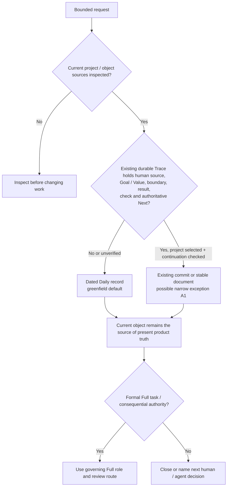

# RES — TFW_20260923-223151_PTW: Daily Trace architecture

> **Date:** 2026-09-25
> **Author:** Researcher, Codex task `codex:thread:local:01a0d505-d0b4-76f2-ad95-58f1bf9cfe2e`; accountable human owner `saubakirov`
> **Status:** 🔬 RES — iteration 1 complete; recommendation pending Coordinator decision
> **Parent HL:** [HL-TFW_20260923-223151_PTW](../../HL-TFW_20260923-223151_PTW.md)
> **Mode:** Pipeline; `focused` research mode, one owner-selected short iteration
> **Producer unit:** `codex:thread:local:01a0d505-d0b4-76f2-ad95-58f1bf9cfe2e`
> **Parent Coordinator:** `codex:thread:local:01a0cf4d-9254-7633-9ba9-393b0eb8e802`
> **Activation / dispatch source:** Command-only `/tfw-research TFW_20260923-223151_PTW`; direct dispatch `journal/20260925-010738__dispatch__ef88.md` at source commit `87f91aaae5bc6bea4616802119a6e55ccd101da3` (same bytes incorporated into this worktree at `aea074e`).
> **Coordination authority:** `HL-TFW_20260923-223151_PTW.md @ 64278fdfcbfc0f6a59fa069aef45265abd03b0c5`; approved frozen baseline `515b837`.
> **Originating proposer:** `none`; the human owner initiated this inquiry and the Coordinator dispatched this Researcher.

---

## Research Context

The approved HL asks whether `tfw-daily-task`, a dated `daily/` folder and a Daily-owned `task.md` template give bounded everyday work the smallest adequate TFW Trace without slowing one-shot delivery, weakening continuation or coupling updates to Full's ten role commands. This iteration examined the local SenseLab and Helpdesk cases, TFW source/update contracts and official Git/GitHub mechanics. It compared a separate dated record, object-adjacent history, existing commit/PR/document Trace and optional versus Full-command distribution. The four completed stage files are [Briefing](1_briefing.md), [Gather](2_gather.md), [Extract](3_extract.md) and [Challenge](4_challenge.md).

## Briefing

The owner selected a quick, light inquiry on H12–H14 with H1/H7/H11 as supporting tests, while preserving clear-request one-shot work, the established SenseLab record, no universal `daily/README.md` and no silent shared-template changes. The [Briefing](1_briefing.md) set six independent dimensions: Trace location, record boundary, distribution, name/identity, relation/discovery and local-form evolution. The Coordinator accepted each subsequent stage checkpoint through the direct native route.

## Decisions

These are **Researcher recommendations**, not owner verdicts or implementation authority.

| # | Research disposition | Rationale |
|---|---|---|
| D1 | Retain `daily/YYYY/YYYYMMDD-HHMMSS_slug/task.md` as the **provisional greenfield default** and retain the SenseLab triad where its project rules require it. | It has observed code/non-code breadth and separates request history from current product truth. No matched measurement proves a one-file form cheaper, so the new form must be validated rather than declared superior. |
| D2 | Keep `tfw-daily-task` provisionally; define `daily` as a bounded route, not cadence or low-risk assurance. Use the immutable whole ID, a collision suffix and exact links; do not organize history by mutable subject. | Current field use gives the name a working referent. `tfw-task` risks reviving a retired command; `quick` risks underchecking. No observed retrieval failure warrants subject folders, a maintained journal or generated view. |
| D3 | Define one optional-package source, explicit receiver/update checks and local-template preservation before claiming cross-project delivery. Do not add Daily to Full's ten-command manifest by implication. | Current `init`/`update` covers the Full manifest, not an optional Daily package. Path isolation alone does not establish update safety. |
| D4 | Preserve commit-body and stable-document Trace as **project-selected, tested exceptions**, not as the new universal default. | A sufficiently complete existing artifact could remove a folder, but no field example here proves second-worker continuation; the observed small commit lacks required source, Value, check and next state. |

### Decision matrix

`Fit` and `Trace` below evaluate the design **if its stated prerequisites hold**. Cost labels are directional Researcher estimates, not measured time/tokens. `Current` means whether the configuration works under the present Full and field contracts without a new canonical change.

| Configuration | Goal/Value + NS1 fit | Selected Trace completeness | Lookup cost | Update cost | Migration / authority risk | Current disposition and falsifier |
|---|---|---|---|---|---|---|
| **C1 dated folder + one file + optional package** | Pass if context starts at current object and the Task names human authority | Can pass; no real greenfield one-file continuation trial yet | Bounded search + exact link; unmeasured at scale | Optional install/update map absent today | Low for new work if old records remain; Full scope wording needs clarification | Provisional default. Loses if a matched no-folder task preserves the same fields and resumes with less work, or folder search misses material current context. |
| **C2 SenseLab dated folder + triad** | Observed project-local fit | Observed source/meaning/version/close separation | Three-file read; actual continuation observed in local record, not independently tested | Local copy can drift from upstream | Do not migrate; project identity/message rules remain local | Preserve field form. Loses as universal form if routine one-shot cases pay extra reads/writes without a decision benefit. |
| **C3/C8 object-adjacent record** | Pass when object is stable and current authority lives there | Conditional: history must remain distinct from current truth | Low for object-first workers; harder for cross-object tasks | Local object rules and package must be aligned | Object rename/access or multi-object task can break reachability | Project option only after a repeat-work trial. |
| **C4 structured commit body** | Pass for an authorized, already-committed tiny code change | Conditional: explicit human source, Goal/Value, boundary, result, check and close/next; observed `6c3ac77` fails | `git log -- <path>`; low only if future worker searches Git | No Daily file template, but message discipline required | Rebase/squash and non-code/uncommitted work make it brittle | Strong no-folder exception to test; a complete second-worker resume would falsify universal H12. |
| **C10 stable document section** | Pass when the document is the continuing work object | Conditional: source/decision/check/next survive revision and access | Low for document-first workers | Embedded form can drift with document | Delivery copy, later edits or privacy can erase/obscure history | Strong non-code exception to test; SenseLab's multi-format sent letter does not fit it well. |
| **C5 host PR/issue only** | Conditional on access and project workflow | Can hold structured fields, but host-only durability is unproved here | Host search and permissions | Host template/provider dependent | Vendor and reader-access risk | Local option only with an inspectable ordinary-file/equivalent continuation route. |
| **C6 Git note** | Conditional code-only fit | Possible but stored in separate ref | Separate-ref discovery | Extra fetch/display/rewrite policy | High hidden-dependency risk for portable default | Do not choose as generic default without a successful distributed retrieval trial. |
| **C7 eleventh Full command** | Misleads about Full role boundary under current contract | Folder may be complete, command authority remains wrong | Same as C1 plus Full discovery | Changes manifest, init/update and parity checks | High contract/migration cost | Reject as drop-in; only a separately approved canonical Full change could admit it. |

The likely smallest **generic** complete form is C1 only if a new worker can locate current object sources and reconstruct the bounded request from its one file. A compact file that omits the human source, check or authoritative Next fails NS1 even when it is faster to write. Conversely, a complete existing commit/document can be smaller than a folder for a project-selected case; an actual continuation trial, not a file-count argument, would settle that exception.

## Open Questions

| # | Question | Status | Answer / next evidence |
|---|---|---|---|
| Q1 | Does a greenfield one-file Task retain meaning revisions and material human words at lower context cost than the SenseLab triad? | Open for TS/implementation trial | Compare matched one-shot and changed-meaning cases; count reads/writes and have a second worker recover Goal, Value, source, result, check and Next. Preserve the triad meanwhile. |
| Q2 | Can the optional package install and update Codex/Claude entries and a Daily-owned template while preserving a modified receiver form? | Open, implementation-critical | Pin one source/version, define exact receiver map and customization disposition, then test clean install, repeat update and customized receiver. Current Full manifest does not answer this. |
| Q3 | Can an existing commit or document really replace the folder in a bounded code/non-code case? | Open, optional architecture exception | Run one real case of each with complete selected Trace and second-worker retrieval after a revision; until then treat C4/C10 as conditional designs. |

## Hypotheses (from HL §10)

| # | Hypothesis | HL status | RES status | Evidence and limit |
|---|---|---|---|---|
| H1 | Value comes from selected, connected Trace rather than daily cadence or file count. | Supported conceptually; naming cue open | **Supported as method criterion**, not measured behavior | NS1/NS2 and field cases show purpose, source, result and continuation in different files; this does not prove every compact form works. |
| H7 | Subject folders or shared journal are necessary for repeat-work retrieval. | Plausibly false | **Unsupported as a universal requirement** | Sticker Task and current product README show an alternative; no large-team retrieval measurement was done. |
| H11 | One `task.md` costs less than the SenseLab triad in every project. | Open | **Unproven; universal form implausible** | SenseLab brief history preserved three meaningful revisions; no matched token/time or continuation trial of one file exists. |
| H12 | Separate dated folder is smallest adequate Trace for every bounded request. | Open | **Universal claim unsupported; conditional counterexamples plausible** | C4/C10 can encode all fields if durable and reachable, but no successful field no-folder Task was observed; actual `6c3ac77` commit message is insufficient. |
| H13 | `.tfw/extensions/daily-task/` path isolates Daily from Full and local forms. | Open | **Path alone falsified as an update contract** | Manifest/init/update cover ten Full commands; optional package and override rule do not yet exist. The path can still be the owned template location. |
| H14 | `tfw-daily-task`, dated folder and `task.md` cue right behavior at team scale. | Open | **Provisionally retained; scale untested** | Existing field name and stable dated IDs work locally; cadence cue, multi-worker collision and lookup cost need trial. |

## HL Update Recommendations

The Researcher classifies recommendations and changes no HL. The Coordinator applies free-section refinements and transcribes any frozen proposal to the append-only §12 for the authorized verdict. A proposed exception grants no permission until ruled.

### Refinements — free sections, coordinator applies

| # | § | What to update | Source |
|---|---|---|---|
| R1 | §2 | State that the observed SenseLab triad records material brief revisions and preserves an explicit distinction between checked result and human acceptance; the one-file benefit remains unmeasured. | Gather G2; Challenge C1; SenseLab field files at HL §2 source epoch. |
| R2 | §7.2 | Add official [Git permalink](https://docs.github.com/en/repositories/working-with-files/using-files/getting-permanent-links-to-files), [commit trailer](https://git-scm.com/docs/git-interpret-trailers), [rebase](https://git-scm.com/docs/git-rebase) and [Git notes](https://git-scm.com/docs/git-notes) references, with their narrow mechanical relevance. | Gather G4; Extract E1/E5; Challenge C2/C5. |
| R3 | §8 | Separate optional Daily package install/update/receiver verification from Full's current ten-command manifest; carry clean receiver, repeat update and customized-template checks as unresolved dependencies. | Gather G1; Extract E3; Challenge C3. |
| R4 | §9 | Add loss of current-object context, source/acceptance confusion, commit rewrite, document revision/access and optional-package template overwrite/omission as risks with concrete detection during TS trial. | Extract E2; Challenge C1–C5. |
| R5 | §10 | Mark H1 supported as a criterion, H7 universal need unsupported, H11 cost unproven, H12 universal need unsupported but no field counterexample, H13 path-only claim false, H14 provisional; retain C4/C10 as tests, not established defaults. | Stage findings and hypothesis table above. |
| R6 | §11 | Add the strategy that task history and current object truth may be separate, and a no-folder selected Trace is viable only when source, authority, result, check and continuation remain durable and searchable for an authorized next worker. | SenseLab sticker/letter cases; Extract E1–E2; Challenge C1–C2. |

### Amendment Proposals — frozen sections, resolved-ruler verdict required

| # | § | Type | Proposed change | Evidence | Cost | Alternatives considered |
|---|---|---|---|---|---|---|
| A1 | §3 | `EXTEND` | Permit a **project-selected exception** to the new-project dated-folder default only when an existing commit or stable document demonstrably preserves the same selected Trace fields, is accessible to the next authorized worker and survives a real continuation check. Keep the dated folder as default and preserve all existing SenseLab records. Do not activate the exception from this RES alone. | NS1/NS2 and HL §3 require complete selected Trace rather than a folder count; official Git docs establish structured commit metadata and exact revision links; Extract C4/C10 and Challenge C1–C2 show a credible path and the observed `6c3ac77` failure. Positive field continuation is **not yet observed** and is an explicit condition. | Adds a conditional decision branch, a second-worker check and possible per-project policy; risks confusing a mere code diff or deliverable with a complete Trace if the condition is weakened. | Keep a folder for every Task: simplest enforcement and field-proven history, but adds a parallel record even when an existing durable artifact fully carries the Trace. Make object/commit records the universal default: fails non-code, uncommitted and multi-format history cases. |

No amendment to §1, §4–§7 is supported by this iteration. The exact Daily-owned template path and one-shot boundary in §3 remain the frozen baseline; optional package mechanics can be specified under that baseline without changing Full's role command set. A1 is a proposal for a narrow optional extension, not a finding that H12 has been empirically falsified.

## Fact Candidates

No new Fact Candidates. I reviewed the owner-origin direction already captured in HL §2/§11 and the current Coordinator gate messages. They add no new human-only project fact beyond the approved HL; repository and field-file observations are technical evidence for this RES, not human-only knowledge candidates.

## Strategic Insights (Research)

No strategic insights. No new human domain knowledge was provided during Researcher briefings; the owner's earlier speed, source-check and naming constraints are already preserved in the approved HL.

## Findings Map

## Iteration Status

- **Iteration:** 1 of 1 minimum / 2 maximum under Coordinator's owner-selected `research/iterations.yaml`; this scoped override narrows config's generic minimum of 2.
- **Hypotheses tested:** H1 (supported as criterion), H7 (universal need unsupported), H11 (unproven), H12 (universal claim unsupported, field exception unproved), H13 (path-only update claim false), H14 (provisional).
- **Hypotheses deferred:** H2/H6 (full execution behavior and user recognition belong to TS trial); H3–H5/H8–H10 (already resolved or outside this focused architecture inquiry).
- **Gaps discovered:** No greenfield one-file continuation trial; no actual no-folder success case; no clean optional-package install/update and local override trial; no large-archive retrieval measurement.
- **Superseded decisions:** None. Existing SenseLab form and approved HL remain in force; this RES recommends, it does not revise them.

### Open Threads (for next iteration or TS proof)

| # | Thread | Why it matters | Suggested focus |
|---|---|---|---|
| 1 | One-file versus triad continuation and cost | A smaller file set may hide meaning changes or source words. | Matched simple and revised tasks; second-worker recovery plus actual read/write observations. |
| 2 | Optional-package update and receiver parity | A template path without distribution checks can drift or overwrite a project form. | Clean Codex/Claude receiver, repeated install/update, customized template, one canonical source. |
| 3 | No-folder exception viability and retrieval at scale | Would change whether A1 is useful; current evidence is constructive, not field success. | One tiny code patch and one stable non-code document with full Trace and independent resume; test bounded search before index/journal. |

### Recommendation

- [x] **SUFFICIENT** — return to `/tfw-plan` for Coordinator classification, possible A1 owner verdict and TS design of the remaining proof gates. This one short iteration answered the requested architecture comparison; it does **not** claim implementation or cross-provider readiness.
- [ ] **MORE NEEDED** — a second research iteration is not necessary before planning unless the Coordinator finds a decision that cannot be specified as a TS check.
- [ ] **BLOCKED** — no Researcher blocker; optional package and no-folder trials remain explicit future evidence requirements.

## Conclusion

The dated independent Daily record remains a defensible greenfield default because the observed field cases span substantial code/design and non-code work while keeping historical request meaning separate from current product files. The investigation exposed a stronger subtraction case than the HL's initial layout discussion: a complete, reachable commit or stable document can conditionally carry selected Trace without a folder, but the actual patch inspected does not do so and no positive field continuation was observed. It also found that `.tfw/extensions/daily-task/` is only a proposed location; it provides no install/update safety until an optional package has explicit source, receiver and local-override checks. The recommendation is therefore provisional and falsifiable, with one narrow frozen §3 exception proposed for authorized ruling rather than silently introduced.

### Material handover at this return

Producer: Researcher unit `codex:thread:local:01a0d505-d0b4-76f2-ad95-58f1bf9cfe2e`; parent/recipient: Coordinator `codex:thread:local:01a0cf4d-9254-7633-9ba9-393b0eb8e802` under `tfw-gates-only`. Bounded sources/epoch: approved PTW HL freeze `515b837`, research control `88572cc`, exact dispatch `87f91aa`, SenseLab field files at the HL §2 stated HEAD, Helpdesk's stated untracked source boundary, current `.tfw/` manifest/init/update/conventions and official Git/GitHub pages inspected 2026-09-25. Material conclusion: C1 is the provisional new-project default; SenseLab's triad stays project-owned; C4/C10 are conditional exceptions; optional package/update parity is unproved; no categories or shared journal are justified by observed retrieval failure. Uncertainty: no matched cost measurements, independent continuation or clean receiver trial. Continuation: Coordinator applies free refinements, routes A1 by HL §12 or declines it explicitly, and sets TS proof requirements; owner retains the frozen-contract verdict. No new human-only fact or research-stage knowledge publication is owed.

---

*RES — TFW_20260923-223151_PTW: Daily Trace architecture | 2026-09-25*
