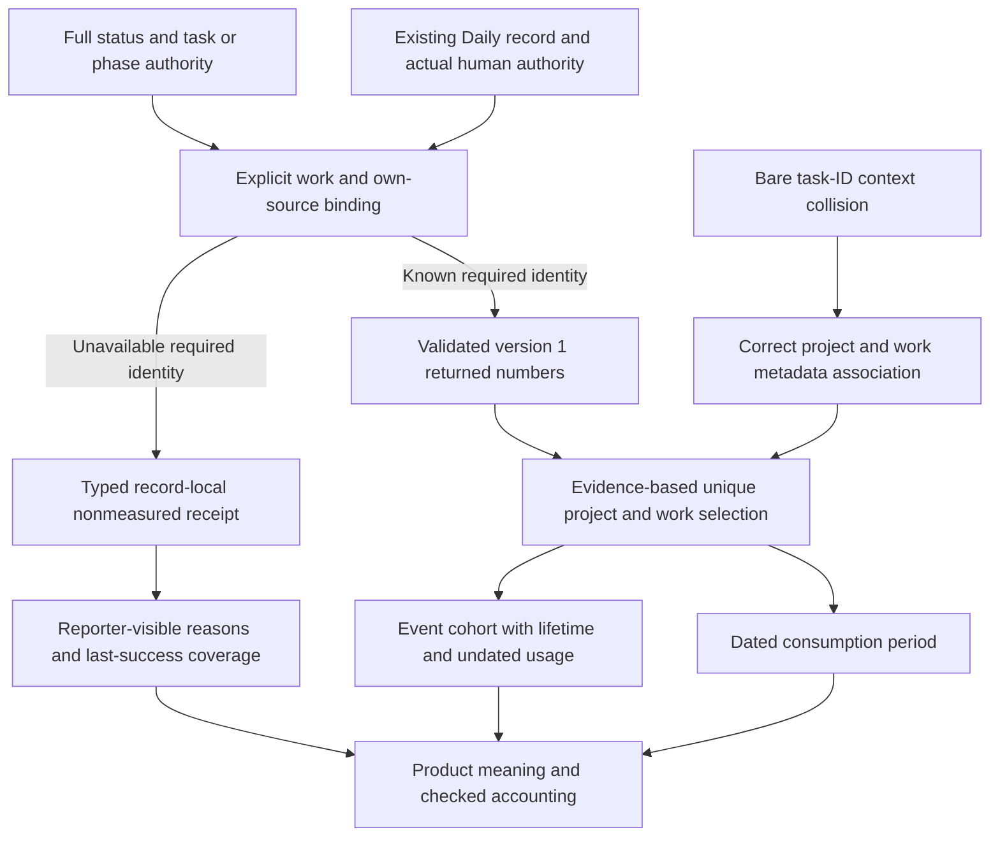

# RES — TFW_20261001-001035_ECON: H1 Daily and product/temporal selection compatibility

> **Current filename**: `research/iter1/RES.md`
> **Date**: 2026-10-01
> **Author**: Codex Researcher
> **Status**: Research iteration 1 complete — bounded findings returned; implementation and H2 remain open
> **Parent HL**: [HL-ECON](../../HL-TFW_20261001-001035_ECON.md)
> **Mode**: Pipeline / focused, one pass per stage
> **Producer unit**: `codex:thread:local:01a0f3df-52c7-7890-abdb-c4e6240540b3`
> **Parent Coordinator**: `codex:thread:local:01a0ec08-7c1d-7570-9ec2-e3e00275687e`
> **Activation / dispatch source**: native command-first `/tfw-research TFW_20261001-001035_ECON`; `journal/20261001-005930__dispatch__c6cd.md @ 9453421f99006dcb66757615d6305c25cd9f04db`
> **Coordination authority**: `HL-TFW_20261001-001035_ECON.md @ de943efbc77914243112a89ab6e97b14ea52bfc1`, §4.1; live status RES / baseline / native-gates / tfw-gates-only, no phase
> **Originating proposer**: `{principal: owner:saubakirov, unit: owner-direct native discussion}`; no agent principal selected
> **Synthesis continuation**: `journal/20261001-014027__gate_answer__9d4e.md @ 9d689118ccfa0f10e967d3d9fe39db369111774b`, transferred as identical journal bytes in `61db15fe`

## Research Context

H1 asks whether the existing accounting helper can support Daily's valid local record and product/temporal queries through a narrow adaptation without changing the numerical schema or inventing Full authority. The investigation separated five dimensions: work identity, declared attribution, numeric versus contextual metadata, temporal selection and product-interest accounting. **H1 is supported as engineering feasibility, with explicit delivery conditions; implemented Daily compatibility is not established.** The necessary seams are selected-record binding/receipt/reporting, reporter-visible unavailable-binding outcomes, evidenced query membership and correct contextual association across projects. No necessity for a wider work-state entity or numerical format migration was evidenced.

Evidence scope: unchanged product sources at `89292e7ac6c366278f6f3107ccc5946f1e73d30e`; helper SHA-256 `6421da79a5cb7e7aca5f2061ca648e04a1147aeec00120c4a9870baacad53328`; Python 3.13.5 bounded **illustrative fixtures**. The probes exercise current validators/entrypaths/aggregation, not an unwritten adapter, native Daily capture, all platforms, per-turn operation or measured savings/overhead. Exact inputs, oracles, temporary reproduction locator and result SHA-256 `17f6b1a543e743ebbafc840e2bb31f4c6a15ed3615c90c31ed07abbd09265bf6` are retained in Challenge C1–C3. No permanent test or product code was added.

## Briefing

[Approved Briefing](1_briefing.md) at `ff33d17fdb7c4d45245077f9be0730922578398f` governs H1 and its counterexamples. Gather `50fdcda5456d32066be08fe7effc2ef136a725c3`, Extract `b8506724af0cff86062d2dd5704e66df76ee6f89` and Challenge `347169c2cb180573acb3c8854f8ca6342004894f` were returned at their separate native gates and advanced only by immutable task-local Coordinator answers. H2 was excluded throughout. The same Researcher, parent and source binding were preserved.

## Decisions

These are research recommendations, not a TS, owner acceptance or architecture activation.

| # | Decision | Rationale |
|---|----------|-----------|
| D1 | Carry forward explicit checked Daily record/file binding as the smallest candidate; retain a local-form-preserving resolver as an alternative. Preserve the existing Full route and version 1 accounting. | Daily-shaped task/role identity validates and counts correctly, but current receive/report/summary refuse a missing Full status. Binding context can change without changing native numeric readers or creating synthetic Full controls. Gather G1; Extract E1/E4; Challenge C1. |
| D2 | Distinguish unavailable required binding from failed extraction. Return the former as a typed, clearly nonmeasured outcome in the existing selected Daily form, with resolvable facts/reasons and last-success references; bound extraction failure uses the existing numeric failure receipt. | Version 1 rejects unknown owner/unit/source even in a failure manifest. A structured record-local outcome preserved nulls, no false extraction claim and readable last-success bytes in manual readback. Actual reporter visibility is a mandatory delivery condition; current helper ingestion is absent. Ordinary valid owner-in-chat Daily needs no invented profile. Extract E2; Challenge C2. |
| D3 | Select evidenced task membership first, then account by the requested temporal meaning: consumption-period dated rows, or event-cohort lifetime rows including undated usage. Keep owner/unit/model predicates grounded in available records. | The existing date filter uses consumption_date and excludes undated rows; no cohort-event or owner/unit CLI selector exists. Fixture lifetime 17 versus Oct-1 spending 12 exposes the difference. Cutoff, generic update or folder stamp cannot invent consumption/completion. Gather G3; Extract E3; Challenge C1/C4. |
| D4 | Keep native primary area/keywords and source-grounded derived product labels in report context; filter a unique associated-work union before accounting. Feature costs need separately attributable records. | An overlapping-interest fixture produces 19 uniquely selected tokens versus 38 from adding separate views. A task's feature association does not allocate its spend. Missing classification/report metadata must be a disclosed gap. Gather G4/G5; Extract E3; Challenge C1. |
| D5 | Correct cross-project contextual association as part of the narrow compatibility surface; do not change numeric spend identity to fix metadata. | Two selected fixture projects with the same task ID preserve the correct 28-token total but current summary exports the first project's area as the second project's. Bare-ID task_meta lookup causes the observed collision. Bind context to selected project/work/root/phase and verify both association and totals. Challenge C3. |

### Evidence and external constraint summary

| Protected claim | Evidence and limit |
|-----------------|--------------------|
| Numeric compatibility without Full status | Current helper validates a Daily folder ID and role daily, counts duplicate bytes once and leaves unknown-model tokens unpriced; status-dependent entrypaths still refuse. Illustrative input, no native Daily invocation. |
| Full behavior/unknown/date boundaries | Ordinary root/phase fixture totals 19; wrong unit/project/phase are refused; null required identities and naive/conflicting dates are refused. These controls are a future adapter verification baseline, not proof of that adapter. |
| Contextual query correctness | Lifetime/period and unique-tag union composition were checked; actual cohort membership and derived labels still need cited work-event/product evidence. Cross-project context collision is reproduced in current CSV enrichment. |
| External schema semantics | [JSON Schema object](https://json-schema.org/understanding-json-schema/reference/object) and [null](https://json-schema.org/understanding-json-schema/reference/null) distinguish closed core, permitted extensions and null versus absence. They support preserving version 1 rather than pretending extensions relax required identity. |
| External date and provenance semantics | [Python datetime](https://docs.python.org/3/library/datetime.html#aware-and-naive-objects) supports explicit-offset enforcement; [W3C PROV-DM](https://www.w3.org/TR/prov-dm/) distinguishes produced data, attribution and derivation. No schema/service/dependency is adopted from these references. |
| Counter-evidence disposition | [OpenTelemetry Timestamp / ObservedTimestamp](https://opentelemetry.io/docs/specs/otel/logs/data-model/) distinguishes source and collection clocks and permits a fallback in its log-conversion context. TFW consumption selection cannot import that fallback against its approved source-date requirement. |

External primary references were accessed 2026-10-01 and used at the stage checkpoints. Conclusions about the narrow adaptation are explicit engineering inferences from these references plus the inspected project sources.

## Open Questions

| # | Question | Status | Answer |
|---|----------|--------|--------|
| Q1 | Do successive live snapshots replace previous bounded contributions once, and what are their completeness/range rules and observed collection overhead? | Deferred to H2, iteration 2 | Not tested here; fixture arithmetic and this Researcher's finite return do not answer it. |
| Q2 | Will the delivered selected-record/report route expose unavailable-binding receipts and prior successful bytes under the actual receiving forms? | Delivery condition, not implemented | The data/contract route is feasible and preserves authority; current helper lacks ingestion. Approved TS/delivery must supply observable reporter readback and failure coverage. |
| Q3 | Will the adapted route retain Full identity/phase checks and correct project/work/classification association? | Delivery condition, not implemented | Existing control cases and the reproduced collision define affected verification. No actual product correction has been made. |
| Q4 | Can supported product/cohort questions be resolved from available work sources? | Evidence-dependent at report time | Cite exact event/offset/classification grounds; disclose missing membership/labels. Ask one consequential clarification when consumption period versus task cohort changes the result. No invented event or feature allocation. |

## Hypotheses (from HL §10)

| # | Hypothesis | HL Status | RES Status | Evidence |
|---|-----------|-----------|------------|----------|
| H1 | Existing helper can accept Daily's own record and supported product/temporal selection through a narrow compatible adaptation preserving schema and Full behavior. | Open in the unchanged governing HL | Supported as bounded engineering feasibility; conditional delivery remains | Gather G1–G5, Extract E1–E4, Challenge C1–C4: version 1 numeric representability, existing-form binding and typed-gap route, query composition, Full control cases, necessary context correction. No implemented compatibility claim. |
| H2 | Bounded cumulative Daily captures update each orderly turn and replace prior contributions once with modest observable overhead. | Open | Deferred, not tested | Coordinator must prepare/dispatch iteration 2; source/range/completeness/overhead are the named next uncertainty. |

## HL Update Recommendations

The Researcher classifies only. The existing Coordinator applies free refinements and retains owner reservations; no task status, iterations.yaml or HL was modified here.

### Refinements — free sections, coordinator applies

| # | § | What to update | Source |
|---|---|----------------|--------|
| R1 | §2 | Distinguish numeric version 1 Daily-shaped representability from current Full-status-dependent receive/report/summary. Add the observed cross-project metadata collision; correct totals alone do not prove correct product association. | Gather G1; Challenge C1/C3 and bounded result hash above. |
| R2 | §7.2 | Add the stage-backed primary schema/null/date/provenance references with their limited methodological scope; preserve TEQM applicability and surviving D82/D86 meaning. | Evidence summary; Gather/Extract/Challenge external references; qualified TKL-20260929-TEQM record. |
| R3 | §8 | Record narrow delivery dependencies: explicit source-backed Daily binding preserving receiving forms, reporter-visible typed unavailable-binding outcomes, last-good references and contextual project/work association. | Extract E1/E2/E4; Challenge C2/C3; D1/D2/D5. |
| R4 | §9 | Retain the risks of unknown required identity, silent receipt/metadata exclusion, ambiguous dates and cross-project context collisions. State that H1 fixtures prove neither live capture completeness nor per-turn overhead. | Gather G2–G5; Challenge C1–C4; Q1–Q4. |
| R5 | §10 | Mark H1 supported at its explicit engineering/fixture scope and conditions. Keep H2 open; carry source/range/completeness, finite tails, real successive/final Daily behavior and observed overhead into iteration 2. | H1/H2 table; Challenge verdict; Iteration Status below. |

### Amendment Proposals — frozen sections, resolved-ruler verdict required

**No amendment proposals.** The typed unavailable-binding recommendation preserves truthful typed returns, unknowns, ordinary Daily authority and last-success records; it does not relax version 1 identity validation or claim present helper ingestion. The context correction and query composition fit the approved product/temporal/project scope. No evidence established a need to change the frozen purpose, phase, DoD/DoF, principles or per-turn obligation. A demonstrated inability to fulfill these conditions later returns to the existing Coordinator for its actual scope/authority decision.

## Fact Candidates

**No new Fact Candidates.** Review of this Researcher's available conversation found Coordinator gate decisions and continuations, without a new direct human domain fact. Earlier owner decisions remain attributed in governing HL §11; they are not republished as new research facts. Agent-discoverable helper/probe observations remain source-backed research findings above.

## Strategic Insights (Research)

**No strategic insights.** No new human domain knowledge, correction or strategic preference was supplied during these research gates. The approved owner's product/report/per-turn choices remain governing inputs, not fresh insights attributed to the Coordinator or this Researcher.

## Findings Map

The diagram shows the recommended separation. Its Daily/gap integration and context correction remain delivery work, while the underlying current numeric/date/phase behavior was checked within the stated fixture scope.

## Iteration Status

- **Iteration:** 1 of 2 (min) / 2 (max), as the Coordinator-prepared control entry states.
- **Hypotheses tested:** H1 — supported as bounded engineering feasibility, with delivery conditions and no implemented compatibility claim.
- **Hypotheses deferred:** H2 — cumulative live capture, successor completeness/reconciliation, source limits and observed overhead, reserved for iteration 2.
- **Gaps discovered:** current Full-entry Daily refusal; unknown required binding cannot enter version 1; current helper has no record-local unavailable-receipt ingestion, cohort-event or owner/unit CLI selection; cross-project same-task-ID metadata collision; live capture remains unproven here.
- **Superseded decisions:** None. No prior approved architecture or decision was changed.

### Open Threads (for next iteration)

| # | Thread | Why it matters | Suggested focus |
|---|--------|----------------|-----------------|
| 1 | Live cumulative range/prefix and completeness meaning | A correct single fixture says nothing about replacing a running-source predecessor once. | H2: verified successive captures, disjoint/covered/overlap counterexamples and truthful live/final completeness. |
| 2 | Orderly turn-return capture and final-tail behavior | Required Daily capture must be observed and failures must preserve prior snapshots. | H2: a real bounded own-source Daily example, repeated turn capture, failure/unknown path, final cutoff/tail and recorded collector overhead. |
| 3 | Receiving-form and reporter compatibility | H1 supplies narrow requirements but no implemented adapter or report acceptance. | Carry R3/R4 and the Full/project collision oracles into later TS/delivery; do not re-label them completed H2 facts. |

### Recommendation

- [ ] **SUFFICIENT** — proceed to TS now.
- [x] **MORE NEEDED** — return to `/tfw-plan` to classify/apply H1 refinements and prepare focused iteration 2 for H2. H1 is sufficient for its bounded question; live replacement/overhead remains decision-changing and the configured minimum is two iterations.
- [ ] **BLOCKED** — no current research blocker identified.

The Coordinator decides the next dispatch and later exact TS/denominator gate. This Researcher stops at this iteration return; no H2 activation or implementation is inferred.

## Conclusion

The investigation supports a narrow, authority-preserving route: keep version 1 attributable numbers, bind Daily through its actual selected record, expose typed unavailable-binding outcomes, compose evidenced task/product membership with the requested temporal accounting, and correct cross-project context association. It exposed two failures that superficial arithmetic would miss: required unknown identity cannot fit even a current numeric failure manifest, and a correct multi-project total can carry the wrong product labels. The result is source-backed engineering guidance and a bounded set of delivery oracles, not a working Daily adapter. This distinction, actual reporter visibility and H2's live source behavior remain essential to honest acceptance.

### Material handover at this return

Producer/parent/activation/authority are recorded in the header. Inspected scope: selected task controls and approved HL; four complete research stages; current Daily/economics/helper/schema/installation/report sources at the named product epoch; relevant qualified TEQM/PV/knowledge sources; exact previously cited Daily §1 attribution; primary external methodological references; temporary illustrative probes. Knowledge handover/current-use conventions were reapplied and record-space incoming TEQM relation lookup found no successor/conflict. The qualified record's finite implementation scope and surviving D82/D86 constraints remain applicable; no source-private observation becomes a provider guarantee.

Material findings and uncertainty are preserved in D1–D5, Q1–Q4, the hypothesis and refinement tables and Challenge's exact probe grounds. No new human fact publication is owed by this role at this return. Continuation belongs to the same task Coordinator: inspect this durable RES and numeric return, classify H1 refinements, then prepare the next complete H2 iteration entry and its actual dispatch. Exact TS/denominator, frozen overruns/changes and final result remain owner-reserved. No task-final acceptance, external effect or product mutation is claimed.

### Own bounded economics contribution

Resolvable returned bytes: [researcher-iter1-20261001.jsonl](../../economics/researcher-iter1-20261001.jsonl), revision **1**, SHA-256 **`4b4611568663a5e003cae5b54cd12043c4fd5edbcf5f2655f1a6a0d5456b1816`**. Collected by the unchanged helper and subsequently accepted by its `validate` command; two compact usage records, no failure receipt. The containing research return commit makes these bytes available to the Coordinator for normal validated receipt; they are not yet claimed received into its own `economics/roles` leaf.

Binding: this actual Researcher's `codex.rollout`, source ID/session_meta.id `01a0f3df-52c7-7890-abdb-c4e6240540b3`, native source version `0.159.2`, range **[0, 377)**, timezone **+05:00**, finite cutoff **2026-09-30T20:46:15.063934+00:00** (2026-10-01 local). Range starts at this new unit's command-first activation; it includes this unit's H1 continuation turns only. Captured source-prefix SHA-256 `e0ae3a887467e645765d52e69f614472a752765a97b3cd2d134539fc59c283e3`, source size 2,828,430 bytes. Exact local source locator was bound by the producer in `research/entry.md`; no other unit's numeric source was accessed.

Measured native response stream: **5,818,365 tokens** (5,778,022 input including 5,552,128 cached; 40,343 output including 8,606 reasoning). Source exposes observed model **gpt-6.1-sol**, effort **high**, consumption date **2026-10-01**. Five matched completed turns contribute **1,798.145 completed-turn seconds**; one current task_started remains unmatched, so no completed duration for this open turn is claimed. Collector operation time **0.020718 seconds** belongs to this single capture, not H2's repeated Daily overhead measurement.

Diagnostics: native token_count cumulative total **5,598,258** differs from the **48 unique-response native thread total 5,818,365**. The collector verified the response stream against its native thread counter and selected that stream; the alternate counter is retained diagnostically and never added. The two returned aggregates compact 53 verified native rows, including five duration rows. `complete = false`; source coverage is finite. The remaining return message, final edits/commit/send and later cleanup tail are excluded once at this cutoff, without recursive recapture. This is this unit's bounded contribution, not total task economics, an API charge, a Daily capture proof or a resolution of H2.

---
*RES — TFW_20261001-001035_ECON: H1 compatibility | 2026-10-01*
