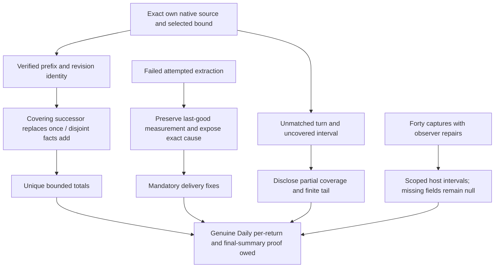

# RES — TFW_20261001-001035_ECON: Bounded native continuity, failure preservation and observed collection cost

> **Date:** 2026-10-01
> **Author:** codex, Researcher
> **Status:** RES — Synthesis returned; Coordinator disposition pending
> **Parent HL:** [HL-TFW_20261001-001035_ECON](../../HL-TFW_20261001-001035_ECON.md)
> **Mode:** Pipeline; focused, one OODA loop per stage; retained gpt-6.1-sol/high
> **Producer unit:** `codex:thread:local:01a0f3df-52c7-7890-abdb-c4e6240540b3`
> **Parent Coordinator:** `codex:thread:local:01a0ec08-7c1d-7570-9ec2-e3e00275687e`
> **Activation / coordination authority:** delegated `HL-TFW_20261001-001035_ECON.md @ de943efbc77914243112a89ab6e97b14ea52bfc1`, section 4.1
> **Originating proposer:** owner saubakirov; Researcher originates the refinements below

## Research Context

H2 asks whether native cumulative successor/range/prefix reconciliation can support the frozen requirement for cumulative Daily snapshots before every orderly return and a final economic summary, with inspectable cost and truthful failures. This iteration tested that mechanism on this unit's exact Codex source and measured collection/integration intervals on the observed Windows host. It did not implement the Daily workflow, alter the product/schema, approve TS or accept the owner's result. Current control remains RES, H2 pending/open, `baseline`, `native-gates`, `tfw-gates-only`, no phase. Synthesis is authorized by [the Challenge answer](../../journal/20261001-030535__gate_answer__d275.md) at `de890861daaebb563c51b6f7c834cc4a09b33115`, transported exactly at `6362f383a122343a5a9d8f82e6c811022b523f04`.

## Briefing

The [Briefing](1_briefing.md) defines H2, protected H1 boundaries and the bounded native experiment. [Gather](2_gather.md) separates five dimensions: coverage, revisions, continuity proof, failure binding and cost scope. [Extract](3_extract.md) factors the 243 configurations into nine coverage/revision families with 27 remaining combinations each. [Challenge](4_challenge.md) checks all ten dimension pairs, executes the selected cases and records every material raw timing, failure readback, source bound and observer repair. This synthesis reread all four stages; no additional timing run was performed.

## Decisions

| # | Decision | Rationale |
|---|---|---|
| D1 | Treat H2 as supported for the bounded native mechanism and observed host cost, conditional on delivery fixes and genuine Daily proof. | Verified covering successors, repeats and disjoint facts reconcile correctly. Failure/report defects and absent Daily cadence proof prevent unconditional acceptance. |
| D2 | Require narrow last-good arbitration and exact failure-cause visibility fixes in delivery. | Received unlinked overlapping failure can exclude both contributions; linked overlap loses code/detail; disjoint failure loses detail. These are reproduced contract defects, not optional refinements to usability. |
| D3 | Distinguish a complete selected bound from complete work; retain finite tails, uncovered intervals and unmatched turns. | Static `--complete` is copied, not independently proved. Open-prefix capture accepted with one unmatched turn. Byte-prefix verification proves continuity only. |
| D4 | Retain measured intervals with their scope; leave the owner's cost judgment open. | Internal collector work, CLI wall time, separate integration calls and native completed-turn duration differ. No causal whole-agent overhead, cross-host promise or modest threshold was measured. |
| D5 | Keep cumulative-view plus disjoint-fact arithmetic as a surviving, unselected alternative. | A+D equals B, but no implemented architecture or every-turn Daily demonstration was tested. This cannot weaken cumulative snapshot cadence. |
| D6 | Preserve H1 R1–R5 and version 1; propose only evidenced free-section refinements. | Findings require scoped delivery/report behavior, not a demonstrated frozen-contract or schema amendment. Unknown core binding remains a separate typed local outcome. |

## Open Questions

| # | Question | Status | Answer |
|---|---|---|---|
| Q1 | Does a genuine verified cumulative successor count once? | Answered at the selected bound | A→B→same-end revision, duplicate receipt and A+D all yield B=1,694,409 once. |
| Q2 | Can failure receipts safely preserve usable last-good accounting and expose exact cause today? | Answered negatively for reproduced paths | Last-good bytes can survive while accounting is excluded. Report visibility is incomplete. Mandatory delivery corrections follow. |
| Q3 | Is historical every-return Daily compliance demonstrated? | Delivery proof owed | Historical A/B captures were made during Challenge after their original returns; they prove mechanism only. |
| Q4 | Is the observed cost acceptable to the owner? | Owner reservation | Exact bounded host timings are available; no acceptance threshold was supplied or inferred. |
| Q5 | Are other hosts/providers, whole-task coverage or causal overhead established? | Outside measured scope | No. Do not generalize the observed Codex/Windows/runtime workload. |

## Hypotheses (from HL §10)

| # | Hypothesis | HL Status | RES Status | Evidence |
|---|---|---|---|---|
| H1 | Bounded feasibility of product economics and Daily integration while preserving v1, truthful binding gaps, dates and product/work context | Open pending Coordinator disposition | Predecessor result carried: supported with explicit delivery conditions | [Iteration 1 RES](../iter1/RES.md) at `ad3c529302fab24c0df436b85593f0f5a8f155f6`; R1–R5 remain required. |
| H2 | Native cumulative successor/range/prefix completeness and one-time reconciliation; failures/last-good preservation, finite tails and observable collection/integration cost | Open until this synthesis is reviewed | Supported at bounded mechanism/host scope; current failure paths fail; final Daily workflow compliance unproved | [Challenge](4_challenge.md) at `dc83d1b9717b8c3382f0d96d7daa33bd6e491cea`; evidence below. |

## Bounded findings and delivery conditions

### Continuity and unique totals

Independent own-source numeric oracles match the unchanged collector: A `[411,490)` contains 1,195,744 tokens and 355.202 completed-turn seconds; B `[411,558)` contains 1,694,409 tokens and 602.036 seconds; disjoint D `[490,558)` contains 498,665 tokens and 246.834 seconds. A→B and A+D both produce B. Three revisions, repeated exact bytes and repeat receipt add no duplicate spend. Incomplete overlapping B is excluded as `unproved successor overlap`, leaving A. Missing predecessor, changed work/revision identity and missing/wrong extension proof are excluded with distinct diagnostics. An own-source numeric derivative with changed predecessor bytes is rejected with `source bytes changed in predecessor range`, exit 2, producing no successor. The original native source was not edited.

The source hash covers normalized complete JSONL lines from line zero through the selected end, even when consumption starts later. The reader reads the whole physical file before selecting the range. A static `complete=true` probe at `[411,826)` is accepted yet diagnoses one unmatched turn: 5,694,046 selected H2 tokens, 1,399.092 completed-turn seconds, cutoff `2026-09-30T21:53:41.231429+00:00`. This proves a selected prefix, not completed work. Its 99-response full-prefix counter is 12,408,025; the alternate counter is 11,972,509. The verified response stream is selected; the two streams are never added. H1 `[0,377)` remains separate and `[377,411)` remains unknown coverage.

Hash equality establishes continuity of inspected bytes, not ownership, authorization or lifecycle completeness; [Python's hash documentation](https://docs.python.org/3.13/library/hashlib.html#hash-objects) supports the digest method. [W3C revision provenance](https://www.w3.org/TR/prov-dm/#term-revision) informs the separation of a derived view from its contributing entities. These are methodological references, not new project dependencies. Exact prefix digests, native response counts, completed-turn boundaries and case results are retained in the committed Challenge.

### Failures must preserve measurement and expose cause

Each fault fixture deliberately selected a missing temporary source. The actual collector returned `exact source file missing`; the known-binding v1 receipt retained code `probe_exact_source_missing` and detail `Fault-injected exact source path unavailable; collector returned: exact source file missing.` These were controlled failures, not native outages.

| Received combination | Actual accounting | Actual report | Required delivery behavior |
|---|---|---|---|
| Good A + linked incomplete failed `[411,558)` | A remains 1,195,744; failure excluded for overlap | Neither code nor detail visible | Preserve A and expose the actual failed attempt/cause independently of overlap exclusion. |
| Good A + unlinked overlapping failed `[411,558)` | Both excluded; unit omitted; accepted aggregate 0 | Neither code nor detail visible | A nonmeasured failure must not disqualify usable last-good measurement. Omitted totals are not observed zero. |
| Good A + disjoint failed `[490,558)` | A remains 1,195,744 | Code visible, detail absent | Preserve A, expose precise detail and disclose unmeasured attempted interval. |

All received bytes retained the cause. A `failure_only` received-minus-reported set does not capture the latest failed attempt when a prior success exists. Failure receipts measure no coverage; preserving bytes alone is insufficient when the usable measurement is excluded. Failure-writer `operation_seconds` is a literal zero, not observed handling cost. Delivery must measure it or use a truthful null/reason within v1 optional metrics. Unknown owner/unit/source binding still cannot be manufactured into v1 required core fields: retain H1's local typed unavailable-binding outcome, producer attribution, attempted extraction versus binding failure and visible reasons.

### Observed cost and observer repair

Unchanged helper SHA-256: `6421da79a5cb7e7aca5f2061ca648e04a1147aeec00120c4a9870baacad53328`; last product commit `0cd723a203611871e3c49a174aeb3e7220fda40c`. Scope: Python 3.13.5, Windows 11 build 26200, Codex source version 0.159.2, gpt-6.1-sol/high. Repaired samples use ten A captures without predecessor and ten B captures with genuine A predecessor; every sample validates, receives and reports the expected total using temporary Full fixtures. Those fixtures do not supply actual Daily lifecycle authority.

| Interval, seconds | A median (min–max) | B median (min–max) |
|---|---|---|
| Internal collector operation | 0.033663 (0.028442–0.056568) | 0.0403555 (0.033338–0.065839) |
| Collect CLI wall time | 0.27793915 (0.15588890–0.36010990) | 0.22212370 (0.15520260–0.33328630) |
| Separate validate + receive + report | 0.51157695 (0.431307–0.8671098) | 0.49411345 (0.4202291–0.7926923) |
| Sum of observed CLI intervals | 0.82420625 (0.5907863–1.1619029) | 0.76407745 (0.5963241–1.0030923) |

The internal operation ends before serialization/write/final validation and begins after binding checks; it includes read/decode/prefix hash/compaction and predecessor validation. External CLI includes startup, writing and validation. Do not add internal operation again to the CLI sum. Setup and B predecessor seeding are excluded; tool dispatch, agent/human work and causal baseline are unmeasured. Selected prefixes are 3,612,637 and 4,112,824 bytes; physical source ranges 5,478,501–5,485,759 bytes. Prefixes stayed stable while source grew. B predecessor cost and bound size are confounded; no controlled scaling/cache claim follows. Compact outputs are two rows and 2,646–2,648 / 2,783–2,784 bytes. [Python's elapsed counter documentation](https://docs.python.org/3.13/library/time.html#time.perf_counter) grounds wall interval measurement, which includes waiting and differs from process CPU time.

Forty timing captures actually occurred. The initial twenty succeeded, but a temporary observer asserted refusal exit 1 where the actual CLI returned 2; external wall and physical-size fields were lost from memory before serialization. Their twenty immutable capture outputs, internal operation values and totals were recovered. Missing observer fields remain null with cause. A checkpointed repetition performed twenty complete samples; they alone supply the table above. Initial internal medians A=0.037332, B=0.0456095 are retained separately, not pooled. The repaired refusal assertion and finisher's missing D variable were repaired by recovering existing outputs, without another timing run or product edit.

Durable grounds are the committed [Challenge](4_challenge.md), which embeds all twenty repaired timing rows, original twenty operation values, physical-size bounds, cases, method and repairs. Returned numeric files were hash-checked by the Coordinator: completed `results.json` SHA-256 `dca682f47ad18e02e61e6fe72d7c32e275390e711fdc1c86e26f3a91159b42eb`; recovered-original `recovered-original-run.json` SHA-256 `64df1839bb1ca407c006c3545c90486b3fd434d8aa908acdad615e996a8a3e3d`. OS-temp relative locators and observer script hashes are retained in Challenge as supplemental producer evidence. Temporary paths alone are not durable or cross-host proof. No probe JSONL belongs in the actual contribution ledger.

## HL Update Recommendations

The Researcher classifies, never applies or rules. H1 R1–R5 remain in force: Daily collection versus Full reporting boundary; truthful typed local binding gaps; observed dates/cohort versus lifetime semantics; grounded product classification and overlapping union; project/work/root/phase metadata context without changing native spend identity.

### Refinements — free sections, Coordinator applies

| # | § | What to update | Source |
|---|---|---|---|
| R6 | §2 | Record verified native covering/disjoint/repeat results and reproduced failure defects as current conditions. Historical after-return probes do not prove Daily cadence. | Challenge continuity/failure cases; D1–D3. |
| R7 | §7.2 | Add stage-backed Python elapsed/hash and W3C provenance method, exact helper/host scope and durable evidence references. No library dependency or source authority follows. | Challenge method/raw samples; source links above. |
| R8 | §8 | Require last-good measurement to survive nonmeasured failed attempts; show exact latest failure code/detail even when excluded; justify selected-bound completeness; measure or null failure operation cost; prove genuine Daily cumulative per-return captures and final summary in delivery. | Reproduced three failure combinations, static flag/open-prefix probe and timing boundaries; H1 typed-gap conditions. |
| R9 | §9 | Preserve finite tails/unknown gap, forty actual timing captures, initial missing observer fields, internal/CLI distinction and one-host confounded workload. No invented modest threshold, causal overhead or cross-host assurance. | Challenge observer repair, timing/raw counts and bound diagnostics. |
| R10 | §10 | Classify H2 supported at bounded mechanism/observed-host scope, with current failure-path defects and genuine Daily delivery proof owed. Carry conditional H1 result and owner TS/denominator/final-result reservations. | D1–D6 and both RES returns. |

### Amendment Proposals — frozen sections

**No amendment proposals.** The evidenced fixes and disclosure conditions fit the frozen purpose/cadence and v1 boundaries. Nothing authorizes a weaker cadence, new schema, reporting lifecycle or architecture choice.

## Fact Candidates

**No new fact candidates.** Continuations supplied workflow dispositions, not new human-only domain facts. Agent-observed behavior belongs in the findings and delivery evidence above.

## Strategic Insights (Research)

**No strategic insights.** No new human-sourced domain context was introduced.

## Findings Map

## Iteration Status

- **Iteration:** 2 of 2 (min) / 2 (max); synthesis complete at this return, control disposition belongs to Coordinator.
- **Hypotheses tested:** H2 supported at bounded mechanism/host scope with mandatory delivery conditions; H1 conditional support carried from iteration 1.
- **Hypotheses deferred:** None within the two prepared iterations.
- **Gaps discovered:** Current failure arbitration/cause visibility; unverified static completeness flag; real Daily cadence/final-summary proof; unknown `[377,411)` and final tail; initial observer fields unavailable; causal/cross-host/scaling scope unmeasured.
- **Superseded decisions:** None. H1 conditions and owner reservations remain.

### Open Threads (delivery scope, not an automatic next iteration)

| # | Thread | Why it matters | Suggested focus |
|---|---|---|---|
| 1 | Implement narrow failure/report corrections alongside H1 requirements | Present paths can omit last-good totals or precise cause | TS names the three reproduced combinations and truthful binding-gap readback as delivery oracles; no permanent test is prescribed. |
| 2 | Demonstrate genuine Daily cumulative snapshot before each return and final economic summary | Historical probes establish mechanism only | Execute approved delivery workflow with actual source/work binding, immutable revisions and disclosed finite tail. |
| 3 | Owner cost and denominator decision | Timings and associated task cost do not establish benefit, causal overhead or acceptance | Coordinator presents exact TS scope and observed cost; owner retains approval. |
| 4 | Other platform/runtime support | One-host evidence cannot supply compatibility guarantees | Keep explicit scope; widen only under authorized delivery or later research. |

### Recommendation

- [x] **SUFFICIENT** — proceed to `/tfw-plan` to classify recommendations and prepare TS with the mandatory conditions above.
- [ ] **MORE NEEDED**
- [ ] **BLOCKED**

Both prepared hypotheses have bounded evidence and the configured two-iteration minimum is met. No further research is needed to pre-solve the implementation. This recommends planning, not TS approval, corrected behavior or final Daily acceptance; the Coordinator decides the route.

## Conclusion

Native selected-bound continuity and one-time reconciliation work for the tested successful paths, with inspectable host costs. Research also reproduced defects that otherwise would hide precise failed-attempt causes or exclude usable last-good accounting. Delivery must correct those paths and prove the actual Daily cadence/final summary while retaining H1 boundaries. The study's limits are explicit: historic after-return probes, one host, confounded predecessor/bound sizes, repaired observer fields and partial source coverage cannot support broader claims.

### Material handover at this return

Producer is the exact Researcher unit above, returning only to its recorded Coordinator. Grounds are this unit's four committed H2 stages, native numeric bounds and controlled cases, plus accepted H1 RES; epoch is observed 2026-10-01 / source version 0.159.2 / unchanged helper hash above. The qualified `TKL-20260929-TEQM` scope/disposition and exact incoming references were rechecked: no incoming correction/successor found. Its accepted Spec/independent candidate is not final owner or deployment acceptance; the narrow D82 Python economics exception and D86 closure/effect distinction remain. No foreign native source, role history or unreturned reasoning was inspected.

Material returned: scoped H2 conclusion, mandatory delivery defects, free refinements R6–R10 and durable Challenge evidence. Original evidence remains authoritative; this RES does not replace it. Uncertainty is bounded by the coverage/host/observer disclosures and unresolved owner choices above. Continuation is `/tfw-plan` through the same Coordinator; H2/control/HL disposition, exact TS, denominator and final-result acceptance remain with the authorized decision holders. This return makes no product, control, schema or lifecycle edit.

### This Researcher's final bounded economics contribution

One normal final-return capture, not another benchmark: [researcher-iter2-20261001.jsonl](../../economics/researcher-iter2-20261001.jsonl). Validated v1 file SHA-256 `7df7f5b4a58b5aa391e386d3f0ad86faee854b54d0d05121e826a9e38fb69699`, revision 2, predecessor `4b4611568663a5e003cae5b54cd12043c4fd5edbcf5f2655f1a6a0d5456b1816`. Declared project `my-project` and TFW 3.8.0 are read from project configuration, owner saubakirov from task status, role Researcher, actual source/unit ID as above, no phase, timezone `+05:00`, reporting mode `native-gates`. Project identity is not inferred from the checkout directory name.

Selected range `[411,1005)`, exclusive line end, cutoff/captured_at `2026-09-30T22:16:19.205117+00:00`, `complete=false`. Native source version 0.159.2; selected source prefix hash `3b1a5e85531d3c3f3d857734c76c24d432fb692b92b170a6a31fee4f743854d5`, 6,772,590 bytes. Two compact rows represent 68 verified response records and five completed-turn durations: input 9,240,995 (cached 8,775,168; fresh 465,827; cache writes 0), output 82,462 (reasoning subset 22,147), total **9,323,457 tokens**, **2,492.258 completed-turn seconds**. Internal collection operation **0.05281 seconds**; no external timing claim for this return.

The full-prefix verified 120-response thread counter is 16,037,436 versus alternate token_count 15,483,216; diagnostics preserve the disagreement and select the verified response stream without addition. One unmatched task_started remains; ongoing duration is unavailable, not zero. H1 `[0,377)` and this range are disjoint; direct reconciliation of these two returned files yields four compact records, no exclusions/diagnostics, **15,141,822 tokens** and **4,290.403 completed-turn seconds**. These are only this unit's two inspected contributions, not a task total. The unreturned `[377,411)` gap stays unknown. No covered cumulative predecessor-prefix claim is made for this disjoint increment.

The finite end precedes collection/write, this economics paragraph, commit, addressed return and final answer; their later consumption is outside this capture. The existing H1 bytes remain unchanged. This normal research return follows the current producer recipe; it does not retroactively establish or weaken the frozen future Daily cumulative-per-return obligation. Fixture/timing probe JSONLs are not returned as ledger contributions.

---

*RES — TFW_20261001-001035_ECON | 2026-10-01*
